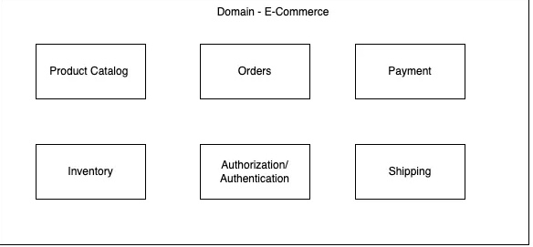

# Microservice Antipatterns

A well-built microservices architecture-based application can withstand the test of time by being scalable, flexible, and resilient to most issues that may come its way.

These architectures achieve a high level of resilience due to its loosely coupled components that can run independently therefore not being affected by other microservices within the application.

## 1. Monolith in Microservices

If you’re trying to build microservies while preserving a monolith architecture, you’ll run into issues with scalability, fault tolerance and many more. This is often caused by:

1. **Shared Databases:** When you’re building microservices, it’s often a good idea to have a database per service. This lets you control the database type, schema rules, IOPS capacity on a per service rule thus letting you have finer control over scaling. But, if you use a single database for all your service, you make it harder for your app to grow.
2. **Complex Deployment:** Despite being decomposed into smaller services, the deployment process is still complicated and time-consuming, requiring coordination between various teams and manual involvement. This limits the agility and flexibility achieved by implementing microservices.
3. **Inadequate Service Boundaries:** Poorly specified service boundaries would result in overlapping functionality and unclear ownership. This can lead to duplication of work and difficulties in controlling and improving the architecture.

So, to avoid having monoliths in microservices, I’d recommend going ahead with a single database per microservices along with defining clear ownership of your microservices via a Domain Driven Design.

### Developing a DDD-Oriented Microservices

#### **What is Domain-Driven Design (DDD)?**

Domain-Driven Design (DDD) is an approach to software development that emphasizes modeling software based on the domain it serves. It involves understanding and modeling the domain or problem space of the application, fostering close collaboration between domain experts and software developers.

#### **Why should we combine DDD with microservices?**

Combining DDD with microservices architecture can be highly beneficial for building complex, scalable, and maintainable software systems.

- **Bounded Contexts and Microservices Boundaries:** DDD introduces the concept of bounded contexts, which defines the boundaries of a domain model and encapsulates its logic. These bounded contexts align well with the idea of microservices, where each microservice represents a specific bounded context. This alignment helps in defining clear and independent responsibilities for each microservice, promoting better modularization and separation of concerns.
- **Decentralized Data Management:** In microservices, each service is responsible for its data. DDD’s emphasis on aggregates, entities, and value objects encourages a decentralized data management approach, where each microservice has its data store that corresponds to its bounded context.

#### **How microservices fit into the DDD methodology?**

We explore the core concepts of DDD, including bounded contexts, aggregates, entities, value objects, and domain services. By understanding these principles, you can effectively identify the boundaries of your microservices and design them around the business domains they represent.

Microservices architecture offers a way to structure an application as a collection of loosely coupled services, where each service runs independently in its process and communicates through lightweight mechanisms.

For instance, we can have microservices dedicated to “Order Management,” “Product Catalog,” “Payment Processing,” and “User Management.” Bit supports this approach by providing tools for creating and managing microservices through component-based development.

1. Understanding the Domain: In DDD the initial step involves thoroughly understanding the domain. This necessitates collaborating with domain experts to identify crucial business concepts, relationships, and behaviors.
2. Bounded Contexts
3. Aggregate Design: Aggregates serve as consistency boundaries within the domain, encapsulating clusters of related entities and value objects. They guarantee data consistency and establish clear boundaries for enforcing business rules.

In conclusion, developing DDD-oriented microservices entails a comprehensive understanding of both DDD principles and microservices architecture.

By adopting DDD, identifying bounded contexts, and aligning microservices with aggregates, you can construct systems that are scalable, maintainable, and closely aligned with your business needs. It is crucial to continuously iterate and refine your architecture, incorporating domain expertise and feedback. This iterative approach ensures that your microservices evolve and adapt over time, keeping pace with the changing needs of your business. By combining the power of DDD and microservices, you can create robust and adaptable software systems that drive your organization forward.

