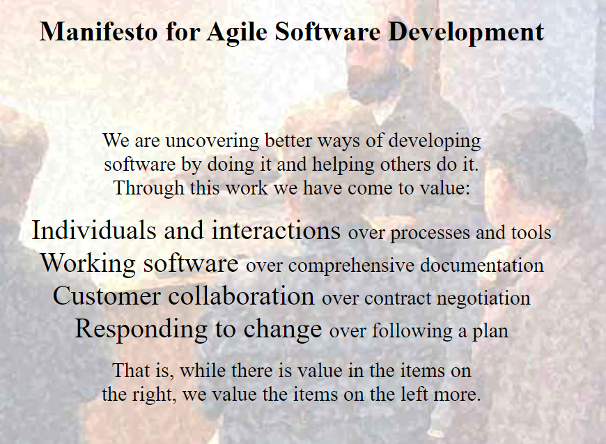

# AGILE

Agile is more of a mindset and a belief system.

## Agile Manifesto: Agile Values

We are **uncovering better ways** of developing software by doing it and helping others do it.

1. **Individuals and interactions over processes and tools**
  - We are going to value the people and the interaction more.
  - We will value face to face communication.
  - In estimation work; we will value interaction & conversation more that the actual result of what the estimate us.
2. **Working software over comprehensive documentation**
  - It doesn't mean that we don't need to have a documantation, howeever a key thing that you wanna pay atention to in this value is compherensive. Because the main deliverable is the software. 
3. **Customer collaboration over contract negotiation**
  - We wanna collaborate and delight our customers!
4. **Responding to change over following a plan**
  - Let's value being ready for changes and responding to any change.
  - If we are developing a complex piece of software, something will change and then the plan will not be useful. So planning is very important, but we should change it, if it necessary.

## 12 Agile Principles

1. Our highest priority is to satisfy the customer through early and continuous delivery of valuable software.
2. Welcome changing requirements, event late in development. Agile processes harness change for the customer's competitive advantage.
3. Deliver working software frequently, from a couple of weeks to a couple of montsh, with a preference to the shorter timescale.
4. Business people and developers must work together.
5. Build projects around motivated individuals. Give them the environment and support they need, and trust themt o get the job done.
6. The most efficient and effective method of conveying information to and within a development team is face-to-face conversation.
7. Working software is the primary measure of progress.
8. Agile porcesses promote sustainable development. The sponsors, developers, and users should be able to maintain a constant pace indefinitely.
9. Continuous attention to technical excellence and good design enhances agility.
10. Simplicity the art of maximizing the amount of work not done is essential. 
11. The best architectures, requirements, and design emerge from self-organizing teams.
12. At regular intervals, the team reflects on how to become more effective, then tunes and adjust its behaviour accordingly.

## Benefits of Agile

Agile was created to help solve problems,
- THe number one thing that Agile does is it allows you to deliver that value in smaller increments to the customer.
- They can give you feedbacks.
- Because of agile is a an iterative process, the team is actually able to get feedback on their performance aswell.

## Challanges of Using Agile

Agile is actually difficult for existing companies and organizations to implement if they're using some type of waterfall or other metodologies.

- Agile changes everything. Changes whole mindset. It is all or nothing process.

- Companies have to be all in to spend some money and a lot of time in making that adjustment. 

-  there's not a clear role

In Agile that takes control or has ownership of that particular project. Instead, the team works together collaboratively and everybody chips in and does their part to make sure that the project meets that eventual business need.