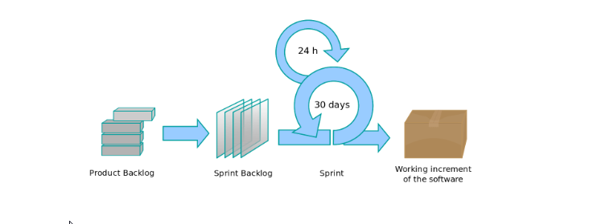

# AGILE METODOLOJİ

Agile Metodoloji, yazılım sistemlerini etkili ve verimli bir şekilde modellemeye ve dökümantasyonunu yapmaya yönelik pratiğe dayalı yöntemlere denir.

Aşırı kuralcı klasik yazılım süreç modellerine tepki olarak ortaya çıkan Agile Manifestosy öncesinde yazılımlar daha yüksek maliyetli ve gerektiğinde dökümante etmek amacıyla ortaya çıkan, dünyada birçok yazılım firmasının farklı projelerinde benimsediği bu metodun kullanımı 90'lar sonrasında hız kazanmıştır.

2001 yılında yazılımda önde gelen isimlerden bazıları <b>Agile Yazılım Geliştrime Manifestosu</b> 'nu yayınlamışlardır. Manifesto, nasıl daha iyi yazılım geliştirdiklerini ve bunu yapmak isteyenlere yol gösterecek 4 maddeden oluşmaktadır.

## Agile Manifesto

1. Bireyler ve etkileşimi, süreç ve araca tercih etmek.
2. Çalışan bir yazılımı, detaylı belgelendirmeye tercih etmek.
3. Müşteri ile işbirliğini, sözleşmedeki kesin kurallara tercih etmek.
4. Değişikliklere uyum sağlayabilmeyi, belirli bir plana tercih etmek.

## Agile Prensipleri

- Öncelik kaliteli yazılımı müşteriye teslim edebilmektir. Projenin ilk aşamalarından itibaren sürekli teslimler yapılır, müşteri ilk versiyonlardan itibaren yazılımı kullanarak yazılıma değer katar. Böylece yapılan yatırımlar da hızlı geri dönüş sağlar.
- Değişiklikler projenin ileriki aşamalarında dahi olsa kabul edilir. Amaç müşterinin ihtiyaçlarını karşılayabilmektir.
- Çok kısa aralıklarla yazılım teslimleri yapılır. Bu aralıklar tipik olarak 2-4 hafta arasındadır. Bu sayede sürekli feedback alınarak, müşterinin istediği tam olarak elde edilir.
- Ekip kısa sürelerle toplanır, çalışma yöntemlerini gözden geçirir ve daha etkili çalışmak için geriye dönük toplantılar yaparak durumları gözden geçirir.

## Agile Metodolojiler

1. Extreme Programming - XP
2. AGILE Unified Process
3. Scrum
4. Test-Driven Development
5. AGILE Data Method
6. Feature-Driven Programming

## SCRUM

- Rekabetçi piyasa koşulları nedeni ile şirketin karlılığının arttırılmasında sağladığı faydalar; yeniliklere ayak uydukmaktaki esneklikler, SCRUM metoduu waterfall metodlara karşı üstün kılar.
- Scrum karmaşık ve belirsiz gereksinimlerin olduğu projeler için daha anlamlıdır.
- Kapsam tamamlandıktan sonra projeye başlanmaz. Kapsam proje boyunca tamamlanmaya çalışılır.
- Çoğu zaman, müşteriler büyük resmi göremediklerinden, isteklerinin tamamını proje başında iletemezler. Maliyeti nedeni ile ertelenen müşteri talebi de, müşterinin istemediği şekilde ürün çıkarılması sonucu, müşterinin memnuniyetsizliğiyle sonuçlanır.
- Scrum metodla birlikte müşteriden gelecek <b>CR</b>'lar her bir <b>SPRINT</b>'te handle edilerek ilerlenir. Bu da müşteri memnuniyetinin arttırılması demektir.
- İlk SPRINT'teki maddeler ilk aşamada bilinen ve çok iyi anlaşılmış gereksinimlerir. Kapsam dinamiktir. Ürün yaşam döngüsü boyunca güncellenir.

## Scrum Master

- Sürecin anlaşılmasından ve kuralların doğru işletilmesinden sorumludur.
- Backlog'taki maddelerin açık ve geliştirme ekibi tarafından anlaşılır olmasına yardımcı olurlar.
- Dışarıdan gelebilecek ekstra görev ya da taleplerden ve takımı hedeften şaşırtıcı her türlü engelin kaldırılmasından Scrum Master sorumludur.
- Geliştirme ekipleri içinde olası problemlere Scrum Master müdahale etmelidir.

## Sprint

- Max 1 ay süresi olan, 1 ay sonunda ilgili iterasyonda çıkması planlanan ürünün geliştirildiği fazladan her bir sürece denir.
- SPRINT kapsamındaki maddelete, SPRINT backlog'ta listelenir.
- SPRINT'ler birbirini izler, birbiri ardına başlarlar.
