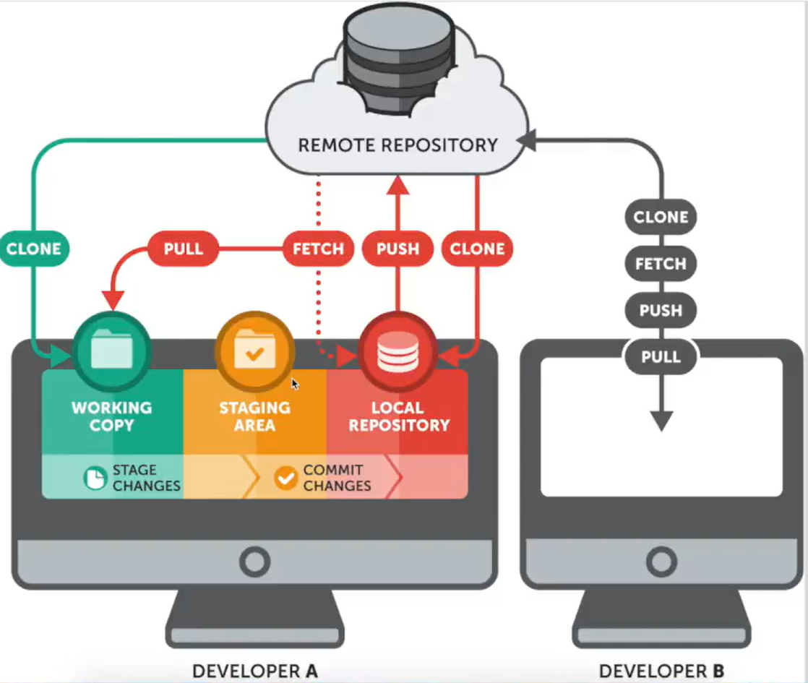

# GIT

- Git bir versiyon kontrol sistemidir. Genel olarak yedek almak için kullanılır.

- Uzak repository hizmeti veren hizmetler Github, Gitlab vs.

## Terminal Komutları

<code> pwd  
        ls, -a  
        cd  
        mkdir  
        touch  
        code          
</code>

## Git Komutları

- Folder reposu oluşturma ve .git file'ını foldera eklemek.
  - <code>git init</code>
- Commit ettiğimiz, yani local repository'e attığımız ve çalışma alanımızın arasındaki değişiklikleri gösterir. Çalıştığımız branch'i gösterir.
  - <code>git status</code>
- Commit edilmemiş dosyayı, ya da modified yapılmış dosyayı, git'e ekler.
  - <code>git add</code>
  - Hepsini birden göndermek için
    - <code> git add . </code>
- Staging area'da bulunmasını istemediğimiz dosyaları, çalışma alanımıza, untracked files listesinin altına döndürebileceğimiz.
  - <code> git rm --cached index.html </code>
- Staging area'dan local repository'e dosyamızı nasıl kaydedeceğimiz.
  - git commit -m "message"
- Mesajı değiştirmek istediğimizde
  - git commit --amend -m "eksflksfl"
- Komutu ekrana yazdırma
  - git log
  - git log --oneline
- Eski bir commite geri dönmek için;
  - git reset _commit_id --hard
    - hard bayrağı sürümlerin hepsini siler
  - git reset _commit_id --soft
    - soft olduğu için silinen commitleri stage areaya atar.
- Versiyondakileri geri döndürmek istiyorsak;
  - git revert _commit_id 

## Branches

Branch, dal anlamındadır. Neden kullanırız?

- Genellikle projemizde bazı değişiklikler yapıcak ve bu değişiklikler sonucunda yaptığımız işlemlerin işe yarar ya da çalışır olup olmadığını kontrol edeceğimiz durumlarda yaparız.
   - Bir branch oluştururuz, değişiklikleri buraya pushlarız ve bir sorun yoksa master branch'iyle birleştiririz.
   
- git branch dev_branch
- git branch -a 
- git checkout dev_branch
- git checkout -b feature_branch

- git checkout master
- git checkout -b feature_v2
- git branch -d dev_branch or -D will force it.

- git checkout master
- git merge feature_1
- git log --oneline

## Push

- git push ___link_ branch_name 

- git remote add origin __link 
- git remote -v

- git clone 

## Github Fork & Pull Request

Bir public repository'i kendi profilimize kopyalamaya fork diyoruz. Owner olarak biz oluyoruz.

- git clone ile repoyu çekebiliriz.
- Yaptığımız değişiklikleri git add . ile staging area'ya atabiliriz.
- git commit ile atıyoruz.
- git remote -v
- git push origin _branch_name

Sonrasında orjinal repository'de bir değişiklik olmuyor, fakat bizim repomuzda değişiklik oluyor. Sonrasında create pull request ile orjinal repository'e bir request gönderebiliyoruz. O koda katkı sağlayabiliyoruz.

Orjinal reponun sahibi de bu pull request'i görebiliyor, review changes'le değişiklik yapılmasını isteyebiliyor, veya isterse merge ederek repositorysine çekebiliyor.

## Git Fetch & Pull

Temelde ikisi de ufak repoda hali hazırda bulunan farklılıkları gidermek için kullanılan komutlardır.

- Fetch, çalışma alanımıza uzak repository'den varolan bütün bilgileri getirir ve referans olarak kaydeder. Branch'ler olarak bulunur, istersek merge ile birleştirebiliriz.

- Pull komutu ise, repo ve çalışma dizini arasındaki farklılıkları algılar ve farklı olan dosyaları indirir, çalışma alanımızı en güncel hale getirir.

- git push origin master dediğimiz zaman repoda fazladan commit gördüğünzde önce güncellemen gerekiyor diyor.

  - git fetch origin ile bunu çekebiliyoruz.
  - git branch -a ile ise tüm branchları geitiryo,
  - git merge origin/master dediğimizde ise dosyalar birleşiyor, ve değişiyorlar.

- git pull origin master dersek ise getirecek ve branchları birleştirecek.

## Stash

Commit ederek, local repoya işlediğimizden farklı bir alan olarak tanımlanır.

- Genelde bi projede çalışırken, farklı bir alanda değişiklik yapacakken stash komutuyla farklı bir dosyada değişiklikler yapmak istediğimizde, bunu bir versiyon olarak kaydetmek istemeyeceğimiz için stash komutuyla yaparız.

- Birden fazla dev çalışıyorsa, dosyadaki değişiklikleri çalışma alanımıza kaydetmemiz gerekiyo, öncelikle a dosyasında yaptığımız değişiklikleri stash komutuyla belli bir alanda saklarız, sonrasında pull komutuyla uzak repodan son güncellemeyle çekeriz, sonrasında ise stash komutuyla en güncel versiyondaki yaptığımız değişiklikleri de kaybetmemiş oluruz.

- bir değişiklik yaptık.
- git stash save "changed file"
- git stash list
- git stash save "changed file v2"

> stash save yaptığımzda değişikliğimiz kaybolur.

- git stash show -p 
- git stash drop
- git stash pop -> ile çalışma alanımıza geri gelir.
  - id'si 0 olan gelir. Yani son atadığımız, fakat 1, 2 yazarak diğerlerini de getirebiliriz.

## git Alias

Bu komut kullandığımız git komutlarını kısaltmak için kullanılan bir komut.

- Config dosyamıza alias adında komutlar işlemek.

- git config --global alias.st status
  - yaptığımız zaman st komutu status komutu yerine geliyor.

- git config --global alias.co 'commit -m'
  - dersek co "message" diyerek -m flagi kullanmayabiliriz.

- git config list

## git Diff

Değişiklikleri nasıl geri alacağımızı ve listeleyeceğimiz komut.

- git statusle değişiklikleri görebiliriz.
- git checkout -- yazi.txt yapsak yazi.txt'dekiler geçmiş konumuna döner.

- yine bir değişiklik yaptığımız zaman,
- nasıl bir değişiklik olduğunu görmek için git diff yazarak, neyin değiştiğini görebiliriz. 

## git remove

- git rm test.txt dersek siler.
- git staus yaptığımızda deleted olarak gösterir.
- -r klasör ve içindekiler siler.

## git move

- Move özelliği iki işe yarar, dosya taşır ve isim değiştirebilir.

- git mv deneme.txt test.txt
  - ismini değiştirir.

- git mv test.txt ./folder/
  - dosyayı başka bir klasöre taşır.