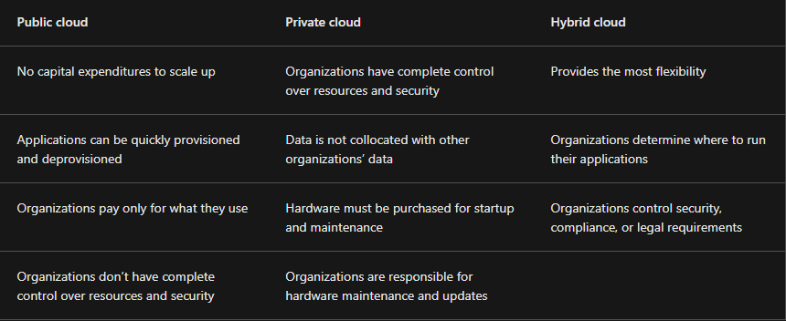

# Microsoft Certified: Azure Fundamentals (AZ-900)

Demonstrate foundational knowledge of cloud concepts, core Azure services, plus Azure management and governance features and tools.

You can describe Azure architectural components and Azure services, such as:

- Compute
- Networking
- Storage

You can also describe features and tools to secure, govern, and administer Azure.

## Describe Cloud Computing

### Introduction to cloud computing

Cloud computing is the delivery of computing services over the internet. Computing services include common IT infrastructure such as virtual machines, storage, databases, and networking.

Because cloud computing uses the internet to deliver these services, it doesn’t have to be constrained by physical infrastructure the same way that a traditional datacenter is. That means if you need to increase your IT infrastructure rapidly, you don’t have to wait to build a new datacenter—you can use the cloud to rapidly expand your IT footprint.

In cloud computing the PC is in a cloud provider's data center instead of phisically with you. This lets you pay for only the services you use, plus someone else gets to manage the upkeep of the computer. Basic services provided by cloud providers are compute power and storage. 

Compute power is how much processing your computer can do. For example, when buying a home computer, you may choose RAM, processor, then it slows down. With cloud computing you can add and remove compute power as you needed. This saves on cost since you only pay for the resources you use.

Storage is the volume of data you can store on your computer. Over time you need to buy another hard drive to store more data. In cloud computing you can request more storage as you need it. 

Cloud providers manage the upkeep of the computer so you don't have to. They will make sure that therea are backups, that the OS is up to date, as well as making sure that everything is up and running 24 hours a day. As your business grows and your computing needs change, you can quickly bring on new computing resources in a cost effective way.

### Describe the shared responsibility model

Start with a traditional corporate datacenter. The company is responsible for maintaining the physical space, ensuring security, and maintaining or replacing the servers if anything happens. The IT department is responsible for maintaining all the infrastructure and software needed to keep the datacenter up and running. They’re also likely to be responsible for keeping all systems patched and on the correct version.

With the shared responsibility model, these responsibilities get shared between the cloud provider and the consumer. Physical security, power, cooling, and network connectivity are the responsibility of the cloud provider. The consumer isn’t collocated with the datacenter, so it wouldn’t make sense for the consumer to have any of those responsibilities. The consumer is also responsible for access security, meaning you only give access to those who need it.

Then, for some things, the responsibility depends on the situation. If you’re using a cloud SQL database, the cloud provider would be responsible for maintaining the actual database. However, you’re still responsible for the data that gets ingested into the database. If you deployed a virtual machine and installed an SQL database on it, you’d be responsible for database patches and updates, as well as maintaining the data and information stored in the database.

When using a cloud provider, you’ll always be responsible for:
- The information and data stored in the cloud
- Devices that are allowed to connect to your cloud (cell phones, computers, and so on)
- The accounts and identities of the people, services, and devices within your organization

The cloud provider is always responsible for:
- The physical datacenter
- The physical network
- The physical hosts

Your service model will determine responsibility for things like:
- Operating systems
- Network controls
- Applications
- Identity and infrastructure

### Define cloud models

The cloud models define the deployment type of cloud resources. The three main cloud models are: private, public, and hybrid.

#### Private cloud

A private cloud is, in some ways, the natural evolution from a corporate datacenter. It’s a cloud (delivering IT services over the internet) that’s used by a single entity. Private cloud provides much greater control for the company and its IT department. However, it also comes with greater cost and fewer of the benefits of a public cloud deployment. Finally, a private cloud may be hosted from your on site datacenter. It may also be hosted in a dedicated datacenter offsite, potentially even by a third party that has dedicated that datacenter to your company.

#### Public cloud

A public cloud is built, controlled, and maintained by a third-party cloud provider. With a public cloud, anyone that wants to purchase cloud services can access and use resources. The general public availability is a key difference between public and private clouds.

#### Hybrid cloud

A hybrid cloud is a computing environment that uses both public and private clouds in an inter-connected environment. A hybrid cloud environment can be used to allow a private cloud to surge for increased, temporary demand by deploying public cloud resources. Hybrid cloud can be used to provide an extra layer of security. For example, users can flexibly choose which services to keep in public cloud and which to deploy to their private cloud infrastructure.

#### Azure Arc

Azure Arc is a set of technologies that helps manage your cloud environment. Azure Arc can help manage your cloud environment, whether it's a public cloud solely on Azure, a private cloud in your datacenter, a hybrid configuration, or even a multi-cloud environment running on multiple cloud providers at once.

### Describe the consumption-based model

When comparing IT infrastructure models, there are two types of expenses to consider. Capital expenditure (CapEx) and operational expenditure (OpEx).

CapEx is typically a one-time, up-front expenditure to purchase or secure tangible resources. A new building, repaving the parking lot, building a datacenter, or buying a company vehicle are examples of CapEx.

In contrast, OpEx is spending money on services or products over time. Renting a convention center, leasing a company vehicle, or signing up for cloud services are all examples of OpEx.

Cloud computing falls under OpEx because cloud computing operates on a consumption-based model. With cloud computing, you don’t pay for the physical infrastructure, the electricity, the security, or anything else associated with maintaining a datacenter. Instead, you pay for the IT resources you use. If you don’t use any IT resources this month, you don’t pay for any IT resources.

This consumption-based model has many benefits, including:
- No upfront costs.
- No need to purchase and manage costly infrastructure that users might not use to its fullest potential.
- The ability to pay for more resources when they're needed.
- The ability to stop paying for resources that are no longer needed.

With a traditional datacenter, you try to estimate the future resource needs. If you overestimate, you spend more on your datacenter than you need to and potentially waste money. If you underestimate, your datacenter will quickly reach capacity and your applications and services may suffer from decreased performance. Fixing an under-provisioned datacenter can take a long time. You may need to order, receive, and install more hardware. You'll also need to add power, cooling, and networking for the extra hardware.

In a cloud-based model, you don’t have to worry about getting the resource needs just right. If you find that you need more virtual machines, you add more. If the demand drops and you don’t need as many virtual machines, you remove machines as needed. Either way, you’re only paying for the virtual machines that you use, not the “extra capacity” that the cloud provider has on hand.

- Plan and manage your operating costs.
- Run your infrastructure more efficiently.
- Scale as your business needs change.

To put it another way, cloud computing is a way to rent compute power and storage from someone else’s datacenter. You can treat cloud resources like you would resources in your own datacenter. However, unlike in your own datacenter, when you're done using cloud resources, you give them back. You’re billed only for what you use.

Instead of maintaining CPUs and storage in your datacenter, you rent them for the time that you need them. The cloud provider takes care of maintaining the underlying infrastructure for you. The cloud enables you to quickly solve your toughest business challenges and bring cutting-edge solutions to your users.