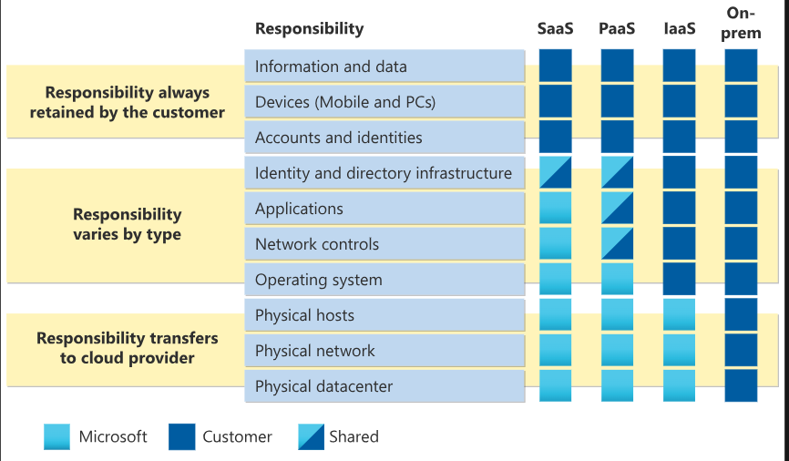

# Microsoft Certified: Azure Fundamentals (AZ-900)

Demonstrate foundational knowledge of cloud concepts, core Azure services, plus Azure management and governance features and tools.

You can describe Azure architectural components and Azure services, such as:

- Compute
- Networking
- Storage

You can also describe features and tools to secure, govern, and administer Azure.

## Describe Cloud Computing

### Introduction to cloud computing

Cloud computing is the delivery of computing services over the internet. Computing services include common IT infrastructure such as virtual machines, storage, databases, and networking.

Because cloud computing uses the internet to deliver these services, it doesn’t have to be constrained by physical infrastructure the same way that a traditional datacenter is. That means if you need to increase your IT infrastructure rapidly, you don’t have to wait to build a new datacenter—you can use the cloud to rapidly expand your IT footprint.

In cloud computing the PC is in a cloud provider's data center instead of phisically with you. This lets you pay for only the services you use, plus someone else gets to manage the upkeep of the computer. Basic services provided by cloud providers are compute power and storage. 

Compute power is how much processing your computer can do. For example, when buying a home computer, you may choose RAM, processor, then it slows down. With cloud computing you can add and remove compute power as you needed. This saves on cost since you only pay for the resources you use.

Storage is the volume of data you can store on your computer. Over time you need to buy another hard drive to store more data. In cloud computing you can request more storage as you need it. 

Cloud providers manage the upkeep of the computer so you don't have to. They will make sure that therea are backups, that the OS is up to date, as well as making sure that everything is up and running 24 hours a day. As your business grows and your computing needs change, you can quickly bring on new computing resources in a cost effective way.

### Describe the shared responsibility model

Start with a traditional corporate datacenter. The company is responsible for maintaining the physical space, ensuring security, and maintaining or replacing the servers if anything happens. The IT department is responsible for maintaining all the infrastructure and software needed to keep the datacenter up and running. They’re also likely to be responsible for keeping all systems patched and on the correct version.

With the shared responsibility model, these responsibilities get shared between the cloud provider and the consumer. Physical security, power, cooling, and network connectivity are the responsibility of the cloud provider. The consumer isn’t collocated with the datacenter, so it wouldn’t make sense for the consumer to have any of those responsibilities. The consumer is also responsible for access security, meaning you only give access to those who need it.

Then, for some things, the responsibility depends on the situation. If you’re using a cloud SQL database, the cloud provider would be responsible for maintaining the actual database. However, you’re still responsible for the data that gets ingested into the database. If you deployed a virtual machine and installed an SQL database on it, you’d be responsible for database patches and updates, as well as maintaining the data and information stored in the database.

When using a cloud provider, you’ll always be responsible for:
- The information and data stored in the cloud
- Devices that are allowed to connect to your cloud (cell phones, computers, and so on)
- The accounts and identities of the people, services, and devices within your organization

The cloud provider is always responsible for:
- The physical datacenter
- The physical network
- The physical hosts

Your service model will determine responsibility for things like:
- Operating systems
- Network controls
- Applications
- Identity and infrastructure

### Define cloud models

The cloud models define the deployment type of cloud resources. The three main cloud models are: private, public, and hybrid.

#### Private cloud

A private cloud is, in some ways, the natural evolution from a corporate datacenter. It’s a cloud (delivering IT services over the internet) that’s used by a single entity. Private cloud provides much greater control for the company and its IT department. However, it also comes with greater cost and fewer of the benefits of a public cloud deployment. Finally, a private cloud may be hosted from your on site datacenter. It may also be hosted in a dedicated datacenter offsite, potentially even by a third party that has dedicated that datacenter to your company.

#### Public cloud

A public cloud is built, controlled, and maintained by a third-party cloud provider. With a public cloud, anyone that wants to purchase cloud services can access and use resources. The general public availability is a key difference between public and private clouds.

#### Hybrid cloud

A hybrid cloud is a computing environment that uses both public and private clouds in an inter-connected environment. A hybrid cloud environment can be used to allow a private cloud to surge for increased, temporary demand by deploying public cloud resources. Hybrid cloud can be used to provide an extra layer of security. For example, users can flexibly choose which services to keep in public cloud and which to deploy to their private cloud infrastructure.

#### Azure Arc

Azure Arc is a set of technologies that helps manage your cloud environment. Azure Arc can help manage your cloud environment, whether it's a public cloud solely on Azure, a private cloud in your datacenter, a hybrid configuration, or even a multi-cloud environment running on multiple cloud providers at once.

### Describe the consumption-based model

When comparing IT infrastructure models, there are two types of expenses to consider. Capital expenditure (CapEx) and operational expenditure (OpEx).

CapEx is typically a one-time, up-front expenditure to purchase or secure tangible resources. A new building, repaving the parking lot, building a datacenter, or buying a company vehicle are examples of CapEx.

In contrast, OpEx is spending money on services or products over time. Renting a convention center, leasing a company vehicle, or signing up for cloud services are all examples of OpEx.

Cloud computing falls under OpEx because cloud computing operates on a consumption-based model. With cloud computing, you don’t pay for the physical infrastructure, the electricity, the security, or anything else associated with maintaining a datacenter. Instead, you pay for the IT resources you use. If you don’t use any IT resources this month, you don’t pay for any IT resources.

This consumption-based model has many benefits, including:
- No upfront costs.
- No need to purchase and manage costly infrastructure that users might not use to its fullest potential.
- The ability to pay for more resources when they're needed.
- The ability to stop paying for resources that are no longer needed.

With a traditional datacenter, you try to estimate the future resource needs. If you overestimate, you spend more on your datacenter than you need to and potentially waste money. If you underestimate, your datacenter will quickly reach capacity and your applications and services may suffer from decreased performance. Fixing an under-provisioned datacenter can take a long time. You may need to order, receive, and install more hardware. You'll also need to add power, cooling, and networking for the extra hardware.

In a cloud-based model, you don’t have to worry about getting the resource needs just right. If you find that you need more virtual machines, you add more. If the demand drops and you don’t need as many virtual machines, you remove machines as needed. Either way, you’re only paying for the virtual machines that you use, not the “extra capacity” that the cloud provider has on hand.

- Plan and manage your operating costs.
- Run your infrastructure more efficiently.
- Scale as your business needs change.

To put it another way, cloud computing is a way to rent compute power and storage from someone else’s datacenter. You can treat cloud resources like you would resources in your own datacenter. However, unlike in your own datacenter, when you're done using cloud resources, you give them back. You’re billed only for what you use.

Instead of maintaining CPUs and storage in your datacenter, you rent them for the time that you need them. The cloud provider takes care of maintaining the underlying infrastructure for you. The cloud enables you to quickly solve your toughest business challenges and bring cutting-edge solutions to your users.

## Describe the Benefits of Using Cloud Services

In this module, you’ll be introduced to some of the benefits that cloud computing offers. You’ll learn how cloud computing can help you meet variable demand while providing a good experience for your customer. You’ll also learn about security, governance, and overall manageability in the cloud.

### Describe the benefits of high availability and scalability in the cloud

When building or deploying a cloud application, two of the biggest considerations are uptime (or availability) and the ability to handle demand (or scale).

#### High availability

When you’re deploying an application, a service, or any IT resources, it’s important the resources are available when needed. High availability focuses on ensuring maximum availability, regardless of disruptions or events that may occur.

When you’re architecting your solution, you’ll need to account for service availability guarantees. Azure is a highly available cloud environment with uptime guarantees depending on the service. These guarantees are part of the service-level agreements (SLAs).

##### **Azure Service Level Agreements (SLA)**

It is the formal agreement between a service provider and customer that guarantees the customer a stated level of service. The service provider may be a commercial company providing the service, like Microsoft, SLAs are also used inside organizations, in an agreement between the IT department and the business users. 

If the service was always available to use, you would say it was 100% available or it had 100% up time. An SLA also commonly includes details like what is defined as down time, when the service is unavailable and any credit you may be entitle to if the SLA is not met. In reality 100% up time is difficult and expensive to achive, because it allows no time for taking the service down for required maintenance or upgrades. It would also require duplicating every single component in case one component failed and would require those backup components to pick up the service tasks with zero interruption to the customer. For these reasons, SLAs of 99% is more common. A service with a 99& SLA percentage can be unavailable for up to 1.6 hours per week or 7.2 hours per month and still be 99% available. That time is cumulative which means it can be added up over multiple incidents of the service being unavailable. A service with the 99.9% SLA can be unavailable for only 10 minutes per week or 43.2 minutes per month. If the service is critical to your business, minutes versus hours of down time can make a big difference but highly available services do come at an extra cost. 

#### Scalability

Another major benefit of cloud computing is the scalability of cloud resources. Scalability refers to the ability to adjust resources to meet demand. If you suddenly experience peak traffic and your systems are overwhelmed, the ability to scale means you can add more resources to better handle the increased demand.

The other benefit of scalability is that you aren't overpaying for services. Because the cloud is a consumption-based model, you only pay for what you use. If demand drops off, you can reduce your resources and thereby reduce your costs.

Scaling generally comes in two varieties: vertical and horizontal. Vertical scaling is focused on increasing or decreasing the capabilities of resources. Horizontal scaling is adding or subtracting the number of resources.

##### **Vertical scaling**

With vertical scaling, if you were developing an app and you needed more processing power, you could vertically scale up to add more CPUs or RAM to the virtual machine. Conversely, if you realized you had over-specified the needs, you could vertically scale down by lowering the CPU or RAM specifications.

##### **Horizontal scaling**

With horizontal scaling, if you suddenly experienced a steep jump in demand, your deployed resources could be scaled out (either automatically or manually). For example, you could add additional virtual machines or containers, scaling out. In the same manner, if there was a significant drop in demand, deployed resources could be scaled in (either automatically or manually), scaling in.

### Describe the benefits of reliability and predictability in the cloud

Reliability and predictability are two crucial cloud benefits that help you develop solutions with confidence.

#### Reliability

Reliability is the ability of a system to recover from failures and continue to function. It's also one of the pillars of the Microsoft Azure Well-Architected Framework.

The cloud, by virtue of its decentralized design, naturally supports a reliable and resilient infrastructure. With a decentralized design, the cloud enables you to have resources deployed in regions around the world. With this global scale, even if one region has a catastrophic event other regions are still up and running. You can design your applications to automatically take advantage of this increased reliability. In some cases, your cloud environment itself will automatically shift to a different region for you, with no action needed on your part. You’ll learn more about how Azure leverages global scale to provide reliability later in this series.

#### Predictability

Predictability in the cloud lets you move forward with confidence. Predictability can be focused on performance predictability or cost predictability. **Both performance and cost predictability are heavily influenced by the Microsoft Azure Well-Architected Framework**. Deploy a solution built around this framework and you have a solution whose cost and performance are predictable.

##### **Performance**

Performance predictability focuses on predicting the resources needed to deliver a positive experience for your customers. Autoscaling, load balancing, and high availability are just some of the cloud concepts that support performance predictability. If you suddenly need more resources, autoscaling can deploy additional resources to meet the demand, and then scale back when the demand drops. Or if the traffic is heavily focused on one area, load balancing will help redirect some of the overload to less stressed areas.

#### **Cost**

Cost predictability is focused on predicting or forecasting the cost of the cloud spend. With the cloud, you can track your resource use in real time, monitor resources to ensure that you’re using them in the most efficient way, and apply data analytics to find patterns and trends that help better plan resource deployments. By operating in the cloud and using cloud analytics and information, you can predict future costs and adjust your resources as needed. You can even use tools like the Total Cost of Ownership (TCO) or Pricing Calculator to get an estimate of potential cloud spend.

### Describe the benefits of security and governance in the cloud

Whether you’re deploying infrastructure as a service or software as a service, cloud features support governance and compliance. Things like set templates help ensure that all your deployed resources meet corporate standards and government regulatory requirements. Plus, you can update all your deployed resources to new standards as standards change. Cloud-based auditing helps flag any resource that’s out of compliance with your corporate standards and provides mitigation strategies. Depending on your operating model, software patches and updates may also automatically be applied, which helps with both governance and security.

On the security side, you can find a cloud solution that matches your security needs. If you want maximum control of security, infrastructure as a service provides you with physical resources but lets you manage the operating systems and installed software, including patches and maintenance. If you want patches and maintenance taken care of automatically, platform as a service or software as a service deployments may be the best cloud strategies for you.

### Describe the benefits of manageability in the cloud

A major benefit of cloud computing is the manageability options. There are two types of manageability for cloud computing that you’ll learn about in this series, and both are excellent benefits.

#### Management of the cloud

Management of the cloud speaks to managing your cloud resources. In the cloud, you can:
- Automatically scale resource deployment based on need.
- Deploy resources based on a preconfigured template, removing the need for manual configuration.
- Monitor the health of resources and automatically replace failing resources.
- Receive automatic alerts based on configured metrics, you are aware of performance in real time.

#### Management in the cloud

Management in the cloud speaks to how you’re able to manage your cloud environment and resources. You can manage these:
- Through a web portal.
- Using a command line interface.
- Using APIs.

## Describe Cloud Service Types

- Describe infrastructure as a service (IaaS).
- Describe platform as a service (PaaS).
- Describe software as a service (SaaS).

### Infrastructure as a Service

Infrastructure as a service (IaaS) is the most flexible category of cloud services, as it provides you the maximum amount of control for your cloud resources. In an IaaS model, the cloud provider is responsible for maintaining the hardware, network connectivity (to the internet), and physical security. You’re responsible for everything else: operating system installation, configuration, and maintenance; network configuration; database and storage configuration; and so on. With IaaS, you’re essentially renting the hardware in a cloud datacenter, but what you do with that hardware is up to you.

> With an IaaS service type, you can approximate your on-premises environment, making a lift-and-shift transition to the cloud relatively straightforward.

#### Shared responsibility model

The shared responsibility model applies to all the cloud service types. IaaS places the largest share of responsibility with you. The cloud provider is responsible for maintaining the physical infrastructure and its access to the internet. You’re responsible for installation and configuration, patching and updates, and security.

Some common scenarios where IaaS might make sense include:
- **Lift-and-shift migration:** You’re setting up cloud resources similar to your on-prem datacenter, and then simply moving the things running on-prem to running on the IaaS infrastructure.
- **Testing and development:** You have established configurations for development and test environments that you need to rapidly replicate. You can start up or shut down the different environments rapidly with an IaaS structure, while maintaining complete control.

### Platform as a Service

PaaS splits the responsibility between you and the cloud provider. The cloud provider is responsible for maintaining the physical infrastructure and its access to the internet, just like in IaaS. In the PaaS model, the cloud provider will also maintain the operating systems, databases, and development tools. Think of PaaS like using a domain joined machine: IT maintains the device with regular updates, patches, and refreshes.

Some common scenarios where PaaS might make sense include:
- **Development framework:** PaaS provides a framework that developers can build upon to develop or customize cloud-based applications. Similar to the way you create an Excel macro, PaaS lets developers create applications using built-in software components. Cloud features such as scalability, high-availability, and multi-tenant capability are included, reducing the amount of coding that developers must do.
- **Analytics or business intelligence:** Tools provided as a service with PaaS allow organizations to analyze and mine their data, finding insights and patterns and predicting outcomes to improve forecasting, product design decisions, investment returns, and other business decisions.

### Software as a Service

Software as a service (SaaS) is the most complete cloud service model from a product perspective. With SaaS, you’re essentially renting or using a fully developed application. Email, financial software, messaging applications, and connectivity software are all common examples of a SaaS implementation.

SaaS is the model that places the most responsibility with the cloud provider and the least responsibility with the user. In a SaaS environment you’re responsible for the data that you put into the system, the devices that you allow to connect to the system, and the users that have access. Nearly everything else falls to the cloud provider.

> SaaS provides access to software solutions, such as finance and expense tracking, email, or ticketing systems.

Some common scenarios for SaaS are:
- Email and messaging
- Business productivity applications
- Finance and expence tracking