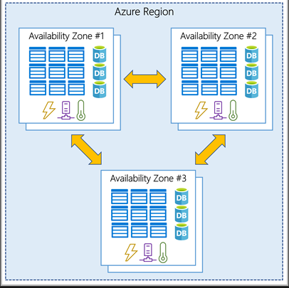
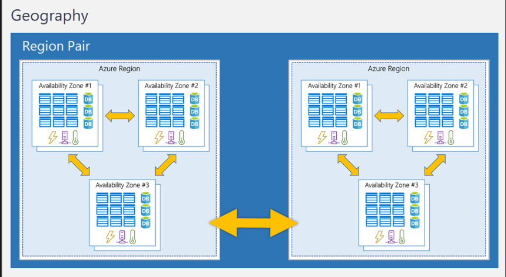
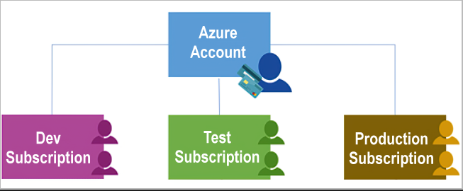
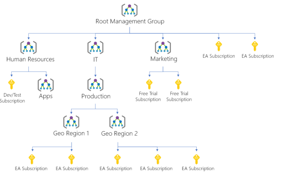

# Core Architectural Components of Azure

Azure is Microsoft's cloud computing platform with an ever expanding set of services to help you build solutions to meet your business goals. Services such as VMs running in the Cloud, website and database hosting, and advanced computing services like AI, ML and IoT.

Azure Container Instances and Azure Kubernetes Service allow you to deploy containerized applications with fully managed services. Azure offers a choice of fully managed relational and in-memory databases, spanning proprietary and open source engines, and Microsoft's Cosmos DB provides support for several popular NoSQL APIs.

Azure offer **Limitless Innovation**. Build intelligent apps and solutions with advanced technology, tools, and services to take your business to the next level. Seamlessly unify your technology to simplify platform management and to deliver innovations efficiently and securely on a trusted cloud.

### Learn Sandbox - PowerShell CLI - Bash CLI

```sh
az version
az upgrade
az interactive
```

Once interactive initialized, you can use the arrow keys or tab to help complete your command. Interactive mode is set up specifically for Azure, so you don't need to enter az to start a command.

```sh
version
upgrade
exit # Use the exit command to leave interactive mode.
```

## Azure Physical Infrastructure

Throughout your journey with Microsoft Azure, you’ll hear and use terms like Regions, Availability Zones, Resources, Subscriptions, and more. This module focuses on the core architectural components of Azure. The core architectural components of Azure may be broken down into two main groupings: the physical infrastructure, and the management infrastructure.

### Physical infrastructure

The physical infrastructure for Azure starts with datacenters. Conceptually, the datacenters are the same as large corporate datacenters. They’re facilities with resources arranged in racks, with dedicated power, cooling, and networking infrastructure.

As a global cloud provider, Azure has datacenters around the world. However, these individual datacenters aren’t directly accessible. Datacenters are grouped into Azure Regions or Azure Availability Zones that are designed to help you achieve resiliency and reliability for your business-critical workloads.

#### Regions

A region is a geographical area on the planet that contains at least one, but potentially multiple datacenters that are nearby and networked together with a low-latency network. Azure intelligently assigns and controls the resources within each region to ensure workloads are appropriately balanced.

#### Availability Zones

Availability zones are physically separate datacenters within an Azure region. Each availability zone is made up of one or more datacenters equipped with independent power, cooling, and networking. An availability zone is set up to be an isolation boundary. If one zone goes down, the other continues working. Availability zones are connected through high-speed, private fiber-optic networks.



You want to ensure your services and data are redundant so you can protect your information in case of failure. When you host your infrastructure, setting up your own redundancy requires that you create duplicate hardware environments. Azure can help make your app highly available through availability zones.

You can use availability zones to run mission-critical applications and build high-availability into your application architecture by co-locating your compute, storage, networking, and data resources within an availability zone and replicating in other availability zones. Keep in mind that there could be a cost to duplicating your services and transferring data between availability zones.

Availability zones are primarily for VMs, managed disks, load balancers, and SQL databases. Azure services that support availability zones fall into three categories:
- **Zonal Services:** You pin the resource to a specific zone (for example, VMs, managed disks, IP addresses).
- **Zone-redundant Services:** The platform replicates automatically across zones (for example, zone-redundant storage, SQL Database).
- **Non-regional Services:** Services are always available from Azure geographies and are resilient to zone-wide outages as well as region-wide outages.

#### Region pairs

Most Azure regions are paired with another region within the same geography (such as US, Europe, or Asia) at least 300 miles away. This approach allows for the replication of resources across a geography that helps reduce the likelihood of interruptions because of events such as natural disasters, civil unrest, power outages, or physical network outages that affect an entire region. For example, if a region in a pair was affected by a natural disaster, services would automatically fail over to the other region in its region pair.

> Not all Azure services automatically replicate data or automatically fall back from a failed region to cross-replicate to another enabled region. In these scenarios, recovery and replication must be configured by the customer.

Examples of region pairs in Azure are West US paired with East US and South-East Asia paired with East Asia. Because the pair of regions are directly connected and far enough apart to be isolated from regional disasters, you can use them to provide reliable services and data redundancy.



## Azure Management Infrastructure

The management infrastructure includes Azure resources and resource groups, subscriptions, and accounts. Understanding the hierarchical organization will help you plan your projects and products within Azure.

### Azure Resources and Resource Groups

A resource is the basic building block of Azure. Anything you create, provision, deploy, etc. is a resource. Virtual Machines (VMs), virtual networks, databases, cognitive services, etc. are all considered resources within Azure.

Resource groups are simply groupings of resources. When you create a resource, you’re required to place it into a resource group. While a resource group can contain many resources, a single resource can only be in one resource group at a time. Some resources may be moved between resource groups, but when you move a resource to a new group, it will no longer be associated with the former group. Additionally, resource groups can't be nested, meaning you can’t put resource group B inside of resource group A.

Resource groups provide a convenient way to group resources together. When you apply an action to a resource group, that action will apply to all the resources within the resource group. If you delete a resource group, all the resources will be deleted. If you grant or deny access to a resource group, you’ve granted or denied access to all the resources within the resource group.

When you’re provisioning resources, it’s good to think about the resource group structure that best suits your needs.

### Azure Subscriptions

In Azure, subscriptions are a unit of management, billing, and scale. Similar to how resource groups are a way to logically organize resources, subscriptions allow you to logically organize your resource groups and facilitate billing.



An account can have multiple subscriptions, but it’s only required to have one. In a multi-subscription account, you can use the subscriptions to configure different billing models and apply different access-management policies. You can use Azure subscriptions to define boundaries around Azure products, services, and resources. There are two types of subscription boundaries that you can use:
- **Billing boundary:** his subscription type determines how an Azure account is billed for using Azure. You can create multiple subscriptions for different types of billing requirements. Azure generates separate billing reports and invoices for each subscription so that you can organize and manage costs.
- **Access Control Boundary:** Azure applies access-management policies at the subscription level, and you can create separate subscriptions to reflect different organizational structures. An example is that within a business, you have different departments to which you apply distinct Azure subscription policies. This billing model allows you to manage and control access to the resources that users provision with specific subscriptions.

You might choose to create additional subscriptions to separate:
- **Environments:** You can choose to create subscriptions to set up separate environments for development and testing, security, or to isolate data for compliance reasons. This design is particularly useful because resource access control occurs at the subscription level.
- **Organizational structures:** You can create subscriptions to reflect different organizational structures. For example, you could limit one team to lower-cost resources, while allowing the IT department a full range. This design allows you to manage and control access to the resources that users provision within each subscription.
- **Billing:** You can create additional subscriptions for billing purposes. Because costs are first aggregated at the subscription level, you might want to create subscriptions to manage and track costs based on your needs. For instance, you might want to create one subscription for your production workloads and another subscription for your development and testing workloads.

> Management groups give you enterprise-grade management at a large scale, no matter what type of subscriptions you might have. Management groups can be nested.

#### *Management group, subscriptions, and resource group hierarchy*

You can build a flexible structure of management groups and subscriptions to organize your resources into a hierarchy for unified policy and access management. The following diagram shows an example of creating a hierarchy for governance by using management groups.



Some examples of how you could use management groups might be:
- **Create a hierarchy that applies a policy.** You could limit VM locations to the US West Region in a group called Production. This policy will inherit onto all the subscriptions that are descendants of that management group and will apply to all VMs under those subscriptions. This security policy can't be altered by the resource or subscription owner, which allows for improved governance.

Important facts about management groups:
- 10,000 management groups can be supported in a single directory.
- A management group tree can support up to six levels of depth. This limit doesn't include the root level or the subscription level.
- Each management group and subscription can support only one parent.

### Sandbox - Create an Azure Resource

1. Create a virtual Machine
   1. Go Azure portal
   2. Create a resource > Compute > VM > Create
   3. Give details. > Review + Create
2. Verify Resources Created
   1. Select Home
   2. Resource Groups
   3. learn - resource group
3. Clean up
    - When you're working in your own subscription, it's a good idea at the end of a project to identify whether you still need the resources you created. Resources that you leave running can cost you money. You can delete resources individually or delete the resource group to delete the entire set of resources.

> A resource can only be in one group at a time.
> Resources inherit permissions from their resource group.
