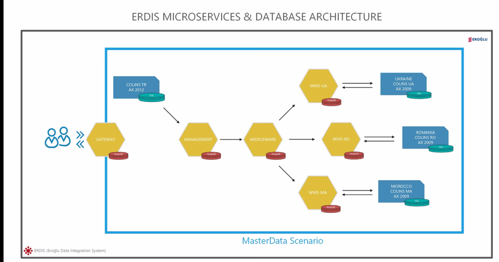
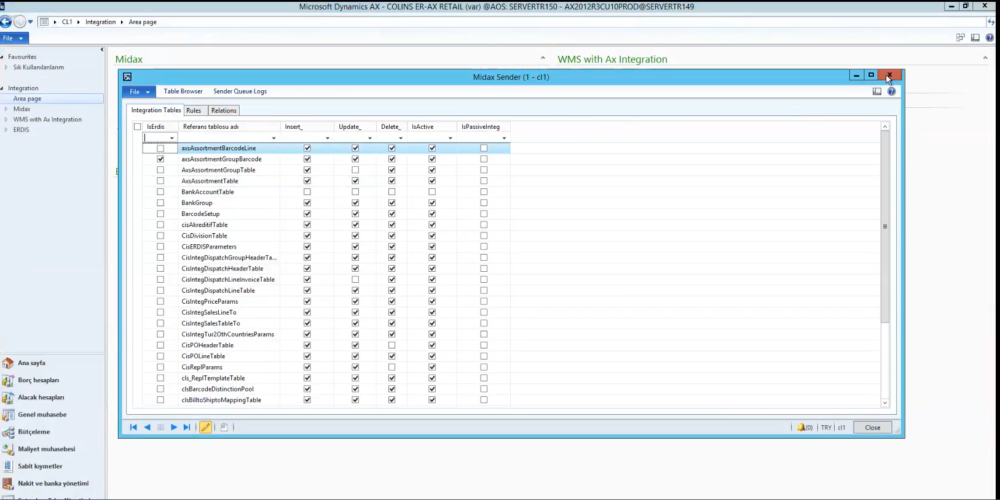
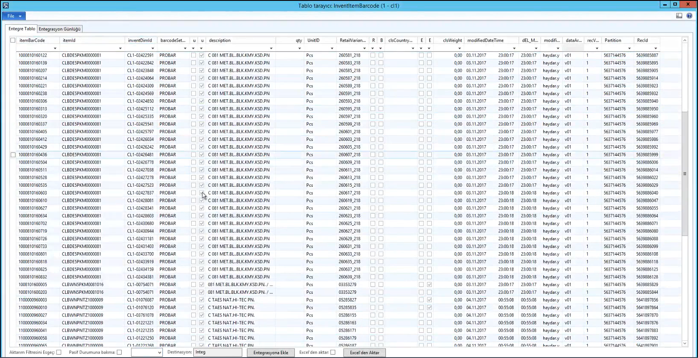

Colins TR AX 2012'den -> AX Erdis Queue'ya akan bir data var.

Barkod tamamen AX'da oluşuyor. RecordRefrecId AX'da oluşuyor.
ErdisSent, Management Worker aldı mı almadım mı boolean değeri.

## EMT

- Management ile Middleware arasındaki tüm iletişimi Kafka sağlıyor.
- Colins TR AX ile Management arası SQL sorgularıyla sağlanıyor.

Servisler 3 kısımdan oluşuyor, işleyen kısımlar worker ve service, client'a aktaran kısımlar API kısımları.

Servisler sürekli run edilmesi gereken yerler, schedule edilmesi gerekilen yerler bir repo olarak düşünüldü, API bacaklarını yazdığımız middleware katmanına gelen yerler ise servisin kendi adıyla yer alıyor.

Normalde 3 kısım, 3 ayrı microservice oluyor. Fakat microservice olarak 3'ünü birlikte almak daha doğru olur.

- Worker'la AX'daki datayı dinledik aldık, bu kısım Produce kısmı,
- Service taşımaya devam ediyor, Kafka'nın topiclerini dinliyorlar. Önce consume ediyor, sonra produce ediyor

Eğer ülkeye ait dataysa önce içeri kayıt edip hangi ülkeye gideceğine bakıyor, Master Data ise direkt middleware'e gönderiyor

---

Bizim bir Master data senaryomuz vardı, bu master data senaryosunda Colins TR AX 2012 database'inden bizim dinlediğimiz bir SP ile insert ve update'leri alarak management'a, management'tan middleware'e, middleware'den de dinleyecek ülkelerin kuyruklarına gönderiyorduk. Ufak bir API Queue yapısı vardı. Middleware ortada durup, ihtiyacı olan her yere bu datayı gönderiyordu.

Şimdi bunun biraz daha detayına gireceğiz.

### Colins 2012 AX TR Yapısı

Bizim burda Colins TR AX 2012'den akan master datalarımızın bulunduğu bir kuyruk yapısı var.

Burası bizim master data kaynağımızın bulunduğu ekran.

Midax sender olarak görünen kısım ise, AX üzerindeki tabloların insert veya update'lerini dinleyebildiğimiz ve bunları entegrasyon kuyruğuna aktarabildiğimiz kısım. Burada hangi parametreleri dinleyeceğimizi belirterek ve _isErdis_ parametresini aktif hale çekerek bunları bizim dinleyebileceğimiz hale getiriyoruz.

Mesela **InventItemBarcode** tablosuna bakalım.

Bu barkod tablosu üzerindeki bir barkod normal şartlarda entegrasyona eklendiği zaman (insert veya update aldığında), erdisIntegrationQueue'ya yeni bir kayıt ekleniyor. ErdisSent'i de false oluyor. Bu kayıt bizim tarafımızda dinlenmek üzere kuyrukta bekliyor. Daha sonrasında biz bir SP yardımıyla ErdisSent'i false olan dataları çekiyoruz.

> **RecId** dediğimiz kısım InventItemBarcode'daki tablonun AX üzerindeki unique ID'si. Açılımı Record ID.

> AX dediğimiz şey msSQL üzerine kurulmuş bir uygulama katmanı.

Ana data hep AX'da oluşuyor. Biz hep buradan data alışı yapıyoruz. ErdisIntegrationQueue'da biz RefTableName ve RecordRefRecId'ye bakarak bunun unique'liğini sağlarız.

---

Yukarıdaki ilk şemada Colinst TR AX 2012'den Management'a olan iletişim SQL sorgusu yani SP ile sağlanıyor. Management, Middleware gibi kalan tüm iletişim **kafka** kuyruklarıyla sağlanıyor. Zaten bunların her biri birer microservice, hatta birden fazla microservice. Kafka produce kısımları ayrı, Kafka consume kısımları ayrı birer servis. Kafka produce kısımlarında ayrıyeten datayı çeken yapılar da var.

- Servisler sürekli run edilmesi gereken yerler bizim için yönetmesi zor yerlerdi, onları birer container olarak düşündük.
- Schedule edilecek işler başka türlü yönetilmesi gerekilen işlerdi. Onları birer container olarak düşündük.
- Ek olarak, API bacaklarını yazdığımız, aslında her bir servisin middleware katmanına denk gelen yeri diye düşünebiliriz. Oralar da servisin kendi adıyla yer alıyor.

3'lülerin her birine microservice gibi bakıyoruz, fakat container olarak 3 ayrı container olarak çalışıyorlar.

---

Management'ta bir registry yapısı var. Cron job'lar içerisinde periyodik olarak SP'yi çalıştıyor. Burada GetQueue'yu çalıştırıyor. Çalıştırdığı SP'nin içerisinden gelen data'yı bir takım işlemlere sokuyor. TABLENAME'i grupluyor, recID'yi grupluyor. Sonrasında **bunları kafkaya produce** ediyor. Kafka'da da **AXERDISQUEUE'ya produce** ediyor. Sonrasında produce edebildiğini **successList** içine pushluyor. Sonrasında bu successList içerisine pushladıklarını da **TABLENAME'e göre grupluyor**, **ErdisSent**'ini **true**'ya çekiyor.

TABLENAME'e göre farklı farklı ayrıştırmalar yapabiliyoruz. Mesela InventTransferTable ise data biçimi olarak ayrıştırabiliyoruz, onları da businessLogic içerisinde tutuyoruz.

Bu noktada worker'ın işi bitiyor, data kafka'ya verilmiş oluyor. `dataListener.js`

---

Öncesinde `server.js`'e bakalım. Biz kafka'nın topiclerini sürekli consume edecek bir yapı olarak kurguladığımız service yapıları var. Bunlar sürekli olarak gidip kafka'nın topiclerini dinliyorlar.

Sonrasında bizim bu datayı Management service taşımaya devam ediyor. Management-service içerisinde de `dataDistributor.js` diye bir yapı var.

Burada topic'imiz bulunuyor. _AXERDISQUEUE_. Burda bir kafka consumer oluşturuyoruz. İşler biraz karışıyor, çünkü consume ederken aynı zamanda produce da ediyoruz.

Gelen datayı consume ederken, aynı zamanda datayı ayıklayarak middleware'e ya da gerekli ülkeye gidecek olmasını belirleyerek o servise gönderiyor.

Kafka'nın içine mesaj (`incomingMessage`) string olarak düşüyor, onun için bunu JSON.parse ile almak gerekiyor. Sonrasında bunu businessLogic'e alıyoruz. businessLogic içerisinde ise bizim Management içerisinde kurduğumuz tableParameters adı altında bir yapı var. Bu tableParameters'tan gelen dataya göre hangi tablodan alınacağına ve nereye gideceğine karar veriyor.

- Master Data ise MiddlewareQueue'ya gidiyor. Doğrudan produce ediyor.
- Ancak master data değil ise, bu datanın nereye gideceğini anlayıp sonra produce ediyor.

---

- Bizim datayı aldık, dinledik ve produce ettik dediğimiz kısım yani SQL'den aldık, dinledik, SQL'den dinlediğimizi onayladık ve _AXERDISQUEUE_ yani Management'ın kuyruğuna produce etti dediğimiz kısım `Management-Worker/dataListener`

- _AXERDISQUEUE_'yu dinlediğimiz (consume ettiğimiz) kısım `Management-Service/dataDistributor`, sonra bu data eğer, master data ise middleware'e, değilse içeriye kaydoluyor.

- Worker içerisinde `shippingReceipt` adlı bir job var. Datayı aldıktan sonra bu datanın üzerindeki alanlara bakıyor. Eğer ki bu alanlar **invoiceAccount**'ı, **tableParameter** tablosundaki **filterTxt**'e uyuyorsa bu shippingReceipt UA'ya gidiyor veya farklı yerlere gidiyor.
  - Master olmayan ve tablo adına göre ayrıştırılmış data

40:00
