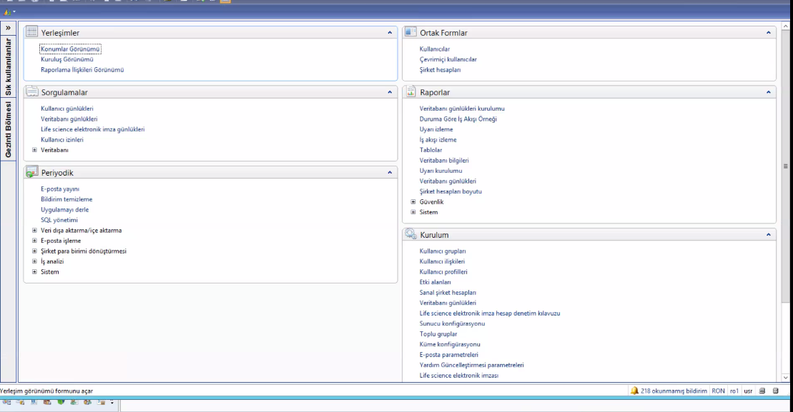

# AX Süreçleri & Development

AXAP'ta X++ diye bir dil var. Biraz .net'e benziyor. Biraz veritabanı geliştirmeye benziyor. ERP'lerde genelde çeşitlilik oluyor bu şekilde.

## AX Genel Mimarisi

Biz kendi sistemimizde AX'ın iki versiyonunu kullanıyoruz. AX 2009 ve AX 2012.

AX2012 masaüstü kullanan son versiyondur. 2017 - 2018'e kadar güncelleme aldı. Sonrasında da dynamic365'e dahil oldu ve farklı bir versiyona dahil oldu.

Kullandığımız versiyonlarda kendi dilinde bir uygulama geliştirip, sonrasında derleme yaparak .net'e çevirmeler yapılıyordu. 365'te biraz daha web tabanlı bir hale geldi. Mobil yönü hala daha çok zayıf.

Herkesin masaüstünde AX 2012 ve ErAx bulunuyor. AX 2009 ErAx adıyla geçiyor. newErAX diye bir şey duyarsak, bu AX 2012'dir.

ErAX Other'da farklı farklı ülkeler bulunuyor, bunlar farklı şirketler gibi bulunmakta. Fas ve Mısır büyük anlamda bitti. Yeni versiyona geçirildi. Şuan Gürcistan, Belarus ve Irak'ta devam eden bir süreç var. Yavaş yavaş hepsi 2012 versiyonuna geçiyor.

2009'daki ürün biraz daha veri tabanı geliştirme gibiydi, 2012'de ise OOP'den yararlanılmış bir versiyon vardı. Miras almalar gibi şeyler, extensionlar yapıp o tabloları istediğimiz alanlara eklemeler yapabiliyordur.

AX 2009

AX 2012

2012 kullanan biri, 2009 kullanabilir. 2009 kullanan biri 2012 kullanabilir.

Sağ altta VAR Model tarzı şeyler var. AX yapısı katmanlı bir şekilde çalışıyor. VAR, User ve Development katmanı.

Örneğin User katmanında yaptığınız bir değişiklik, User katmanında görünüyor. VAR katmanında ise daha core halini görüyorsunuz. Yetkilendirme tarafında User tarafında yapıyoruz. Colins'te çalışanların sadece User katmanında değişiklik yaptırılabiliyor.

Değiştirme ortamında (CTRL + D) değişiklik yaptıysanız, delete derseniz sadece bulunduğunuz katmanda silme yapabiliyorsunuz.

Birden çok katmanlı geliştirme çok iyi olmayabiliyor, çünkü doğru senkronize etmezseniz bir yerde sildiğiniz şeye diğer şeyden erişemeyebilirsiniz.

Kurulum yaptığınızda 3'lü bir veritabanı oluşuyor. Arayüzü o 3 veritabanı oluşturuyor.

- Baseline
- PROD

Biz tabi TR için mesela AX'ı kurmuşuz, diğer ülkeler için ortak bir şey kurmuşuz. Bunu neden yapıyoruz; AX kaynak kod üzerinde değişiklikler yapıyoruz. Bunlar yabancı ülkede ortak olabiliyor, ama TR'de tek AX var.

Rusya, TR'de de değil, Other'da da değil. Çünkü Rusya'da süreç çok daha farklı. Rusya ve Ukrayna'nın da alanı farklı, ama bilinseydi aslında Ukrayna ve Rusya birleştirilebilirdi.

Biz her şeyi şirket bazlı yapsaydık, her birini yeni bir şirket olarak kurup CL1TR, CL1RU gibi şekilde tutup, veritabanını ayırıp farklı alanlar olarak açabilirdik. Ama biz hepsi için farklı AX'lar kurduk.

Biz kendimiz de CL1 kullanıyoruz, çünkü TR'den gelen dataları burdan alıyoruz. Ama HR ile ilgili olanı HRPROD'dan dinliyoruz, Romanyadan olanı ROPROD gibi farklı AX'lardan dinliyoruz.

AX'ta bir sanal tablo mantığı var. Örneğinin sizin muhasebe bilgileriniz tamamen Colins TR şirketine has olabilir, ama lokasyon bilgileriniz her yerde aynı olabilir. AX'ta bir sanal tablo kurarak arkaplanda farklı olan datayı, her yerden aynı şekilde görüntüleyebiliriz.

Şirket kodlarını görüyorduk (CL1)

- Yanında ok görüyoruz, orda hangi menüde çalışacağını seçebiliyorsunuz.
- Biz burda daha çok Borç Hesapları, Alacak Hesapları ve Stok Yönetimi ile ilgileniyoruz.
- Order'la ilgili işlerin çoğunluğu Sipariş Yönetimi'nde yürüyor.
- Ama esas çalışma alanımız Intergation

Sistem Yönetimi'nden gidelim. (Kişi eklemek, yetkilendirmek için) Accounts alanı var. İçe aktar diye bir alan var, active directory'deki kişileri alabiliyoruz. Bir de yeni kullanıcı diye bir alan var, direkt de alabiliyoruz.

Rollerden sadece o rolün yetki verdiği tablolara, veritabanlarına erişimin oluyor.

Sorgulamalar altında Veritabanı, Veritabanı bilgileri var. Buranın veritabanı neydi gibi bilgileri ordan görebiliriz.

## Kurulum

Kurulum altında, Hizmetler ve Uygulama Tümleştirme altında, Bağlantı Noktaları var.

- AIF'lerin açık mı çalışıyor mu gibi şeylere baktığımız yer AIF yeri. AX'tan dışarıya açılan servislerin ayarlamaların yapıldığı yer. Mesai saatleri içerisinde pek indir, kaldır yapmıyoruz.

Configurate sadece kapalıyken açılabiliyor, bağlantı ayarları var. Pull size yetmeyebiliyor onu değiştirebiliyoruz. Timeout sürelerini değiştirmemiz gerekebiliyor.

## Integration Screen

Entegrasyon menüsünün altında Midax Sender diye bir mekanizmamız var. Erdis'ten önce de olan bir şey vardı, uygulama düzeyine çıksın diye Erdis'i yazdık diyoruz. Burası entegrasyonun ilk bacağı. Buraya tablolar eklendikçe burada oluşturduğumuz tablo, diğer veritabanlarına ekleniyor. Insert aldı, update aldı diye geliyor buraya. Bu bize AX'a herkesi bağlamak yerine, veritabanına ulaşarak halledebilmesini sağlıyor.

Ne silindi, ne eklendi hareketleri takip etmek istiyorsanız, loglarla birlikte event dinlenebiliyor.

Tabi biz direkt bu tabloyu dinlerken AX'ta yavaşlık oluyordu. AX'ta yavaşlık olduğu için bu tabloya erdisSent diye bir boolean ifade koyduk erdis'e alıyoruz.

Staging'de gördüğümüz invalid olanların invalid olma sebebi, LOFT olmayanları alın demiş, fakat bir tüm datayı almadan onu çekemiyorum. Sonrasında tüm datayı çekip sonrasında invalid olanları ise öyle işaretlyoruz.

Entegre Tablo'da seçtiğimiz kayıtları insert, update şeklinde entegrasyona ekle dediğimiz şey ile AX'tan güncel verinin tekrar kuyruğa eklenmesini sağlıyor.

Ekledikten sonra entegrasyon günlüğünde F5 yaptıktan sonra gelmiyorsa bir filtre vardır, ve o yüzden o data gelmiyordur.

Data'yı test etmek istiyosan Acceptance kısmında Sistem Yönetiminde Veritabanı bilgileri vardı. getqueue'nun dbConfig'ini bağlıcaksın. Sonrasında burdan integration'da tabloyu bulucaksın. RecId'yi sıralarsın. İşine yarar olduğunu düşündüğün datayı insert ederek entegrasyona ekliyeceksin. Erdis Tablosunda geldi mi diye bakıcaksın. RecordRecId ilgili tablodaki RecId'yi gösteriyor.

Management ve middleware bizim iki data senaryomuz var, master data olması wms tarafına akması, ya da middleware'e akması.

Biz bu logici aktarırken birbirlerine data consume produce edip maliyetli bir işlem yapıyordur. Bunları tek bir sistem üzerine topladık ki dataya tek bir sistem üzerinden yapalım ve maliyeti kısalım. Middleware ve management'ın yapacağı repoyu birleştirerek dataManagement reposu oluşturduk.

Farklı yerlerden dinleniyorlardı, şimdi her bir case için bu dataların nasıl alındığını gördük.
