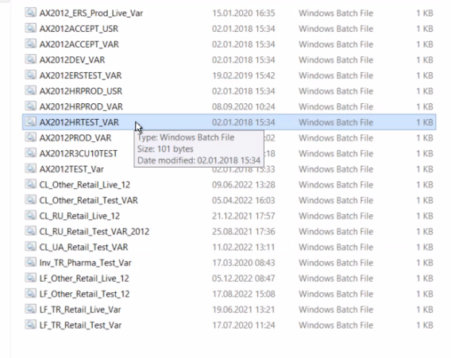
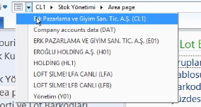
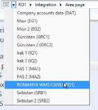
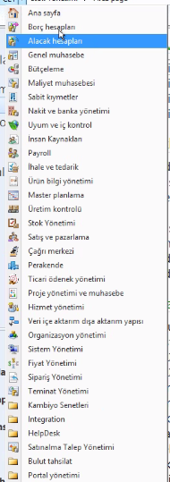
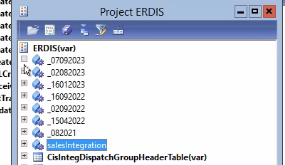
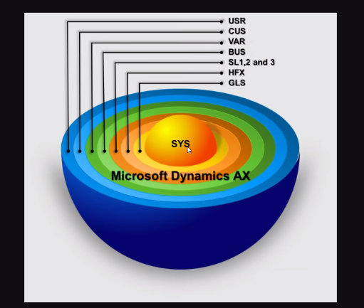

# AX Development

Sistemin çoğunda AX 2012 versiyonunu kullanıyoruz. Bir de 2009 versiyonu vardı. Ukrayna mesela 2009'dan 2012'ye çıkıyor. Bir versiyon 5, 6 yıl kullanılıyor, size eski gelmesin sürekli versiyon güncellemeleri geliyor. Bizdeki 2012 versiyonunda bizim 3 tane temel elementimiz var. AXAP'taya girdiğimiz bir AX2012PROD_VAR dosyası ile bilgisayara kurulmuş client'a bağlanmış oluyoruz. Sonrasında bu client Application Object Server'a bağlanıyor. Farkı şu, server bir tane yere kuruluyor, client ise çok farklı yerlerden o server'a bağlanıyor. 

ShortCuts'ların tamamı farklı bir server'a bağlanıyor. 

> Ekipteki birçok kişi AX'tan işini hallediyor. Tablolardan nereye bağlanacağını biliyor. `AX2012R3CU10PROD` veritabanının kendisini kullanır. `AX2012R3CU10PROD_Model` ise modelleri tutar.

Şuan biz Türkiye veritabanı ile ilgileniyoruz. TR genel olduğu için burada bir ülke kodu yazmıyor. 

Kullanım yüzümüzden geliştirme ortamına geçmek için CTRD+D kısayolunu kullanıyoruz.

Biz ilk kısma en genel olan konuyu giriyoruz. Burada CL1 aslında bu ortamdaki tek gerçek. Other tarafında bu biraz farklı, Rusya ve Ukrayna dışındakiler için burayı kullanıyoruz. Rusya ve Ukraynanın geliştirmeleri daha farklı olduğu için onlar ayrı ayrı kurulmuş, fakat diğer birçok ülke için farklı farklı bu alan kullanılmış. 

Buranın bir yanındaki okta ise modülleri görüyoruz.

 

Burası yetkiye dayalı bir alan, bazı kişiler her şeyi görebilir. Bazı kişiler ise göremeyebilirler. Aşağıdaki 6, 7 menü bizim kendi geliştirmelerimiz.

Midax üzerinden AX'tan AX'a giden bir geliştirme altyapısı. Biz midax'ı dinleyebiliyoruz. Ülkeler için farklı geliştirmeler yapılıyor. 

Çoğunlukla muhattap olduğumuz yerler Stok yönetimi, Alacak Hesapları, Integration, Organizasyon ve Sistem Yönetimi (AIF)kısımlarıdır.

## Development Ortamı (CTRL + D)

Geliştirme ortamımızı kapattığımızda AOT'yi yine `CTRL + D` ile açabiliriz. Bide bizim `CTRL + SHIFT + P`ile açtğımız bir Projects alanımız var. Burası da workspace gibi düşünülebilir. Bize ortam yaratıyor.

- Burada isimlendirme `_TGK_JournalDevelopment` tarzında olmalıdır. 
- Import ile dışarıya aktardığımız bu ortamları taşıyabiliyoruz. Dev'de yaptığımız bir değişikliği bu şekilde Prod ortamlarına taşıyabiliyoruz. Koyduğumuz pakette ne varsa, hepsini alıyoruz. *Geliştirmeleri ezebiliyor, onun için önce ayrıntıları karşılaştırma gibi süreçlerle ileliyoruz.* Karşılaştırırken içeride hiç olmayan bir şey varsa direkt aktarırız, diğerlerini ise karşılaştırırarak aktarırız.

Eğer büyük bir projemiz varsa ve geliştirme yapıldıkça ekleme yapılıcaksa, tarih ve yeni yapılıcak iş ile ilerlenebiliyor.

---

AX yapısı soğanlı diyebileceğimiz bir katmanlı yapıya sahip. Yeni versiyonlar çıktıkça bu katmanlara ortak bir çalışma yapılacağı zaman (mesela TR'de zaman dilimi değiştiği zaman) Microsoft bize HFX'te yolladı. Bu katmanda bir şey silerseniz alt katmandaki değişikliklerle devam edebiliyoruz. Bu şekilde içeriği koruyabiliyoruz. Geliştirici olarak biz VAR'da geliştiriyoruz. Ama Colin's bizim müşterimiz olarak sadece USR katmanına geliyor.

Neden bunla ilgili hata verdi daha demin? Biz belli insanlara belli yetkiler veriyoruz, belli katmanlara erişmesini istiyoruz. Normalde AXAP'tacılar VAR katmanı kullanırken, biz USR kullanmalıyız, ama AXAP'ta bir şekilde izin vermiyor buna.

---

Demin açtığımız ERDIS dosdyası geliştirmelerimizin aldığı yer. Tüm tablolarımız Erdis ile başlıyor.

AOT'nin mantığı ne?

AOT bizim aslnıda kullanabildiğimiz tüm object'leri içeriyor.
Burada 20 tane object ağacı görebiliyoruz, ama temelde 2 tane yer var. 

- Birincisi Data Dictionary, veri tabanında karşılanan her şey burada. Tables, Extended Data Types, Base Enums gibi yerleri kullanıyoruz. 
  - Tables'dan başlarsak, Erdis ile başlayan her şey bizim demiştik.
    - Field'lar bizim column'lar.
    - Burada geliştirme yaptığımızda önce save etmemiz sonrasında ise senkronize etmemiz gerekiyor. Başka bir adamda da aynı şekilde açıldıysa bu tablo birbirini görmeyebiliyor, o yüzden senkronize edildiğinden emin olunması gerekiliyor.
    - Sonrasında method'lar başlıyor. Burada tüm tablo ile işlerimiz varsa, methods'ta yapıyoruz. Method'larda genellikle tercih edilen senaryo, o tablodaki bir şeyi değiştirmesini bekliyorsak, onu tablonun üzerinden yapmak daha mantıklı. Direkt ona insert edebilecek normalde class'da olabilir, ama tek bi method yazdığımız için bunu insert methoduyla yaptık direkt. Ama advance yapsaydık, classlarla çalışırdır.
  - Extended Data Types olarak bir şey açıp, table references'dan bir tabloyla iletişim kur dersek, o direkt relationlı şekilde o tabloyla çalışabilir hale geliyor. Bunu yaptığın için de ilgili alanın verilerini enum gibi seçip ekleyebiliyorsun o tabloya.
  - Base Enums kısmında ise enum yapıyoruz. Base Enum'la extended data types'ları birleştirerek farklı tablolarla aynı base enumdan iki farklı alanı besleyebiliyoruz.

----

1. Projects altında yeni bir project açalım 
2. Altına bir table açalım, `CTRL + S` ile kayıt edelim. Burada birçok şeyi açıp kapatabiliyorsunuz, createdDateTime, createdBy gibi alanları otomatik olarak ekleyebiliyorsunuz.
3. Table için Extended Data Types ekleyelim, buradan String alan açarak, **LecturerName** adında bir data type yaratabiliriz, fakat böyle bir prefix ismi göremeyiz. Lecturer ismini hatırlamazsak sıkıntı yaşarız. O yüzden bunu **ErdisLecturerName** olarak yapmak daha iyi olur.
4. Şimdi Fields içerisine bunu ekliyoruz ve syncronize ediyoruz.
5. Tabloya girdiğimiz zaman, biz sadece atadığımız data type'ı ekleyebiliyoruz, gerisini otomatik olarak o atıyor.
6. Buna ek olarak atadığımız extended data type'ı bir diğer data type olan **Name** type'ı olarak extend edebiliriz ya da direkt duplicate edip adını değiştirebiliriz.
7. Açtığımız data type'ları tablomuzun field'ının içerisine atıyoruz ve eklenmiş oluyor.
8. Data Type birçok yerde olması gereken bir şeyse, extend olarak oluşturmak mantıklı, diğer türlü tablo üzerinde fields alanında data types olarak açılması yeterli.
9. Yeni bir base enum oluşturalım, **ErdisLectureType** adıyla, sonrasında onu projemize atayalım. Bunun içine new element diyerek Enum Type'larını ekleyebiliyoruz. Sonrasında bunu da Fields alanına atıyoruz. Senkronize etmeyi unutmuyoruz. Bu alanı yeni eklememize rağmen daha önce kayıt ettiğimiz kayıtlarda 0. type'ı atıyor.

### Relations

SQL'deki relationlarımızın benzeri burada, tablolar arasında Relations bölümünde yeni bir relation açarak sağlanıyor. Yeni bir tablo açtığımız zaman burada bir diğer tablonun data type'ı ile bağlayabiliyoruz. Yeni kayıt açarken ilişkili kayıtlardan birini almamızı bekliyor olucak.

### Forms

ErdisEducation adında yeni bir form açalım. Bunun Data Source altında veri bölümünü yapabiliyoruz, burada oluşturduğumuz iki tabloyu atabiliriz. Burada tablolar arasında ilişi kurduğumuz için ekstra bir relation kurmamız gerekmiyor. 

Designs kısmında ise formun görselini oluşturabiliriz. Design altında bir **Tab** açıyoruz, bunun altında bir **TabPage** açabiliyoruz. Burada da yeni gruplar açıyoruz. Tablodaki alanları göstermek içinse **Grid**'ler oluşturuyoruz. Bunu da tablolara bağlamamız gerekiyor.

Data kaynağındaki hangi alanları göstermek istediğimize göre Grid altındaki alanlara taşıyoruz. 

Sıkışık, kötü bir şekilde gözükmesin diye ana eklediğimiz elementleri seçip, yüksekliğini ve genişliğini column'a göre genişlet diyoruz.

Daha güzel bir hale getirmek için TabPage alanında
- Caption kısmını Başlıklar ve Satırlar olalrak alalım.
- Grid'lere daha fazla alan ekleyelim.
- Button eklerken *ActionPane*'lerden yararlanıyoruz.