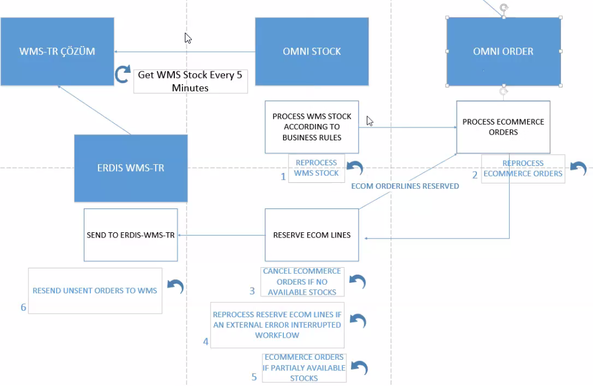

# OmniOrder & OmniStock Süreç Aktarımı

## #1


Müşteri e-ticaret sitesinden INVEON aracılığıyla siparişini veriyor. INVEON AX'taki clsOrderHeaderTable_B2C tablosuna bu siparişi yazıyor. Mağazadan teslim de buradan çalışıyor. Biz buradan dinlediğimiz status Açık Sipariş ve Satış Siparişi alanı. 

- Açık sipariş demek 
  - Öncelikle stoklarda rezervesi yapılıyor.
  - Barkodlar çıkmıyor, ama bu özelliklere ait sezon ve ürün belli. Depoda bu özelliklere uygun bir barkod bulunuyor. 

Biz bu tabloyu Midax Sender'dan dinliyoruz. Midax Sender'dan Erdis Integration Queue tablosuna ekleme yapılıyor. ErdisDataManagement içerisinde erdis.getQueue SP'sini çalıştırarak Staging'e kayıt ediyoruz.

Sonrasında burada dataListener içerisinden dinlemektense, orayı daha fazla yavaşlatmamak adına eCommerceOrder dosyasından dinliyoruz.

Biz buradaki AX kısımlarını atlayarak mağazadan teslim senaryosuna gittik, fakat şuanda AX'taki faturalandırma kısımlarını da yapmamız gerekiyor. 

- StoreOrder, mağazadan teslim oluyor.

Güncel stok şu anda depodaki WMS'yi yöneten Çözüm firmasının API'sinden alıyoruz. OmniStock içerisinde getWMSStock dosyasında 5 dakikada bir çalışan bir listener ile depodan bize akan bir veri oluyor. Burada da gateway'e istek atan bir yapı kurup, gateway'den buraya akan bir yapı kurmamız gerekiyor. 300_000 datayı 20 saniyede içeri çekebiliyor.

Bu kısma kadar sadece depodan veri alınan kısmı işledik, sonrasında burayı kendi stoğumuza çevirmemiz gerekiyor. Bunu yaparken de sizeId, colorId, qualityVersion gibi alanlarımız yok WMS'te. Barcode tablosundan bu propertyleri buluyoruz. Sonrasında locationId value'larını stockconfigtables tablosunda tutuyoruz. Biz cari kodlarını burdan görüyoruz.

WMS stoklarının stoklara dönüşme kısmında processWMSStock dosyasına bakıyoruz. Burası paralel programlama ile yapıldı. Burada StockLockStatus'ü WMS'ten aldığımız için bunların periyodları birbirleriyle çakışırsa, availableQty'nin hesaplanmasını WMS stoklardan buluyor, WMS stoğu yoksa önce orayı kitliyoruz. Onlar şuan işleniyor onlar işlendikten sonra sen onları işleyebilirsin diyor.

Depo içinde adresler destinationId, packageNo, declerationNo alanlarında tutulur, bunlar e-ticaret depoları için boştur. Bunlar depodaki adres konum bilgileri.

Sonrasında işlemeye başlandığında available, blocked gibi Qty'leri 0'a çekiyoruz. Bunu deponun bize gönderdiği kayıtlarda deponun Qty'si 0'a düştüyse depo göndermiyor, çünkü bu şekilde çok kayıt var. stock'un sıfırlandığını anlamak için biz bu Qty'leri 0'a çekiyoruz. 

Sonrasında scale modunu çalıştırıyoruz. Burada ne kadar döküman var buna bakıyor, sonrasında bu 100_000 varsa bölerek gidiyor ve cpuCount'u kadar limit oluşturuyor. Her bir çekirdeğe 10 adet işlem atadınız, bu 8'le 10'u çarparak toplam limitini 80 yapıyor.

```
[ProcessLimit/WorkerNum] - 0 - 1 - 2 - 3 - 4 - 5 - 6 - 7

```

Burada scale'leri 1.ye yolladık, bunları rawDataStock diye bir fonksiyon çağırıyor, WMS'teki ham datayı stock datasına çeviriyor.

> toArray() kullanmazsak, stream olarak dinliyoruz, her aldığımız datayı Transform'a ve Writable'a gönderiyoruz, ordan pipeline'a gönderiyoruz.

Transform kısmında bir $mod mantığı var. 100000 verimiz var demiştik. Bu 100000'i 10000'e böldük 8 tane process'imiz vardı.

## #2

Biz inveondan e ticaret satışını aldık, erdis data management'a ordan omni order'a gönderdik. Burada bir kaydımız oluştu. WmsTR Çözüm'den stoklarımızı aldık, stock'a işleyerek yolladık. OmnsiTock'tan kafka yardımıyla, OmniOrder'ın staging'inde kayıtlı olan kayıtları işleyebilirsin dedik. 

Order'ı aldık, burada processWMSStock ile OMNIORDER_AXERDISQUEUE'ya stock işledikten sonra da OmniOrder'a işleyebilirsin diye gönderiyoruz, sonrasında dataStaging.consumer tarafında bunu dinliyoruz ve Staging'e atıyoruz.

Sonra createPreOrder (Açık Sipariş, Ön sipariş)'in ilk halini kaydediyoruz. Burada ProcessOrders içerisinden buluyoruz, burada length yoksa WMS stock daha yenilenmedi diyoruz. Sonrasında ProcessTypeEnum'ı INSERT olarak bulunan, order'ın bizde olmadığı durumlarda INSERT olarak gelen dataya göre alıyoruz.

- **`SalesStatus === 1`, demek bunun Açık Sipariş olması demek.** (Henüz faturalanmamış, müşteriden parayı aldık, en son stok kontrolü yaparken vardı, bize işlenirken barkodları seçiliyor. Barkod yoksa ETicaret tarafında iptal gelebiliyor.)
  - Rezerve yaptığımız zaman sanal stok üzerinde yapıyoruz, faturalandı olması için fiziksel olarak depoda bunun paketlenmesi ve çıkılması gerekiliyor. Muhasebesel işlemler de o zaman gerçekleşiyor.

    eCommerceDetails içerisindeki webOrderNum'ın kontrolünü yapıyoruz ilk olarak. 

Geldik order oluşturmaya orderMainType ve orderSubType ile eTicaret siparişi olduğunu yazıyoruz. orderStatus OpenOrder olması gibi statüleri kontrol ediyoruz. Bunları OrderHeader üzerinden takip edebilmek adına yapıyoruz. TransactionType'ımız ETicaret -> Mağaza, Depo -Z Mağaza gibi şeyler yer alıyor. eCommerceDetails ve deliveryDetails, invoiceDetails tutuyoruz.

Bunları da sonrasında yeni bir Outbound staging yaratarak, stock servisine yolluyoruz. Bunları staging olarak tutuyoruz ki, failed'a düşen mesajları falan tekrar gönderebilelim.



Process Ecommerce Orders kısmı bitti.

### Reserve ECOM Line (reserveECommerseStock)

Burada reserveEComOrders tarafındaki staginglerin kontrolü yapılıyor var mı yok mu varsa update yoksa create vs.

Burada artık stok var mı yok mu gibi şeylere bakmıyoruz. Burada doğrudan Stock bularak, availableQty'sini bir azalt, onOrderQty'sini 1 arttır diyoruz. Sonrasında value'sü dolu ise reservedStock'a pushluyoruz. StockTransaction'larını OnOrer olarak oluşturuyoruz. Bu value yoksa unavailbleStock'a pushluyoruz.

Tüm lineları bulmuş olabilir 3 satış vardı 3'ünü de reserve ettiyse, EComOrderStockReserved diye bir status'ü produce ediyoruz. unAvailableLength ile eşitse yani hiçbir stock'u rezerve edemediysek, yapamadık Failed'a çekiyoruz ve siparişi iptale çekiyoruz.

3 tane aldı 2 tanesini buldu, 1 tanesini bulamadıysa bu sefer de partialReserved oluyor. Bunları tekrar omniOrder'a yolluyoruz. Staging Inbox'ı Completed'a Outbox'ı Processing'e çekiyoruz. 

Sonrasında OmniOrder'da eComOrderStatus.consumer'a geliyoruz.

- Burada order status'ünü reserved'e çekiyoruz. hepsi reseervedse. Bunu da ShippingOrder_TR'ye produce ediyor.
- PartiallyReserved'de bulabildikleri için yapıyoruz, bulamadıkları için de stattusType'ı Completed'a çekiyoruz.
- Oldu da stock'ların yarısını bulduk veya hiç bulamadık. O zaman bunu ETicaret'tekilere atmamız gerekiyor, bunu da notification servisi ile göndericez.
- Hiçbiri yoksa iptal oluyor

Burdan itibaren order'ın işlenme süreci bitmiş oluyor. Buradan sonra WMS'e gönderme kısmı başlıyor.

## #3 (WMS'e gönderme kısmı) - (Send TO erdis-wms-tr)

Biz buraya rezerve koyduktan sonra wmsTR'ye gönderdik, eCommerce yetkilileri bunların gidip gidemeyeceğine karar vermek için sendOrderToWms'i çalıştırarak Wms-TR'ye gidecek. `SHIPPINGORDER_TR`'ye produce ettik, wmsTR'de dinliyoruz ve staging servise atıyoruz.

scheduler içerisinde sendShippingOrdersToWMS içerisinde orderService içerisinden orderByMongoId ile api ile order'dan çekiyor. Bunları mapliyoruz. Sonrasında da sendToWMS'i çağırarak erdisGateway'e post ediyoruz. gateway'^de wms-TR shippingOrder altında authentication parametreleriyle ve authOptions'la birlikte bu query string'le sorgu atıyoruz. Auth içerisindeki controllers'da ise integUser içerisinde role'lere bakıyoruz ve buna göre IntegUser'ı buluyoruz. Sonrasında gateway'e user dönüyor bu auth bilgileriyle çözüm servisinden bir token alıyoruz. Buranın body'sinde yollayacağımız her şeyi addOutboundOrder olarak yolluyoruz.

Sonrasında reserve olan stockları güncellememiz gerekiyor. Bu omniStock içerisinde updateReservedStockToWMSStock olarak çalışıyor. Burda onOrderQty'i 1 azaltıyor ve onOrderQtyWMS'i 1 arttır deniyor. Transaction içinde de OnOrder olanları Deducted'a çeviriyoruz.

Sonrasında da Order'ın status'ünü güncellemesi için EComOrderStatus'e produce ediyor. Burada orderın orderStatus'ünü sendToWms'e çek diyoruz.


----

Önceki iki aktarımda ECommerceOrder'ların Inveon'dan alınmasını bizde nasıl oluştuğunu, TR çözümden bizde nasıl kullanılabilir stoğa dönüştüğünü ve bu çektiğimiz stoklara istinaden ETicaret siparişlerinin nasıl bizim tarafta işlendiğine baktık. Burada da genel olarak deponun dönüşlerinden bahsedicez. Bu siparişlere istinaden depo ben bunları çıkabiliyorum ya da ben bunları çıktım diye geri döndüğü bir evrak var. Bunu kendi sistemimize kaydererek, biz 2 satır gönderdik, bize 1 satır döndü gibi kısımları göreceğimiz aktarım olucak.

## #4 WMS'ten dönüş kısmı

WMS-TR içerisinde sendShippingOrdersToWMS içerisinden order geçiyor, burada reserve olarak işaretlediğimiz orderları depoya gönderiyorduk. Buranın bir de **EComOrderSenttoWMS** olarak mesaj gönderiyoruz ve order'daki order'ın status'unu buna çek diyoruz. 

Depodan gelen cevaba göre ise Sold, Cancel, PartiallySold olarak güncelliyoruz. Bütün satırlar gittiyse ve depo hepsini döndüyse Sold'a çekiyoruz. Diğer iki seçenek için ise AX'taki JOB'a göre çekiyoruz. 

WMS-TR Çözüm'den WMS-TR'ye gitmesi gereken order'ı yolladık. Bunun dışında bir de depodan alacağımız cevap var, o yüzden de depodan cevap gelecek diyoruz. Cevaba istinaden birkaç tane işlem var. Diğer depolardan farklı olarak burada movementCode alanı bulunuyor. C27 olması durumunda normal eTicaret'te işler nasıl işliyorsa bunları yapıyor ve buna istinaden AX'ta bazı status'leri güncelliyor ve biz de AX'taki o status'leri dinliyoruz.

ShippingOrderResponds tablomuza bakalım.
- Tamamı satıldıysa orderQty ile sentQty'nin eşit olmasını bekliyoruz. Burada gateway'den wmsTR url'inin shippingOrderResponds'una gidiyor. Burada shippingOrderRespond'u alırken companyCode'u ve warehouse'u rakamlarla yolluyorlar, biz bunları kendi yapımıza göre *map ediyoruz*. Bunu mapledikten sonra shippingOrderRespond'u oluşturuyoruz. Bunu yolladıktan sonra da order service'in içerisine işle diyoruz. Burada da kafka kuyruğu ile shippingOrder'ı order'a yolluyoruz. Sonrasında order'da bunu kafkaConsumer'da dinliyoruz. Burada bir takım işler yapıyoruz, unavailableStock'umuz 0'sa ve orderStatus partiallySold değilse OrderStatus'u Sold'a çekiliyor. unAvailable ve order'ın line'ı eşitse cancel'a çekiyoruz. Bunlara göre de mail atıyoruz, ki bunlarla ilgili işlem yapılsın. Aynı zamanda bunları Stock Service'ine cancelStockTransaction'a yolluyoruz. Yani bunlar için stock'da stocktransactions tablosunda tdepoya gitti diye gitmişti, ama depo bizde yok dedi, buna istinaden biz de bu line'ları omni-stock içerisinde dinlediğimiz bir kafkaConsumer'ı ile cancelStockTransactions içerisinde cancel olarak al diyoruz. Biz burdan 1 tane çıktıysak, buraya bir cancel girilmediyse, bu transaction olarak gözükmeli ve buna göre availableQty'miz de stock tarafında düşmeli. Buranın bir de AX bacağı var. AX'ta bunların status'leri güncelleniyor. Bunu order içerisinde updateECommerceOrder scheduler'ı içerisinde dinliyoruz. 
  - Mesela 10 satır gönderdik, depodan da 10 satırın tamamı geldi, o zaman AX'taki salesStatus 3 olarak geliyor, salesGroupStatus ise 1 olarak geliyor. Böyle olduğu zaman order'ın içindeki tüm satırlar satıldı olarak güncellenmiş oluyor. Burada order'ın status'u satıldıya çevriliyor, line status'lerini de satıldıya çekiyoruz.
  - PartiallyReserved depoya yollanmadan önce stocks içerisinde satış esnasında vardı bu stock, o esnada depoda bir hareket yaşandı, ve stock başka bir yere kaydırıldı. Çektiğimiz stock'ta bunu bulamadık ve availableQty'si 0 geldi. O zaman satırlardan bir tanesi iptal olmak zorunda. Bunu eComOrderStatus'de yönetiyoruz. Notification'la beraber satıra istinaden bir geri dönüş yapıyoruz. AX'tan geri beslemeyle tekrar dinliyoruz ve salesStatus 1 ve salesGroupStatus 2 olarak geliyor. Satırı bul status'u cancel olanı bizde de cancel'a çek. LinesWithoutStock içerisine de iptal olan satırı at diyoruz. 
  - Bunun sebebi serkanın yaptığı yeni endpointite linesWithoutStock'u çekiyoruz bunla faturalandırma yapılıyor. Bunu yaptıktan sonra order'ı update ediyoruz. 
  - Kısmi iptal diye bir şey yok, kısmi satış var. Ama kargo satırı bazen iptal olamıyor, bu durumda da kargo satışı için farklı bir durum olarak bakıyoruz, fakat şimdilik aynı işi yapıyoruz.

## ECommerce Order Returns (IADE)

İadenin movementCode'u biraz daha farklı bir movementCode olarak düşüyor. Bizi çok ilgilendirmiyor biz bunu alıp AX'a gönderiyoruz. gateway üzerinden wms-TR içerisinde eCommmerceOrderReturn'ü alıyoruz, depo dönüşüne farklı olarak order ve orderLines alıyoruz. Bunu sonrasında wms-tr'ye api'ye gönderiyoruz. Post'u yapmadan önce yine map'liyoruz. WMS respond'unu alıyor. Bunu map'ledikten sonra kayıt ediyor.

order içerisinde wmsOrderReturn ile consume ediyoruz. orderReturn ve soldOrderLine varsa bunu cancel'a çekiyoruz. uzunluğu eşit değilse de partially sold'a çekiyoruz.