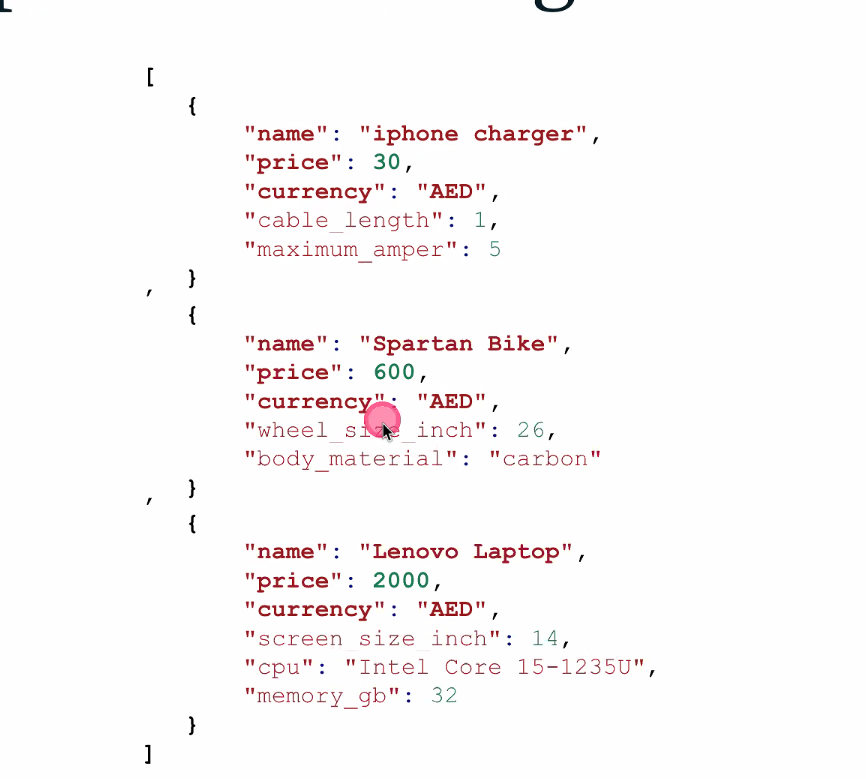
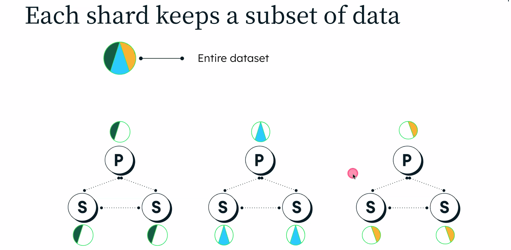
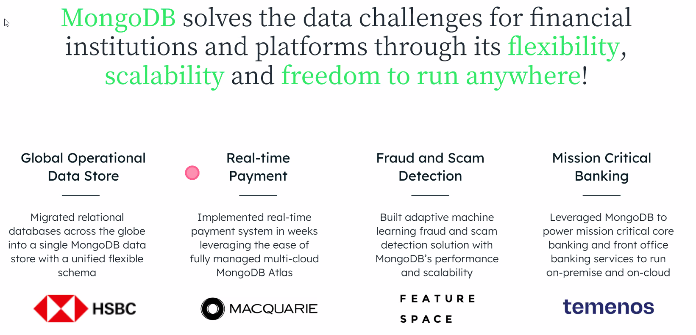
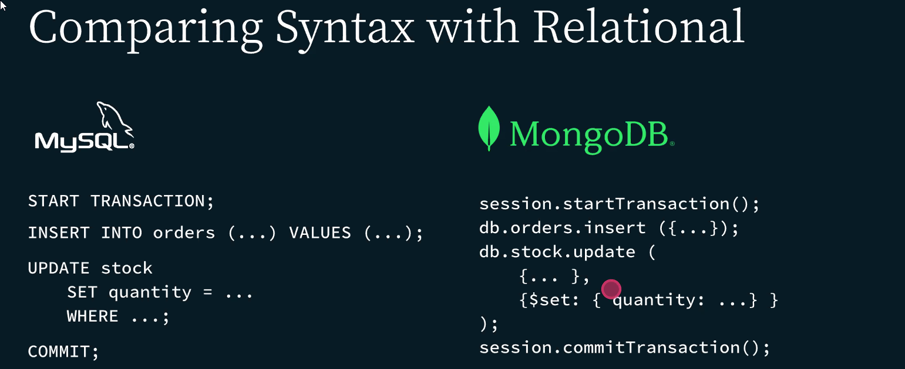
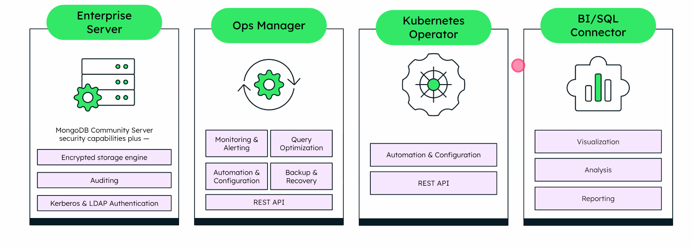

# Modern Uygulamalar için MongoDB

## İterasyon Nasıl Yapılır?

PostgreSQL veritabanımız olduğunu düşünelim, önce bir tablo oluşturduk. MongoDB tarafında da bir collection buna eşit diyebiliriz. Tabii burda table oluşturmadan da veri atışımıza göre mongoDB kendi şemasını oluşturabiliyor. Eklediğimiz ilk collection'a yeni özellikler ekleyebiliyoruz. Aynı kayıt içerisinde tekrar modelleme yapabiliyoruz.

Bunlar için PostgreSQL'de tekrardan tablolar oluşturmamız gerekiyor, fakat mongoDB tarafında ekstra özellikleri ekleyebiliyoruz.

Diğer bir özellik OOP bir dilde geliştirme yapıyorsanız, burada bir User class'ınız olduğunuzu düşünelim. Burada sürekli yeni bir katman oluşturmak gerekiyor, bunlar da uygulamanızı yavaşlatıyor.

> In MongoDB, data that is **accessed together** gets **stored together**.

## MongoDB Veri Modellemesi

- Örneğin CRM uygulaması için, her zaman 1 müşteri için 1 kayıt mı olmalı?
  - Uygulama bazlı modelleme (Relational modellerde genellikle entity bazlı olur.) Mümkünse her şey bir collectionda, mümkün değilse en az collection'da olması isteniyor.
  - M320 MongoDB Data Modelling kursu

## Polymorphism

- How can you store similar records
  - That may have different attributes
  - In the same table / collection / dataset
- and able to query it.

Birbirine benzer kayıt olduğunda, her birinin ayrı ayrı özellikleri de olabilir. Bunları relational'da tutmak çok zor olabiliyor. MongoDB'de farklı field'lara sahip, farklı kayıtlar olabilir.

## How to Migrate the Data

Var olan datayı nasıl MongoDB'ye taşıyalım?

- Application modernization
- Legacy offload / read offload
- Operational Data Store / Single View

Oracle Relational Migrator ile relational db'den Mongo'ya göre map edebiliyoruz. Birçok yerde SP kullanıldığını görüyoruz. Bunları nasıl mongoDB'ye taşıyoruz, SP'leri Mongo Query'sine çevirebilecek bir generative AI modeli çalışıyor ve bu SP'yi query'e çevirebilen bir yapı var.

Tabloları aldıktan sonra birebir mi map edelim, yoksa kendiniz MongoDB'den recommenation alabilirsiniz.

Bire bir olması MongoDB'yi efektif kullanmadığımızı gösterir. Aynı sayıda tablo varsa bu makul değildir. Burada ayrı ayrı collectionlarla orders'ı mesela orders_details'i array olarak gömebiliriz.

Shippers'ı da aynı şekilde orders'ın içine gömebiliriz. Bu bize bir yandan daha fazla data size sağlayabilir, fakat join sayısı azalacağı için daha hızlı okuma ve yazma yapabiliriz.

Mapping bittikten sonra migrasyon için bir job oluşturuyoruz. Source sisteme bağlantıyı kontrol ediyoruz, target olarak MongoDB'yi seçiyoruz. Snapshot seçebilirsiniz, ya da continuos diyebiliyoruz. Burada birisi tek seferlik bir şey yaparken, diğeri oraya gelen kayıtları sürekli olarak MongoDB'ye alıyor.

Küçük datalar için sub document önerisi var, fakat 2000 kişi follower'ı olan bir yere sub document yapmak mantıklı değil. Burada daha çok yeni bir tablo yapmak mantıklı olur.

## MongoDB nasıl Dağıtık Veritabanı Olarak Çalışır?

### Single-node Architecture:
- Single Point of Failure
- Downtime for upgrades
- Performance (Yük artarsa nasıl scale olacak?)

### Replica-Set Architecture:
3 tane farklı container, makine kullanılması önerilen.
Primary node'a yazma işlemi yapıyoruz, secondary node'lara otomatik olarak yazılır. Bu by default olarak mongoDB'ye gelebiliyor. Direkt olarak bir cluster oluşturabiliyorlar.

- **High Availability:** Primary uçsa da secondary'lerden okuruz. (Yazma sadece Primary'den oluyor (eventual consistency - veri tutarlılığı için), iki secondary primary'nin down olduğunu gördüğü için secondary'ler aralarında seçim yaparak yeni primary oluşturuyorlar. Driver'a haber ediyorlar ve artık o node'a yazım yapılıyor.) Down olan Primary tekrar giriş yaparsa Secondary olarak sisteme giriş yapar. Bu olaylar otomatik olarak gerçekleşir. 
- **Upgrades / Patches:** Versiyonlamada down olmadan dönüşüm sağlanabilir.
- **Workload Isolation:** Farkı bir node kullanarak raporlama, ya da backup alabilirsiniz.

  

## Kritik Uygulamalar İçin MongoDB

- Yüksek Erişilebilirlik / Automatic Failover / Zero-Downtime
- Hızlı İterasyon 
- Ölçeklenebilirlik
- Veri Tutarlılığı (Strong Consistency)
- ACID Transaction

## Deployment Options

Development kısmında open source kısmından devam etmek mantıklı olsa da sonrasında production'da aşağıdaki ikiliden birini kullanmak mantıklı.

- MongoDB Enterprise Advanced
  
- MongoDB Atlas (Cloud)

MongoDB Atlas: Yazılımcıların Veri Platformu