# Azure Virtual Training Day

## Overview of Azure and App Related Services

### 1. Hosting Options

In the cloud services there are different options.

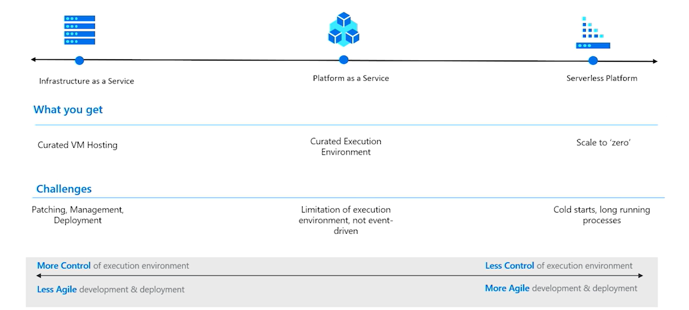

- Infrastructure as a Service -> With more control
- Platform as a Service -> You don't have to create VM by yourself. Managed by Azure. If you don't need to any admin dashboard.
- Serverless Platform -> On-demand apps, scalable. Only you can change your options.

### Shared Responsiblilty Model

Balance of control and responsibility depends on the category of the service.
- Move-in Ready
- Some Assembly Required

#### Hosting Options

- **Azure App Service**
  - High Productivity for developers
    - Any language
    - Blue / Green Deployment
    - Rich Ecosystem
    - Containers
  - **Fully Managed**
    - Built in Backup
    - Always Available
    - Scale on demand
    - Built-in infrastructure
- **Static Web Apps** - Works for fullstack apps.
  - Global Hosting
  - End-to-end development experience
  - Streamlined build and deployment
  - Custom domains authentication
- **Azure Container Apps** - Serverless containers for microservices
  - If you are running apps with microservices and containerized applications.
  - Lightweight
  - Event-driven Processing
- **Azure Kubernetes Service**
  - 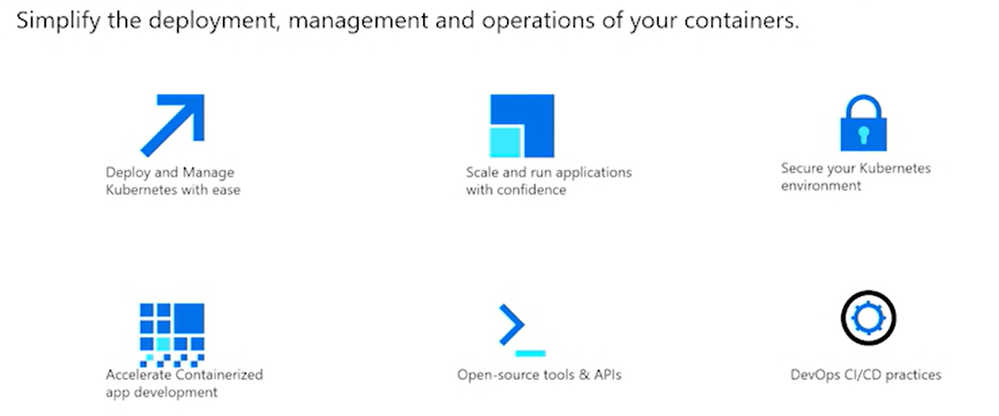
  - Helps monitoring
  - You pay only for running pool nodes, not for masters
  - Cost saving
-** Azure Functions**
  - Optimized for Event Driven Functions
    - Event driven programming model
    - Elastic scale
    - C#, JS, TS, Java, Python
    - Industry leading tools from Github, VsCode.
  - 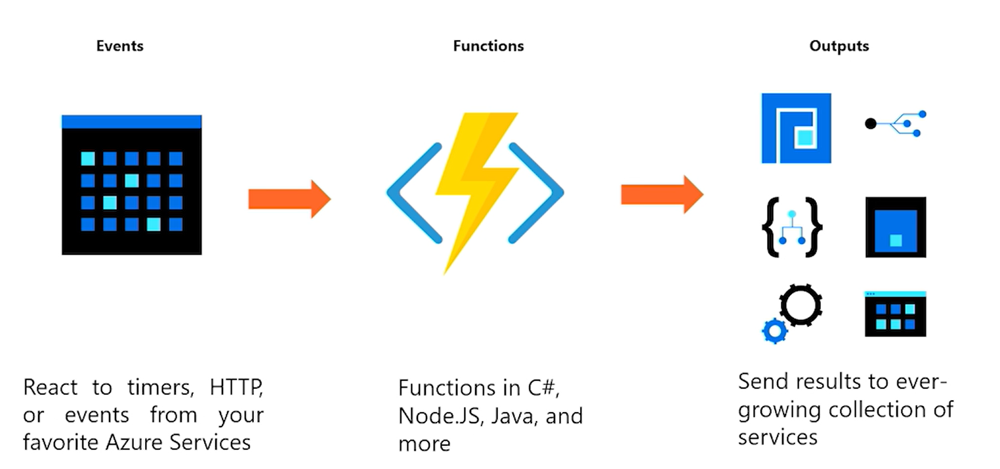
- **Azure Spring Apps**
  - Build and deploy Spring Boot application with a fully managed service, jointly built and operated with VMware. More choices and full integration into Azure's ecosystem and services.
    - Fully managed infrastructure
    - Built-in app lifecycle management
    - Ease of monitoring

### 2. Overview of Various Database Options

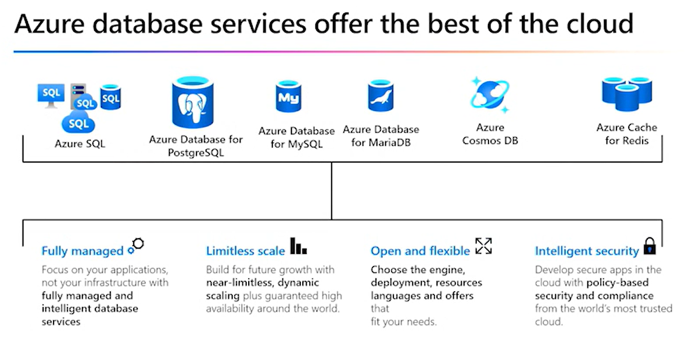

By choosing Azure data solutions, business gain access to fully managed. 

Removing the hardware and software requirements, developer focus the design. Azure services such as AI are design and integrated with your mouse. 

#### Azure SQL

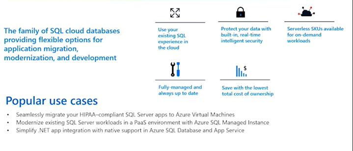

If you required traditional database, like tables, columns you can select it.

#### Azure SQL Server on VMs

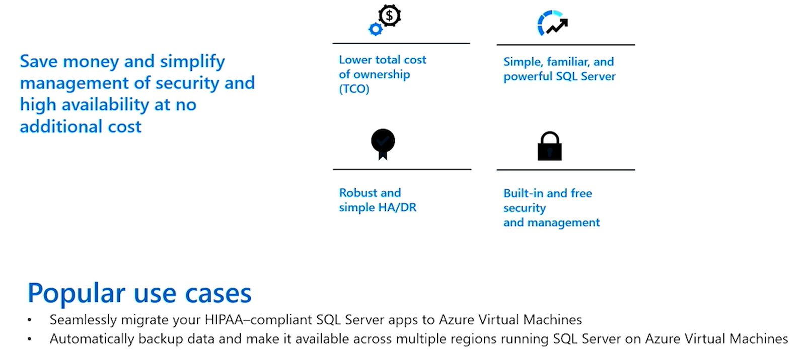

#### Azure Databases for MySQL and MariaDB

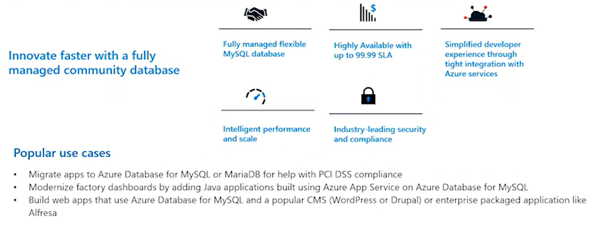

#### Azure Databases for PostgreSQL

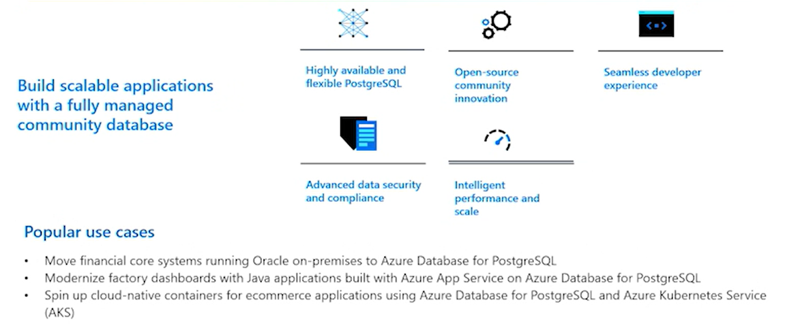

#### Azure Databases for CosmosDB

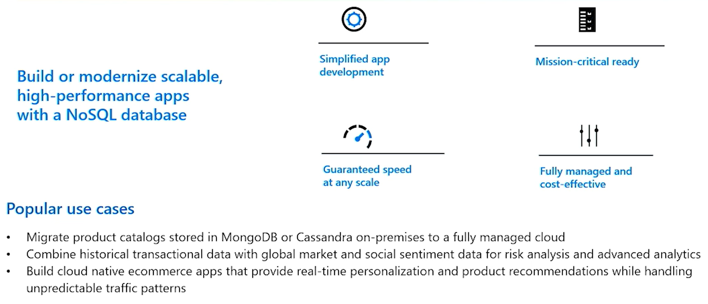

#### Azure Cache for Redis

Can used with .NET or Java web apps.

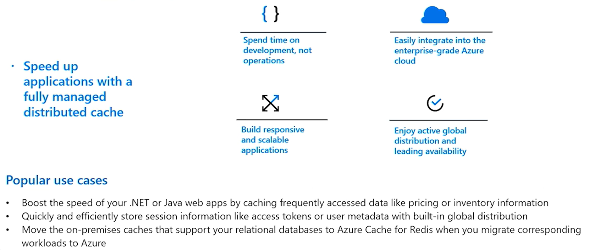

#### Azure Storage

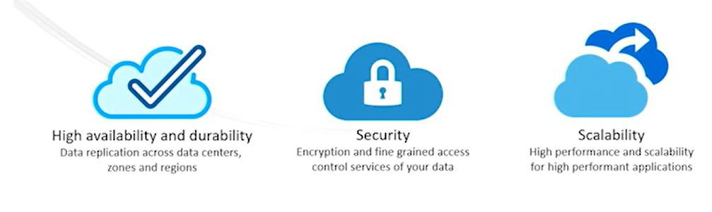

Offers georeduncancy replicates the data, encrypted data, reliable.

### 3. Manage your Data With Azure Cosmos DB

Low latency, elastic, scalability, consistency and high availability.

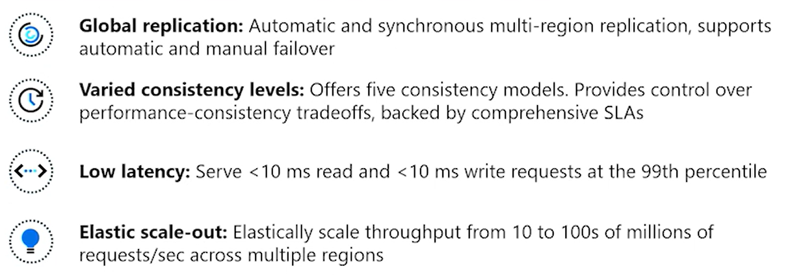

Azure cosmos DB approaches data consistency as a spectrum of choices instead of two extremes. Developer can precise choices respects to high availibility.

Sorgular varsayılan olarak belirttiğimiz consistency level'ı kullanır.

#### Challenges with Global replication
1. Users writing at the same time at different regions
2. Users reading from different locations
3. Time consumed in replication data

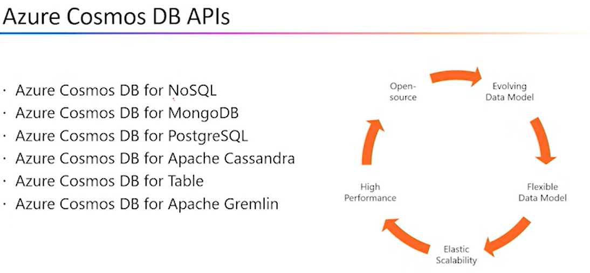

Azure Cosmos DB native olarak noSQL olarak bulunmaktadır. 

Mevcut queryleriniz bulunmaktaysa, ilk olarak buradan devam edilmesi makul.

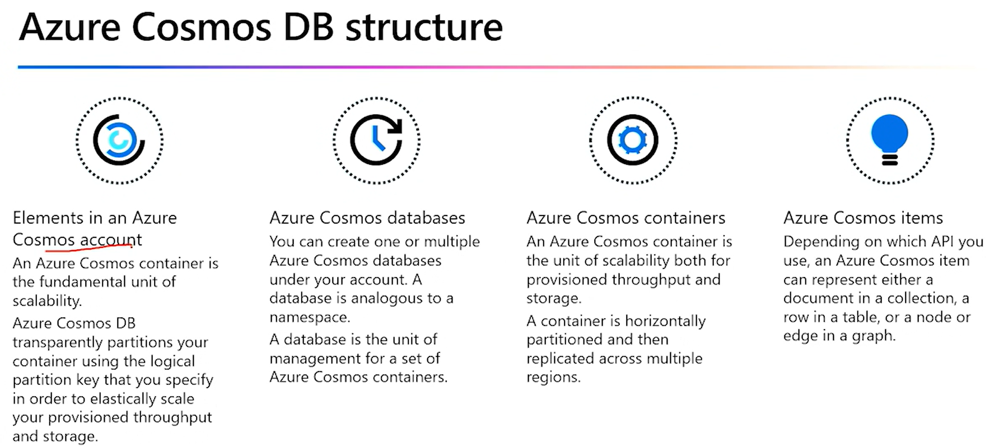

Azure portal'a gelerek, create a resource'a basabiliriz. Buradan Azure Cosmos DB kısmından create'e basabiliriz. Hangi API'yi seçmek istediğimizi buradan görebiliriz. 

Provisioned kısmında belli bir kısma kadar ücretsiz, serverless'de ödediğiniz kadar devam edersiniz.

Storage Account oluştururken de Cosmos DB oluşturduğunuz yapıyı seçtiğinizde, birbirleriyle birlikte çalışacaklardır.
