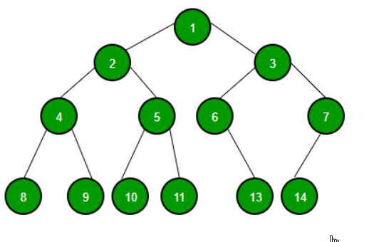

# Trees

A data structure that  consists of nodes in a **parent / child** relationship.

- **Lists - Linear**
- **Trees - Nonlinear**

## Tree Terminology 
- **Root** - The hop node in a tree.
- **Child** - A node directly connected to another node when moving away from the *root*.
- **Parent** - The converse notion of a child.
- **Siblings** - A group of nodes with the same parent.
- **Leaf** - A node with no children.
- **Edge** - The connection between one node and another.

## Uses For Trees

Lots of different applications!
- HTML DOM
- Network Routing
- Abstract Syntax Tree
- Artifical Intelligence
- Folders in Operating Systems
- Computer File Systems

## Kinds Of Trees
- **Trees**
- **Binary Trees**
- **Binary Search Trees**

### Trees
- Each node could have any number of child nodes.
### Binary Trees
- Each node can have at most two children.
## Binary Search Trees
- BSTs are a special case of a binary tree, which is a type of a tree.
- At most have two children per node, zero, one or two children.
- Top of that BSTs are sorted in a particular way.
- BSTs are used to store dataa that can be compared that is sortable.

## How BSTs WORK?
- Every parent node has at most **two** children.
- Every node to the left of a parent node is **always less** than the parent.
- Every node to the right of a parent node is **always greater** than the parent.

### Insertion a Node to BST
1. Create a new node
2. Starting at the root
    1. Check if there is a root.
    2. If there is a root, check if the value of the new node is greater or less?
        1. If it is greater
            - Check to see if there is a node to the right
                - If there is, move to that node and repeat these steps
                - If not, add that node as the right property
        2. If it is less
            - Check to see if there is a node to the left
                - If there is, move to that node and repeat these steps
                - If there is not, add that node as the left property.
### Finding a Node in a BST
1. Starting at the root
    1. Check if there is a root, if not - we're done searching!
        1. If there is a root, check if the value of the new node is the value we are looking for, if we foind it, we're done!
        2. If not, check to see if the value is greater or less
        3. If it is greater
            - Check to see if there is a node to the right
                - If there is, move to that node and repeat these steps
                - If there is not, we'ree done searching!
        4. If it is less
            - Check to see if there is a node to the left
                - If there is, move to that node and repeat these steps
                - If there is not, we're done searching!

## Big O of BST
- Insertion - **O(logn)**
- Searching - **O(logn)**

---

## Traversing A Tree
There is two ways:
- ### **Breadth-first Search**
    - We wanna visit every node on the same level, every sibling node before we look at a child.
    - Horizontally

    **Pseudo Steps**
    1. Create a queue and a variable to store the values of nodes visited.
    2. Place the root node in the queue.
    3. Loop as long as there is anything in the queue
        - Dequeue a node from the queue and push the value of the node into the variable that stores the nodes
        - If there is a left property on the node dequeued - add it to the queue
        - If there is a right property on the node dequeued - add it to the queue
    4. Return the variable that stores the values

- ### **Depth-first Search**