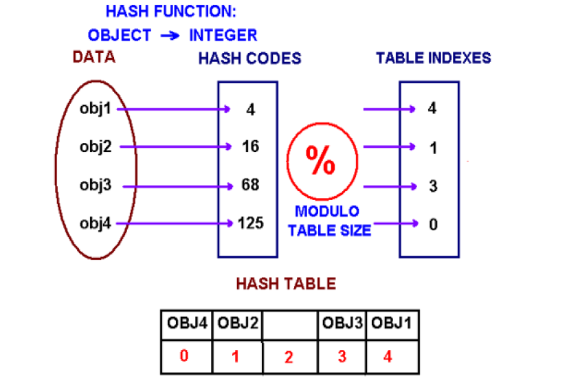

# Concept Of Hashing

The problem at hands is to speed up searching. Consider the problem of searching an array for a given value. 
- If the array is not sorted, the search might require examining each and all elements of the array. 
- If the array is sorted, we can use the binary search, and therefore reduce the worse-ease runtime complexity to O(logn).

We could search even faster if we know in advance the index at which that value is located in the array. Suppose we do have that magic function that would tell us the index for a given value. With this magic function our search is reduced to just one probe, giving us a constant runtime O(1). Such a function is called a **hash function**.

> A hash function is a function which when given a key, generates an address in the table.

The example of a hash function is a *book call number*. Each book in the library has a *unique* call number. A call number is like an address: it tells us where the book is located in the library. Many academic libraries in the US, uses Library of Congress Classification for call numbers. This system uses a combination of letters and numbers to arrange materials by subjects.

A hash function that returns a unique hash number is called a **universal hash function**. In practice it is extremely hard to assign unique numbers to objects. The later is always possible only if you know (or approximate) the number of objects to be processed. Thus, we say that our hash function has the following properties: 
- It always returns a number for an object.
- Two equal object will always have the same number.
- Two unequal object not always have different numbers.

## Collisions

When we put objects into a hashtable, it is possible that different objects (by the equals() method) might have the same hashcode. This is called **collision**.

How to resolve collisions? Where do we put the second and subsequent values that hash to this same location? There are several approaches in dealing with collisions. One of them is based on idea of putting the keys that collide in a linked list! A hash table then is an array of lists! This technique is called a **seperate chaining** collision resolution.

Another technique of collision resolution is a **linear probing**. If we can not insert a index *k*, we try the next slot *k+1*, If that one is occupied, we go to *k+2*, and so on. This is quite simple approach but it requires new thinking about hash tables. Do you always find an empty slot? What do you do when you reach the end of the table?

## Hash Set

HashSet stores and retrieves elements by their content, which is internally converted into an integer by applying a hash function. Elements from a HashSet are retrieved using an iterator. The order in which elements are returned depends on their hash codes.

## Hash Map

HashMap is a collection class that is designed to store elements as *key-value* pairs. Maps provide a way of looking up one thing based on the value of another.

HashSet and HashMap will be printed in no particular order. If the order of insertion is important in your application, you should use *LinkedHashSet* and/or *LinkedHashMap* classes. If you want to print data in sorted order, you should use *TreeSet* and/or *TreeMap* classes.

## Priority Queue

We are often faced witht a situation in which certain events/elements in life have higher or lower priorities than others. For example, university course prerequisites, emerngency vehicles have priority over regular vehicles. A *Priority Queue* is like a queue, except that each element is inserted according a given priority. The simples example is provided by real numbers and/or relations over them. We can say that the smallest (or the largest) numerical value has the highest priority. In practice, priority queues are more complex than that. A priority queue is a data structure containing recors with numerical keys (priorities) that supports some of the following operations:
- Construct a priority queue
- Insert a new item
- Remove an item with the highest priority
- Change the priority
- Merge two priority queues