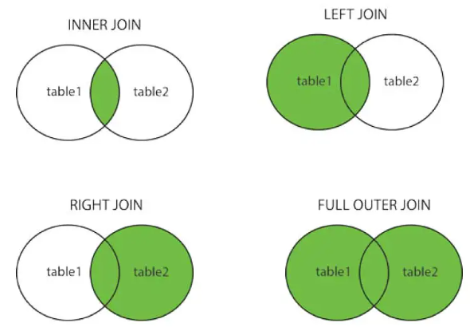

# Microsoft SQL

| <font size="4px">**Contents**</font>                   |
| :----------------------------------------------------- |
| 1. [***Concepts***](#concepts)                         |
| 2. [***SELECT*** Statements](#selectstatements)        |
| 3. [Filtering data with ***WHERE*** Clause](#where)    |
| 4. [Sorting Data with ***ORDER BY*** Clause](#orderBy) |
| 5. [***INNER JOIN***](#innerJoin)                      |
| 6. [***LEFT OUTER JOIN***](#leftOuterJoin)             |
| 5. [***RIGHT OUTER JOIN***](#rightOuterJoin)           |


<a id="concepts"></a>
An **instance** can be thought of as an installation of SQL Server. Every time we create a new server and then install SQL on it, we are actually creating a new instance of SQL.

Each instance has unique name on a network.

We have a **database** which is kind of the next concept and at a high level, it's just an organized collection of data. There are **schemas** and **tables** contained within a database is just a container to **store and organize** data.

Schema is the next concept. That's a physical grouping of tables in a logical way. We create these schemas sort of in a way that makes sense to us.

Table is the next concept. That's really just nothing more than a collection of data organized in rows and columns. Can think of an `Excel Table` or `Excel Worksheet` as a table. There are some differences, but really its rows and columns.  

For now these four concepts (**Instance, Database, Schema, Table**) is enough for us.


## <a id="selectstatements">***SELECT* Statements**</a>

### Literal SELECT Statements
```sql
SELECT 'Eren Yusuf', 'Duran'

SELECT (5 * 5) - (3 * 5)
```
### Basic SELECT Statemenents
```sql
SELECT TOP 500 firstName, LastName FROM Person.Person

SELECT * FROM Person.Person

SELECT TOP 100 * FROM Production.Product

SELECT TOP 100 
	firstName AS "Customer First Name", -- can write with double quotes
	LastName AS [Customer Last Name] -- can write with brackets
FROM Person.Person
```

- `*` is a nice feature, but we don't want to return every snigle row of larget tables. Because it slows down performance and sucks up a lot of server or computer resources.
  
  ---

Any time that you query a view, you are actually executing a SQL statement. So instead of having to rewrite a bunch of JOINS, we can query a view which makes our lives a little bit easier. Think of a **View** as a `Virtual Table`. We're gonna query the same way.

```sql
SELECT * FROM HumanResources.vEmployee

SELECT * FROM HumanResources.Employee

SELECT 
  FirstName, 
  LastName, 
  EmailAddress, 
  PhoneNumber
FROM Sales.vIndividualCustomer
```

## <a id="where">**Filtering data with *WHERE* Clause**</a>

Where clause that allows you to filter rows of data based on some criteria.

```sql
SELECT AVG(ListPrice) 
FROM Production.Product
WHERE ListPrice > 1500

SELECT *
FROM HumanResources.Employee
WHERE MaritalStatus = 'S' AND Gender = 'M'

SELECT *
FROM HumanResources.Employee
WHERE (MaritalStatus = 'S' AND Gender = 'M') OR OrganizationLevel = 4

SELECT *
FROM Sales.vStoreWithDemographics
WHERE 
    (AnnualSales > 1000000 AND BusinessType = 'OS') OR 
    (YearOpened < 1990 AND SquareFeet > 40000 AND NumberEmployees > 10)

SELECT *
FROM HumanResources.vEmployee
WHERE FirstName IN ('Chris', 'Steve', 'Michael', 'Thomas')

SELECT *
FROM Sales.vStoreWithDemographics
WHERE AnnualSales BETWEEN 1000000 AND 2000000 -- AnnualSales between 1000000 AND 2000000

SELECT *
FROM HumanResources.vEmployee
WHERE FirstName LIKE 'Mi%' -- Any FistName starts with 'Mi', %s, %h%

SELECT *
FROM HumanResources.vEmployee
WHERE FirstName LIKE 'Mi_' -- Should be one char after 'Mi'

SELECT *
FROM HumanResources.vEmployee
WHERE FirstName LIKE '_on%'

SELECT *
FROM HumanResources.vEmployee
WHERE FirstName LIKE 'D[a,o]n' -- Selects 'Dan' or 'Don'

SELECT *
FROM HumanResources.vEmployee
WHERE FirstName LIKE 'D[^o]n' -- Select everything except o

SELECT *
FROM Person.Person
WHERE MiddleName IS NOT NULL

```

## <a id="orderBy">**Sorting Data with *ORDER BY***</a>

Order BY Clause, which is the clause that allows us to sort our result set based on some criteria.

```sql
SELECT FirstName, LastName
FROM Sales.vIndividualCustomer
ORDER BY FirstName

SELECT FirstName, LastName
FROM Sales.vIndividualCustomer
ORDER BY 2 DESC -- 2 behave like LastName

SELECT FirstName, LastName AS [Customer Last Name]
FROM Sales.vIndividualCustomer
ORDER BY [Customer Last Name] DESC
```

```sql
SELECT
FROM
WHERE
GROUP BY
HAVING
ORDER BY

FROM
WHERE
GROUP BY
HAVING
SELECT
ORDER BY
```

- These top six lines is how to we write our SQL code.
- These bottom six lines is the order in which SQL evaluetes the clauses.

So if we look at this, the `SELECT` clause is evaluated before the `ORDER BY` clause. So if we had an alias or if we wanted to specify ordinals, the `ORDER BY` clause actually understands the aliases, because SQL has already interpreted and passed out the `SELECT` clause.

But if I wanted to try to use the alias, for example, in the `WHERE` clause, the `WHERE` clause is actually before the `SELECT` clause. So by the time the `WHERE` clause evaluate it, it's not even aware of any column aliases.

> So with this little info is why we can use the column ordinal or the column aliases in the `ORDER BY` clauses.

- **ASC** is default one. So if you don't specify that it will automatically gives it **ASC**.

```sql
SELECT FirstName, LastName
FROM Sales.vIndividualCustomer
ORDER BY LastName DESC, FirstName DESC
-- Double ORDER BY clause.

SELECT FirstName, LastName
FROM Sales.vIndividualCustomer
ORDER BY LastName, FirstName DESC
-- With this way LastName will ASC because it is default ASC.

SELECT LastName, FirstName, SalesQuota
FROM Sales.vSalesPerson
WHERE SalesQuota >= 100000
ORDER BY SalesQuota DESC, LastName
```
---

## JOINS

**JOIN** is a method that allows us to return columns from different tables in the same query.

There are four types of join and they are;
- Inner Join
- Left Outer Join
- Right Outer Join
- Full Outer Join

<br />



## <a id="innerJoin">***INNER JOIN***</a>

**INNER JOIN** is essentially think of it as the intersection of two sets or two tables. 

```sql
SELECT P.Name, P.ProductNumber, PS.Name AS [ProductSubCategory Name]
FROM Production.Product P
INNER JOIN Production.ProductSubcategory PS
ON P.ProductSubcategoryID = PS.ProductSubcategoryID

SELECT 
	PS.Name AS ProductSubCategoryName,
	PC.Name AS ProductCategoryName
FROM Production.ProductSubcategory PS
INNER JOIN Production.ProductCategory PC
ON PS.ProductCategoryID = PC.ProductCategoryID
-- This query takes the Product Name from ProductSubCategory table.
-- Takes the Product Category Name from ProductCategory table.
-- IN PS there are ProductCategory ID's and in PC there are it's names.

SELECT 
	P.FirstName, P.LastName, E.EmailAddress
FROM Person.Person P
INNER JOIN Person.EmailAddress E
ON P.BusinessEntityID = E.BusinessEntityID
-- Takes Person Names from Person table
-- Takes Person Email from EmailAddress table

SELECT 
	P.FirstName, P.LastName, E.EmailAddress, PP.PhoneNumber
FROM Person.Person P
INNER JOIN Person.EmailAddress E
ON P.BusinessEntityID = E.BusinessEntityID
INNER JOIN Person.PersonPhone PP
ON PP.BusinessEntityID = P.BusinessEntityID
-- With this way we can do two INNER JOIN together.
``` 

## <a id="leftOuterJoin">***LEFT OUTER JOIN***</a>

## <a id="rightOuterJoin">***RIGHT OUTER JOIN***</a>
