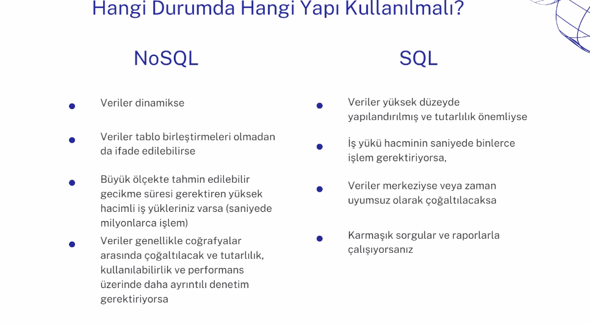
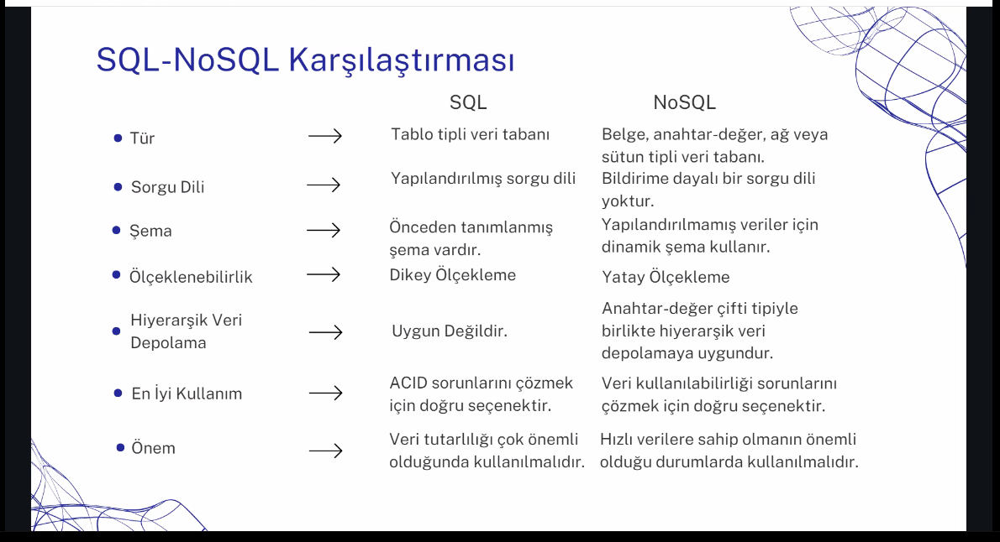

- Satır veya header kaçarsa entegrasyonda sıkıntı oluyor, dökümanın tamamını bir bütün halinde tutmak için document-based bir model kullanıyoruz. Bu yüzden de MongoDB tercih ediyoruz.

- SQL'de nispeten daha hızlı query sonuç alınır.

## SQL (Structured Query Language)

- Data is stored in tables
- There is rows and columns

## NoSQL (Not only SQL)

- Data is stored in collections
- There is documents and fields
