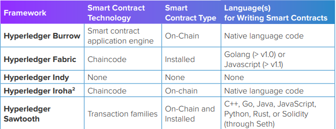

# Hyperledger Architecture - Smart Contracts

As an umbrella project Hyperledger does not have a single architecture per se. However
all Hyperledger projects follow a design philosophy that includes a modular extensible
approach, interoperability, an emphasis on highly secure solutions, a token-agnostic
approach with no native cryptocurrency, and ease-of-use. 

- **Consensus Layer** - Responsible for generating an agreement on the order and confirming the correctness of the set of transactions that constitute a block.
- **Smart Contract Layer** - Responsible for processing transaction requests and determining if transactions are valid by executing business logic.
- **Communication Layer** - Responsible for peer-to-peer message transport between the nodes that participate in a shared ledger instance
- **Data Store Abstraction** - Allows different data-stores to be used by other modules.
- **Crypto Abstraction** - Allows different crypto algorithms or modules to be swapped out without affecting other modules.
- **Identity Services** - Enables the establishment of a root of trust during setup of a blockchain instance, the enrollment and registration of identities or system entities during network operation, and the management of changes like drops, adds, and revocations. Also, provides authentication and authorization.
- **Policy Services** -  Responsible for management of various policies specified in the system, such as the endorsement policy, consensus policy, or group management policy. It interfaces and depends on other modules to enforce the various policies.
- **APIs** - Enables clients and applications to interface to blockchains.
- **Interoperation** - Supports the interoperation between different blockchain instances.

## Introduction to Smart Contracts
A smart contract is essentially business logic running on a blockchain. 

Smart contracts can be as simple as a data update, or as complex as executing a contract with conditions attached. For example, a smart contract can update an account balance, with validation to ensure that enough money is in an account before doing a debit.

*There are two different types of smart contracts:* 
- **Installed smart contracts** install business logic on the validators in the network before the network is launched. 
- **On-chain smart contracts** deploy business logic as a transaction committed to the blockchain and then called by subsequent transactions. With on-chain smart contracts, the code that defines the business logic becomes part of the ledger.

### **Which Hyperledger Frameworks Support Smart Contracts?**
- Hyperledger Burrow
- Hyperledger Fabric
- Hyperledger Iroha
- Hyperledget Sawtooth

### **Smart Contract Integrity and Availability**
To ensure the integrity and availability of the blockchain network and the smart contract layer, enterprise blockchains must control access to certain resources. Since smart contracts are programs, they are vulnerable to malicious attack, coding errors, and poor design. A breakdown in any of these areas can compromise the integrity or availability of the blockchain system.

Hyperledger recommends the following four safeguards to use with the smart contract layer to help ensure integrity and availability.

1. Denial-of-Service Production
2. Sandboxing
3. Resource Management / Flow Control
4. Application Lifecycle Management

Since different businesses have different requirements for blockchain, the Hyperledger community is working on several different ways to implement smart contracts.

Table 1 compares the smart contract implementations used across Hyperledger frameworks. For each framework, the table lists the smart contract technology used, the type of smart contract (either installed or on-chain), and the main programming language(s) used to write smart contracts.

---

### **Smart Contracts in Hyperledger Burrow**
Hyperledger Burrow is a permissioned smart contract machine. It provides a modular blockchain
client with a permissioned smart contract interpreter built to the specifications of the Ethereum
Virtual Machine (EVM), with some extensions and some changes yet to be incorporated.

**Application Global State**
The application state consists of all accounts, the validator set, and Hyperledger Burrow’s
built-in name registry. A transaction that calls on the smart contract code in a given account
will activate the execution of that account’s code in a permissioned virtual machine.

**Secure Native Functions**
Secure native functions provide the ground rules that all accounts and all smart contract
code must follow. They do not reside as EVM code, but are exposed to the permissioned
EVM via interface contracts. Permissioning is enforced through secure native functions. And
permissioning underlies the execution of all smart contract code.

**Permission Layer**
Hyperledger Burrow comes with a capabilities-based, evolvable permissioning layer.

The network is booted with an initial set of accounts with permissions plus a global default
set of permissions. Network participants with the correct permission can modify the
permissions of other accounts by sending an appropriate transaction type to the network.
This transaction is vetted by the network validators before the permissions are updated on
the target account. Through the EVM, further sophisticated roles-based permissioning can
be leveraged through Hyperledger Burrow’s roles on each account. Roles can be updated
through discrete transactions or smart contracts.

**Permissioned EVM**
This virtual machine is built to observe the Ethereum operation code specification and assert
that the correct permissions have been granted. An arbitrary but finite amount of gas—the
execution fee for every operation run on Ethereum—is handed out for every execution. This
ensures that the execution will be completed within some finite period of time.

**Gateway**
Hyperledger Burrow exposes RESTful and JSON-RPC endpoints for clients to interact with
the blockchain network and the application state either by broadcasting transactions or by
querying the current state of the application.

Websockets allow interfacing components to subscribe to events. This is particularly valuable
since the consensus engine and smart contract application engine can give unambiguously
finalized results to transactions after each block.

**Signing**
Hyperledger Burrow accepts client-side formulated and signed transactions. An interface for
remote signing is available. External signing solutions are crucial for Hyperledger Burrow’s
users since these allow the blockchain nodes to run on commodity hardware.

**Interfaces**
Hyperledger Burrow also uses boot and runtime interfaces, largely through files read by the
blockchain node at boot. Of course, Burrow also includes a remote procedure call (RPC)
which allows for interfacing with the node during runtime.

---
### **Smart Contracts in Hyperledger Fabric**
A smart contract in Hyperledger Fabric is a program, called chaincode. Chaincode can be written in Go, JavaScript (node.js), and eventually other programming languages such as Java that implement a prescribed interface. Chaincode runs in a secured Docker container isolated from the endorsing peer process. Chaincode initializes and manages the ledger state through transactions submitted by applications.

A chaincode typically handles business logic that members of the network have agreed to. The state created by a chaincode is scoped exclusively to that chaincode and can’t be accessed directly by another chaincode. However, with the appropriate permission, a chaincode in the same network can invoke another chaincode to access its state. 

There are two different types of chaincode to consider: 
- **System chaincode** typically handles system-related transactions such as lifecycle management and policy configuration. However the system chaincode API is open for users to implement their application needs as well.
- **Application chaincode** manages application states on the ledger, including digital assets or arbitrary data records. 

A chaincode starts with a package that encapsulates critical metadata about the chaincode,
including the name, version, and counterparty signatures to ensure the integrity of the
code and metadata. The chaincode package is then installed on the network nodes of the
counterparties. 

**Using Chaincodes to Develop Business Contracts and Decentralized Applications**
- There are generally two ways to develop business contracts for Hyperledger Fabric:
    - To code individual contracts into standalone instances of chaincode
    - To use one chaincode to handle all contracts (of certain types) and have it expose APIs to manage lifecycle of those contracts. This second approach is probably more efficient.

**Using Chaincodes to Define and Manage Assets**

Users of Hyperledger Fabric can also use chaincode to define assets and the logic that
manages them.

In most blockchain solutions, there are two popular approaches to defining assets: 
- The stateless UTXO (unspent transaction output) model, where account balances are
encoded into past transaction records.
- The account model, where account balances are kept in state storage space on the ledger.

---
### **Smart Contracts in Hyperledger Sawtooth**

Hyperledger Sawtooth is a distributed ledger project dedicated to making smart contracts
safe, particularly for enterprise use. It supports both types of smart contracts: installed and onchain. Developers can choose from seven languages to develop smart contracts in Sawtooth.

**Installed Smart Contracts with Transaction Families**

Any fully programmable language present certain risks. To limit these risks, other blockchain
networks will specify fixed transaction semantics. These networks can use families of
transactions that support only certain allowed operations. In this context, you can think of a
transaction family as a distributed application.

A sophisticated example that blocks arbitrary syntax is the <a href="https://github.com/hyperledger-archives/sawtooth-supply-chain">supply chain transaction family</a>.
The semantics of that family include about 20 operations required to trace the provenance
and other contextual information of any asset, but no further operations that could be
misused, either on purpose or by accident.

Any transaction family can be deployed with Hyperledger Sawtooth, so long as this
family supports the transaction family API. This is a simple API that supports a few operations
like **get state** to fetch something from the ledger and **set state** to set something in
the ledger.

Transaction families can be written in just about any language, including C++, Go, Java, JavaScript, Python, Rust and Solidity via Seth. Existing transaction families that support the API.

**On-Chain Smart Contracts with the Seth Transaction Family**

On-chain smart contracts are handled by plugging the Hyperledger Burrow Ethereum
Virtual Machine (EVM) onto the Hyperledger Sawtooth validator node. Once this is in place,
smart contracts can be written with Solidity code on Hyperledger Sawtooth using the
Sawtooth-Ethereum (Seth) transaction family and transaction processor. This allows for fully
programmable smart contracts.

Contracts are compiled in Hyperledger Sawtooth with the **seth load** command, which has
an **-init** flag that takes a hex-encoded byte array as an argument. This string is interpreted
as the contract creation code. The **solc** compiler can be used to generate this string for a
Solidity smart contract.

Contracts in Solidity, which can be compiled in Hyperledger Sawtooth, are similar to classes
in object-oriented languages. They contain persistent data in state variables, and functions
that can modify these variables. Calling a function on a different contract performs an EVM
function call and switches the context so that state variables are inaccessible.

Creating contracts is best done using the JavaScript API web.js. When a contract is created, a
function with the same name as the contract called a “constructor” may be executed once. The
constructor is optional and only one constructor is allowed, so that overloading is not supported.

If one contract wants to create another contract, the source code (and the binary) of the
newly created contract must be known to the creator. This means that cyclic creation
dependencies are not possible.

---

## Conclusion
**Key takeaways include:**
1. The Architecture WG will continue to define the following core components for
permissioned blockchain networks: Consensus Layer, Smart Contract Layer,
Communication Layer, Data Store Abstraction, Crypto Abstraction, Identity Services,
Policy Services, APIs, and Interoperation. 
2. The Architecture WG has shared a generalized reference architecture for smart
contracts that can be used by any Hyperledger project. 
3. Hyperledger Burrow, Hyperledger Fabric, Hyperledger Iroha, and Hyperledger
Sawtooth each manifest the reference architecture principles in unique ways.

---

### Permissioned Blockchain Networks

Blockchain requirements vary across different business and industries. Some uses require
rapid network consensus systems and short block confirmation times before being added
to the chain. For others, a slower processing time may be acceptable in exchange for lower
levels of required trust. 

---

### *Resources*

- <a href="https://www.hyperledger.org/wp-content/uploads/2018/04/Hyperledger_Arch_WG_Paper_2_SmartContracts.pdf">Hyperledger Architecture</a>