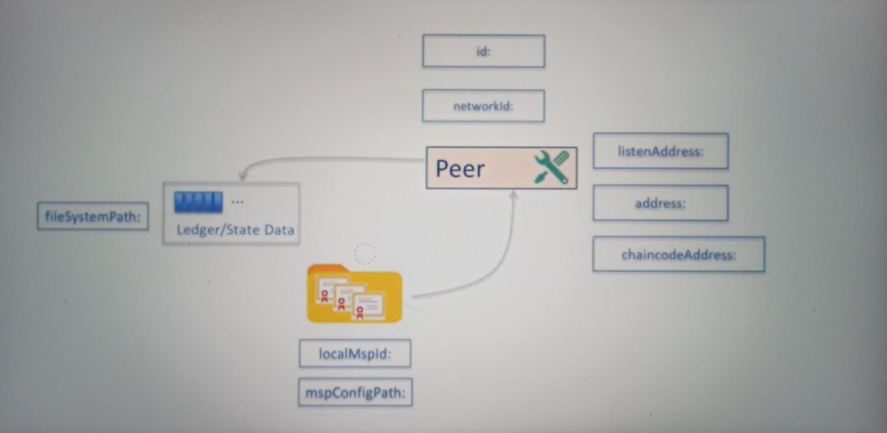

# Peer Configuration

Core.YAML has multiple section. Per section has the properties that control general behavior of the peer. For example, MSP configuration, networking and storage path where the peer is controlled by way of the properties under the peer section.

- **peer**: General properties e.g., Networking, MSP, Storage Path
- **ledger**: State database e.g., CouchDB connection
- **chaincode**: Chaincode runtime e.g., Logging, Startup timeout

Peer emits information about its internal state and this information is used for managing the peer instances.

Third party products or systems can intergrate the peer to carry out monitoring and alerting for the peer instances. The endpoint configuration for monitoring and alerting is managed under the **operations** and **metrics** section.

The last section is the **vm** section that has information regarding the use or docker containers within a virtual machine.

---

All parameters specified in the core.YAML file may be orderer by way of environment variables. Naming schema `CORE_SECTION_SUB-Section_PROPERTY`

- e.g. `CORE_PEER_LISTENADDRESS`

Make sure that you set `FABRIC_CFG_PATH` variable.

---

Peer writes data to the file system and there are certain parameters that need to be set for the file system writes.

Every peer in the network has an identity. Identity is assigned by way of an ID parameter under the general properties for the peer.

- **id**: Peer's identity `devpeer`
- **networkId**: Seperation of networks `dev`

The way it is used is that when the chaincode is instantiated, peer sets up a docker image and the name of the image is prefixed with he networkID. The peer process can be configured to listen on multiple addresses;

- **listenAddress**: Incoming gRPC connections; by default listens on all network interfaces.
- **address**: CLI config endpoint; other peers in the same org

If the **address** parameter is not set, then all incoming connections accepted on **listenAddress**.

> As a best practice always set the address parameter to a private IP address.

- **chaincodeAddress**: Chaincode listener address - Optional
  - is used by chaincode containers for interacting to the peer.

There are two parameters for setting up the local MSP.

- **localMspId**: Must match with the MSP ID in the channel _genesis block_
- **mspConfigPath**: File system path for MSP local configuration for the crypto material.
- Peer writes to the file system, where path to peer write is specified at **fileSystemPath**. As a best practice this path must be protected and secured.

## Transport Layer Security for the `peer`

Like the orderer, peer also has gRPC server embedded with it. It can receive calls from gRPC clients. The peer also acts as a gRPC client to the orderer.

The peer binary has the gRPC server and there are gRPC services which are exposed to the clients. These services are exposed on the `listenAddress`. gRPC support TLS, which is enabled by way of the properties under the TLS subsection. You can enable and disable the TLS and then you can also enable, disable client authentication.

The peer binary acts as a gRPC client to the orderer. If the orderer has the client authentication enabled, then the peer has to present it's certificate.

As look at the parameters you need to set for enabling the TLS on the peer.

1. Enabling the TLS
   - `tls`: TLS Configuration
     - `enabled`: true | false
     - `key`: Path to the private key _server.key_
     - `cert`: Path to the TLS certificate _server.crt_
     - `rootcert` : Truster root certificate
2. Setting up the Client Authentication
   - `tls`:
     - `clientAuthRequired`: true | false
       - false = Accepts connection from any source
     - `clientRootCAs`:
       - `files`: List of Client CA certs that can be trusted
3. gRPC TLS Client
   - `clientCert`:
     - `file`: Cert used by peer for client connections
   - `clientKey`:
     - `file`: Key used peer for client connections

### Enabling TLS on the Peer

There are 3 steps.

1. Enable the TLS & Set the certificates
   - It can be done by way of either the core.YAML update the `enabled, cert, key, rootcert` parameters or it can be done by of overwriting the core.YAML parameters in the environment variables.
2. Setup the VM `hostname` & `etc/hosts`
   - Reason you need to do this is because the DNS certificate issued to the peer is for a specific host. In our case devpeer host, doesn't have an associated IP and that is the reason we need to add that UP address to _axios_.
3. run a command to check if TLS is working. - `peer channel list` can be.

- `. env.sh`
- `. ./snippets/enable.tls.sh`
- `.start-node.sh`

if running this commands you would take an error.

- Peer associated with the host: devpeer
  - `sudo hostname devpeer`
- Host devpeer need to set with an IP address
  - if in `sudo vi/etc/hosts` does not have devpeer:
    - `sudo edit /etc/hosts`
  ***
- Hostname for the TLS certificate must match with VM hostname.
- Hostname must have IP address setup

## Gossip Data Dissemination Protocol

_Gossip data dissemination_ protocol is computer-to-computer process that is based on the way _social network disseminates information_ or how the _epidemics spread_.

The main objective of this protocol is to get all the nodes in sync in terms of the data they hold.

- There is **NO CENTRAL** data repository or hub.
- _Nodes interact_ with each other to _send | receive data_.
- Network state is _eventually consistent_.
- Inherent _redundancy_, because each of these nodes pull the same data.

> Hyperledger Fabric Peers _leverage gossip data dissemination protocol_ to broadcast ledger and channel data in a scalable fashion.

There are 3 primary functions;

1. Manages _Peer discovery_ & _channel membership_
2. Peers identify the missing data and receive daata from other peers.
3. New peers catch up by receiving data from other peers.

> All peers engaged in the concept network must be members of the same channel. In other words two peers that have joined different channels will not engage in the gossip data dissemination protocol.

One of the peer is elected as a leader. The leader peer then connects to the order to receive the block data on receiving the block data from the orderer. The leader peer forwards that block data to lead peers in the network. These peers receiving the data. Then engage in te gossip dissemination to disseminate the new block data to the rest of the peers in the network.

Sometimes the peers will discover that they are lagging. In that case, they don't wait for the data to be sent. They can initiate a pull request from other peers to guard the log data, builds forward data to random number of peers, and this number is selected independently by each of the peers.

There are two ways in which the leader can be set. Either it can be set statically by way of assigning the peer the role of a leader, or it can be set by real dynamic election of leader RUNTIME.

Peers send signed heartbeats to other peers. If connected peer, does not send, then that peer is pushed after some time. That's how the inactive peers are removed from the Gossip Network.

### Gossip Parameters Setup

In order for a peer to connect to a gossip network.

- `peer`:
  - `gossip`:
    - `bootstrap`: List of bootstrap
    - `aliveTimeInterval`: Time (seconds) between alive message
    - `aliveExpirationTimeout`: Alive expiration in seconds
    - `orgLeader`: true | false
    - `useLeaderElection`: true | false
  ***
- Large network for peers it is recommended to set `useLeaderElection = true`

## BCCSP Setup

CSP exposes the cryptographic functions such as **encryption, decryption, key pair generation, private key security**.

Peer crypto service provider is configurable. Peer support both software based CSP and hardware based CSP.

- `BCCSP`: Blockchain Crypto Service Provider
  - `Default`: Preferred Provider _SW | PKCS11_
    - `SW`:
      - `Hash`: Hashing algorithm
      - `Security`: Key size
      - `FileKeyStore`: Location of the keystore (default LocalMSPDir/keystore)

## `peer` Events

- Peers emit events on receiving blocks.
- Clients subscribe to this events.
- Event subscription is on per channel basis.
  - Only member organization can subscribe.
  - Subscriber may be from outside the organization.
    - Receive missed events
- Chaincode emit events. Defines the chaincode events.
  - Emitted in code using SDK/API.
  - Chaincode events included in the block event emitted by peer.
- Chaincode event subscription
  - Get the status of the transaction.
  - Trigger asynchronous processing.
- Client Subscription models
  - `Filtered`:
    - Block information summary | Transaction status
    - Less restrictive in terms of access.
    - Chaincode _event_ name only
  - `Un-Filtered`:
    - All of transaction information
    - Stricter access restriction
    - Chaincode _event_ payload
  ***
- `events`:
  - `Address`: `0.0.0.0:7053` CORE_PEER_EVENTS_ADDRESS

## core Ledger Setup

The peer binary stores the **ledger** and **state data** in persistent storage. The transaction log or the blockchain data is always stored in the **levelDB database**. The data is written into the file system.

The state data can be configured to use levelDB or an instance of couchDB.

To setup to peer to use couchDB:

- `core.yaml`:
  - `ledger`:
    - `stateDatabase` = CouchDB
    - `couchDBConfig`
    - `couchDBAddress`: Database instance address
    - Database credentials need to be set
      - `username`
      - `password`
    - Database tuning parameters may be set
      - `maxRetriesonStartup`
      - `maxRetries`
      - `requestTimeout`
      - `queryLimit`
- State data written to couchDB.
- Database configuration parameters set

### Best Practices

**Txn Log**

- Use the local file system as opposed network drive.
- Secure the file system.

**State**

- Co-locate the peer and CouchDB on same server/host.
- Setup secure access credentials.
- Disable remote access to CouchDB in production.
  - If used for querying then whitelist UP from where to connect.
