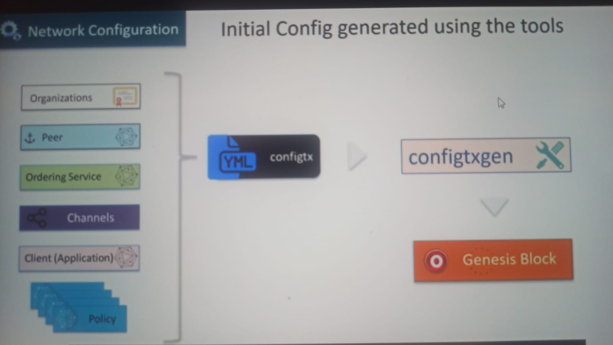

# Setting Up the Network Configuration and Policies

Members need to include the initial set of **organizations** that will be part of the network. Examples are _ACME AIR_ and _Budget_.

Each of these organization will have **anchor peers**. So those need to be identified as part of the network setup.

**Ordering service** as the administration point for the network. As a result, desicions need to be made around how the administration will be carried out using the ordering service.

Initial set of **application channels** need to be described. These channels will be used by the various members for carrying out the transactions.

Then there is a set of **client or applications** that need to be described in the network configuration.

**Policies** for he network are defined as part of the network configuration. These policies are defined at _multiple level_.

- Organization Level
- Ordering Service Level
- Channels Level

Policies defined who can modify the configuration elements and also how those modifications will be carried out.

---

So the initial set of configuration elements along with the policies are encoded in the `configtx.yaml`file. Then configtx file then used as input to the `configtxgen tool` that generates the **Genesis Block**, that contains the initial configuration for the network.

The genesis block, along with the configuration elements and the policies is **stored in ledger**.

- Also the _changes are consensus driven and they are enforced by the policies contained in the Genesis Block_.
  - Consensus driven model leades to **transparency**.
  - High level of **trust** among the members.
  - **Built in audit for config changes**.

_Even **Policies** can change over a period of time_.

---

The configuration for the network and the channels is updated by way of a special transaction called the **Config Update Transactions**.

- Config update tx are submitted for making changes.

Administrators submit these config update transactions to the network. These transactions go through the same process as the normal transactions, except they are executed by the configuration system chaincode. Once the config transaction has been validated, it is delived by the orderer in a block or config block. _This is a special block that has only **one transaction and that is the config update transaction**._

---

Orderer system channel is a special channel that gets created as part of the network initialization. All of the peers and the orderers in the network are aware of the orderer system channel by way of the Genesis Block.

- Orderers and peers use the orderer system for initialization. That is the reason Orderer System Channel also **refers to as Bootstrap Channel**.
- Network configuration held in the orderer system channel ledger.
- Primary responsibilities of the orderer system channel is to orchestrate the creation of **new channels**. These are application channels.

## Inspecting the latest channel config

There are three steps;

1. _Fetch the latest **Config Block**._
2. Translate the block to **JSON**.
3. Extract the _config_ using ./jq

---

0.  - Initialize orderer and peer.
1.  - Create a temp folder under the `peer/simple-two-org/temp`
    - `peer channel fetch config -c acmechannel -o localhost:7050 ./temp/config_block.pb`
2.  - `configtxlator proto_decode --input ./temp/config_block.pb --type common.Block > ./temp/config_block.json`
3.  - We need channel configuration path.
    - `export JQ_CONFIG_PATH=.data.data[0].payload.data.config.channel_group.groups.Orderer.values`
    - `cat ./temp/config_block.json | jq $JQ_CONFIG_PATH`
