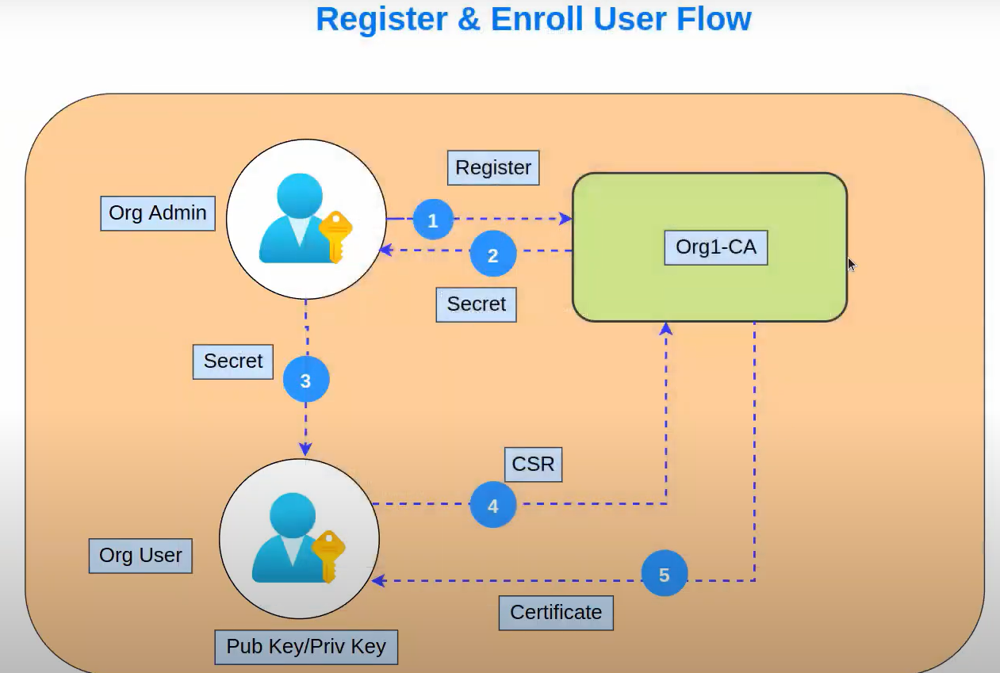

# <a href="https://github.com/adhavpavan/FabricNetwork-2.x.git">Fabric Network</a>

- Right now we have total four organizations. **Three peer organizaton** and **One orderer organization**.
- We have only one peer in each organization. In the previous repository we had 2 peers for each organization.
- Each of the peer is going to be **endorser peer** in our network.
- We are not going to use **cryptogen tool** for generating the crypto material. We'll use **Certificate Authority** for creating the crypto material. We will have 3 CA for Peers and 1 CA for Orderer Organization.
- Each peer has current state database as **CouchDB**.

---

1. Run CA services for all organizations.
2. Create crypto materials for all organizations.
3. Create channel artifacts using OrgMSP.
4. Create channel and join peers.
5. Deploy Chaincode
   1. Install all dependencies.
   2. Package chaincode.
   3. Install chaincode on all endorsing peers.
   4. Approve chaincode as per lifecycle endorsement policy.
   5. Commit chaincode definition.
6. Create connection profiles.
7. Start API server.
8. Register user using API.
9. Invoke chaincode transaction
10. Query chaincode transaction.

---

1. Create certification authorities with docker-compose file in `artifacts/channel/create-certificate-with-ca`. Then run `create-certificate-with-ca.sh` file for create **crypto-config** file inside the `channel`.
2. Then come to next step. Next step is the generating the _channel artifacts_. Like creating the **genesis block** and **channel transaction** files.
   - In **configtx.yaml** file at `channel` folder, We have three organizations.
   - With `create-artifacts.sh` file, we can create the _channel artifacts_.
3. Then docker services for orderers, peers and couchdb instances should be up and running. So we are starting them `/artifacts/docker-compose.yaml`.
4. Then we need to create channel and join all peers to this channel.
   - `./createChannel.sh`
5. Next step is the deploying the chaincode with `deployChaincode.sh`
   - In `artifacts` folder there is a `configtx.yaml` file. We have policies defined here.
     - In here there is a _LifecycleEndorsement_ and it's rule is **MAJORITY Endorsement**. We have 3 organization and for committing the chaincode we require atleast majority of the endorsement. So we should approve for two atleast.

# API

Need to be install node modules, then with `generate-ccp.sh` inside config folder going to create connection profiles inside the config folder.

## Cross Chaincode Communication

Sometimes there is a requirement to share the data or communication between smart contracts.

## Certificate Revocation in Hyperledger Fabric

Before starting revoking the identity we have to know that what is the process for creating the certificate for particular user.

1. Registration and Enrollment
   - In this step generally, admin of the organization is responsible for registering the new user. In the diagram you can see here the **first step**, admin of the organization need to register that particular user with the **certificate authority**. For each organizations we have dedicated certificate authority. Then admin gets the secret. This operation done by admin of the organization only. When admin get this secret, so this secret can be sent to the user who want to enroll.
   - Using this secret new users can going to enroll, he will create **certificate signing request (CSR)**. For creating the CSR we need to have public and private key and this user need to have them. Using these he create the CSR and request to the same CA. CA just verify if this is the valid user, because admin have already registered that user and owns validation takes place and this CA written one certificate to the user. This is the certificate for that particular new user.
   - In this registration and involvement process user get finally certificate after creating the CSR.

The flow is straightforward.

1. Registration - Can be done by organization admin.
2. Enrollment - Can be done by user if he has the secret.
