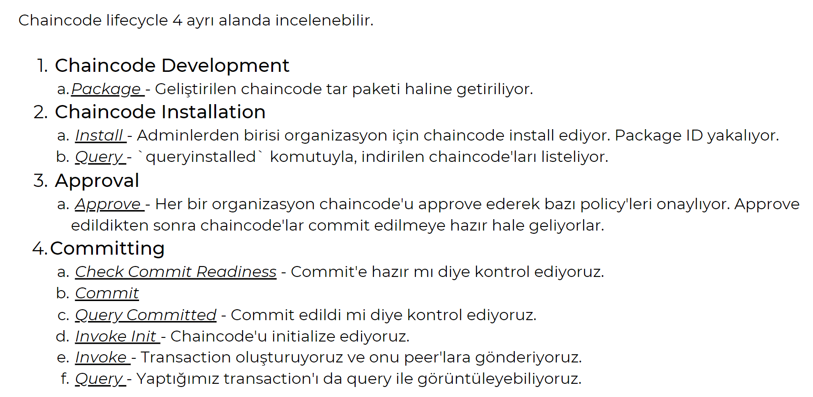

Fabricteki ana temaları Enes'le birlikte anlatmıştık geçen sunumda. Bugün hem oraları biraz hatırlatmak, hem de üstüne development'ta işler nasıl yürüyor anlatmak istiyorum sizlere.

Bilinmesi gereken şeylerle ilgili ufak bir şey hazırladım bunu da gruba atıyorum.

- **Orderer**: Ordering System, İletişim kanalını sağlar. _Consensus_ mekanizmasını sağlar ve _transactionların_ yürütülmesinden sorumludur.
- **Peer Node**: Defterleri ve akıllı sözleşmeleri yönetirler. Fabric Gateway hizmetini çalıştırarak işlem tekliflerini ve onayları da yönetir.
- **Configtxgen**: Network ve Channel konfigürasyonları
- **Cryptogen**: Test ağında kullanılmak üzere identity yaratma aracı.
- **Certification Authority**: Production'da kullanılmak üzere identity yaratma aracı.

Bunları hatırladıysak geçelim development kısmına.

Göstereceğim örnekte;

- 3 farklı peer organizasyon ve bir tane de orderer organizasyon bulunmakta. Bunları yetkilendirme gibi şeyler için kullanabiliyoruz.
- Her bir peer endorser peer olarak bulunuyor. Yani işlem onaylayıcılar. Burada 3 tane peer'ımız var demiştik. 2'si onaylamazsa işlem onaylanmıyor.
- Burada cryptogen kullanmıyorum, çünkü daha test için kullanılan bir şey. Gerçek hayatta kullanılacaklar için certification authority makul olan seçenek.
- Database olarak ise CouchDB kullanıcağız.

## NEDEN CouchDB?

CouchDB 2005'ten beri hayatımızda olan NoSQL bir veritabanı. JSON tabanlıdır. HTTP REST API ile veritabanına erişimi sağlanır.

### **MongoDB vs. CouchDB**

|                                   | CouchDB                                                                                                                                                                                                                                 | MongoDB                                                                                                                                                                                                                                                                                                                                                                      |
| :-------------------------------: | :-------------------------------------------------------------------------------------------------------------------------------------------------------------------------------------------------------------------------------------- | :--------------------------------------------------------------------------------------------------------------------------------------------------------------------------------------------------------------------------------------------------------------------------------------------------------------------------------------------------------------------------- |
|            Data Model             | **JSON**, The data formats are limited to: strings, numbers, arrays, objects, boolean.                                                                                                                                                  | **BSON**, Large number of data types                                                                                                                                                                                                                                                                                                                                         |
|             Indexing              | Indexing of documents is **limited**                                                                                                                                                                                                    | Secondary indexes on any field are available and supported in different types                                                                                                                                                                                                                                                                                                |
|          Query Language           | CouchDB uses an HTTP **Rest API** to its server endpoint to query and manipulate data. _Queries_ in the basic API support either returning all documents in a database, or retrieving a specific document based on a unique identifier. | MongoDB has a very rich query language called MQL. It supports a wide variety of modern native drivers as well as a shell. The data can be edited, deleted, inserted, and queried in many shapes and forms. The queries can use complex operators like geo queries, text queries, regular expressions, and compound conditions. Any query can be sorted or have projections. |
| High Availability and Scalability | CouchDB is eventually consistent and uses optimistic locking as part of its database operations. Write operations do not lock database objects and conflict errors need to be resolved by the application developer.                    | MongoDB allows multiple database users to concurrently access the same data by managing a well defined concurrency control.                                                                                                                                                                                                                                                  |

CouchDB'de client tek bir veritabanına bir bilgi girdiğinde, bu bilgilerin diğer veritabanlarına yayılmasını garanti eder. MongoDB'de ise veritabanı fazlalık sağlamak için bu çoğaltma setini kullanmayı tercih etmez.

Performans ve okuma hızı olarak MongoDB, CouchDB'ye göre üstündür.

CouchDB, hem master-master, hem de master-slave replikasyonu sunarken, MongoDB yalnızca master-slave yapılandırmalarını kapsar. Esas olarak da bu sebeple Hyperledger Fabric'te CouchDB database olarak kullanılmalıdır.

---
