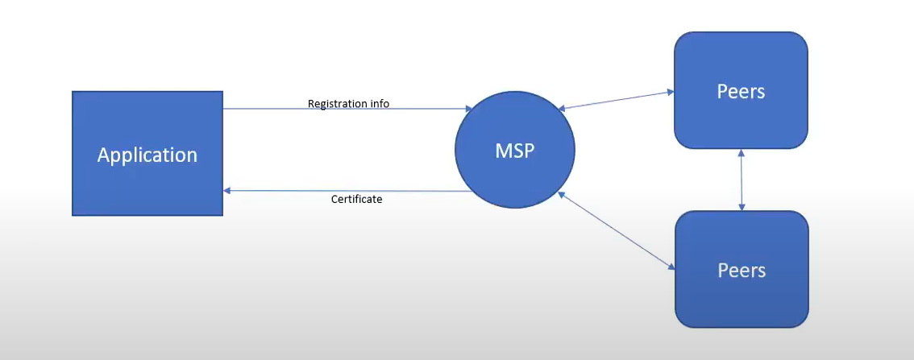

# Hyperledger Fabric

- **Permissioned Ledger**: Need permission to be on the network
- **MSP**: Member Service Provider
  - Validates users
  - Authenticates users
  - Allows access to new users
- The network is run by peers
- **Proposal**
  - A proposed change to the state of the network
- **Endorsement**: Endorse a transaction
- **Committing**: Commit new transaction
- **Ordering Service**: Order transaction in a block
- **Ledger**: Global state
- **Channels**

This is basically hyperledger network looks like.

This is how distibuted application. This application allows users to communicate with peers. However between user and peer also an msp. Peer can be an MSP aswell.

If user wants to commit a transaction what they do is they propose a change to the global state to the peer. Then the peer basically runs a chaincode and decides whether the transaction can be done or not. If the transaction can be done, then the peers regardles of whether the transaction can be done or not.

Peers give response succcess or failure. Once peers receive the transaction what they do is they act as endorsers or committers. Peers give validates the transaction and the transaction gets sent to the ordering service.

A lot of peers simultaneously sends a lot of transaction to the ordering service and then ordering service creates a sequence of transactions. Once the sequnce of transaction is done, the ordering service sends these transactions back to the peers. This sequence basically is a **block**.

Once that is done peers commits this block to the **global ledger**. If the transaction is committed in a private channel, then the peers only updates the global ledger. They don't put the transaction by itself in the ledger.
