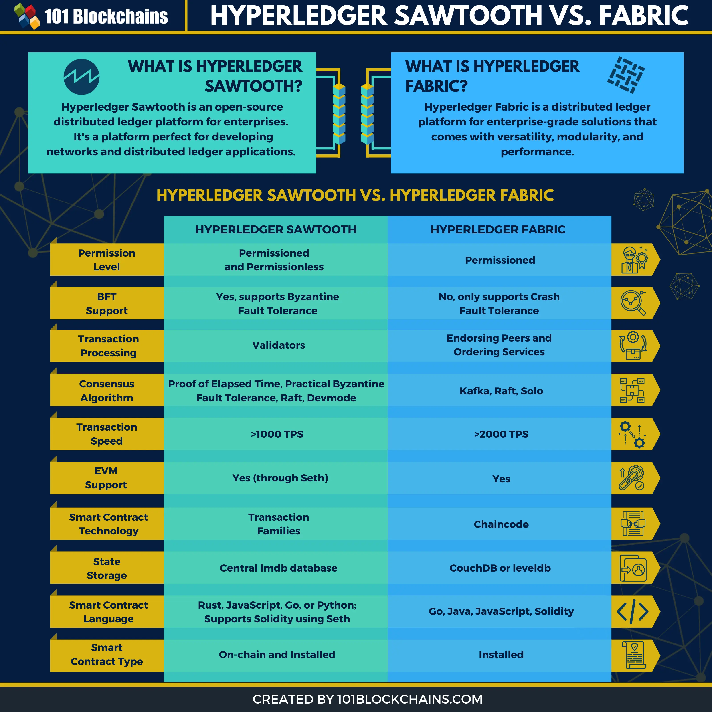

# Hyperledger Sawtooth Vs. Fabric: How Are They Different?

Hyperledger blockchain is one of the popular projects on the market right now. Hyperledger Fabric and Hyperledger Sawtooth are two platforms that offer the best of the best output for enterprises. That’s why there’s always a popular debate on Hyperledger Sawtooth vs Fabric.

Many of you also think that both of the platforms are more or less the same. But that’s not the real case. In reality, there are some distinct differences between them, and today we’ll talk about them as well.

Hyperledger Fabric seems to be a bit more on the popular side, but both of the platforms have their special use cases. Anyhow, enough with the chit chat, let’s start the comparison of Hyperledger Sawtooth vs Fabric.

## What is Hyperledger Sawtooth?

First of all, we’ll start with a little introduction to both of the platforms to clear things up for you a bit. <a href="https://101blockchains.com/hyperledger-sawtooth/">Hyperledger Sawtooth</a> is one of the major open-source projects of the consortium Hyperledger. In reality, it does have some similarities with Hyperledger Fabric.

However, it’s more suited for developing decentralized applications or platforms.

Also, they ensure that you have the best smooth experience in the development. Therefore, they kept the development layer totally separated from the main network.

That’s why no matter what you do, the core system will always stay unaffected. More so, the increasing amount of resource sharing won’t affect the core system in any way. Thus, making this platform the perfect example of developing applications.

You should keep in mind that the platform does support a wide variety of programming languages. So, that gives you a whole lot of interesting ways to <a href="https://101blockchains.com/implement-blockchain/">implement blockchain</a> applications or blockchain solutions.

You can learn more about the use cases in the <a href="https://101blockchains.com/hyperledger-sawtooth-tutorial/">Hyperledger Sawtooth tutorial</a>. Actually, Hyperledger does offer very enriching tutorials on Sawtooth just to help developers understand it better. So, if you are interested in learning more about it, you can easily use their Hyperledger sawtooth use cases for that.

