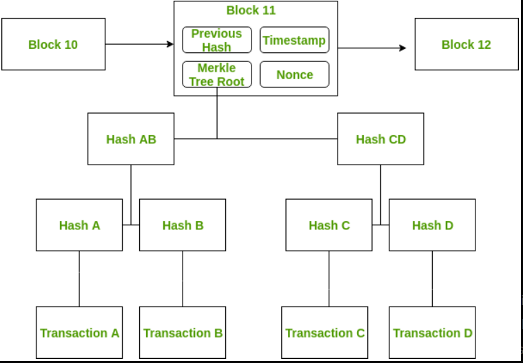

# Introduction to Blockchain Technology

Blockchain technology has been garnering great hype recently. It gained popularity after the introduction of Bitcoin in 2009 by the person or group of people by the pseudonym Satoshi Nakamoto. Many people confuse and believe blockchain to be bitcoin. But, bitcoin is one application of the blockchain technology. There are many other applications and use cases that can be solved using blockchain other than just payment systems.

> **A Blockchain** is defined as a peer to peer distributed ledger forged by consensus, combined with a system for smart contracts.

- Now, that definition might contain a lot of uncommon terms so lets start by breaking it into parts and understanding each term.

### Peer to Peer Network

You must be aware of BitTorrent and Tor. Both of these are built on peer to peer network design. A peer to peer network is a distributed application architecture that consists of computing devices connected to each other, without a central server.

In centralised networks, the security is dependent on a single entity. If that central server is attacked, the security of the overall network is compromised. But a peer to peer network is more secure as there is no single point of failure.

### Distributed Ledger

A ledger is a system containing all the records of a input and output of a process. A distributed ledger is a data structure which is spread across different computing devices. DLT (Distributed Ledger Technology) is the technology that distribute records across all the users. DLT consists of 3 components – **Data Model** (current state of ledger), **Language of transactions** (which changes ledger state) and **Protocol** (used to build consensus). Blockchain is a type of DLT. This way the data is shared among all its users increasing transparency and avoiding corruption.

### Consensus

Consensus is a process of ensuring that all the different users in a blockchain come to an agreement regarding the current state of blockchain. There are several consensus mechanisms that are used by different blockchains to achieve consensus. For example, Bitcoin uses Proof-of-Work while Ethereum is moving from Proof-of-Work to Proof-of-Stake algorithm.

### Smart Contracts

Forget smart contract and blockchain for a moment. Think about contracts in general. These contain some conditions which need to be fulfilled in order for some transaction (eg; money exchange) to occur. For example, if you are selling me a laptop, a contract will contain that I will be responsible to pay you only if the laptop works properly. Similarly, smart contracts are pre-requisite conditions which need to be fulfilled for transactions to happen in a blockchain.

---

## What is inside a blockchain?

- Previous hash,
- The timestamp,
- Nonce,
- Merkle tree root

Each block containes a cryptographic hash of the data of the previous block. The **nonce** is calculated by the miners by solving cryprographic puzzle to propose the next block in the chain. It is known as **proof of work**.

The blockchain is said to be immutable because of its cryptographic properties. But this does not mean that changing the data is impossible. It means that it is extremely hard to change the data and any change can be easily detected. A merkle tree is a binary tree with hash pointers. A merkle tree is a structure that allows for efficient and secure verification of content in a large body of data. The advantage of using merkle trees is that proving membership requires O(logn) steps. Also, in a sorted merkle tree, non-membership can also be proved in O(logn) steps. The first block is known as the **genesis block**.

**Advantages of Blockchain**, what is the need for using blockchains. Blockchains are expected to be implemented by most businesses because of the several benefits it provides. The blockchain eliminates the need of a third party between two entities that are willing to exchange something. This saves time as exchanges can be done without any outside interference. It saves money as it reduces overhead and cost of intermediaries. It reduces risk of tampering, fraud and cyber crime due to its immutable nature. There is no need to trust a third party now as the records are stored in distributed ledgers. It has several other advantages specific to the use case it is applied to.

### **Types of Blockchain**

There are different types of blockchains possible in the ecosystem.

1. Public
2. Private
3. Consortium

---

### Resources

<a href="https://www.geeksforgeeks.org/introduction-to-blockchain/?ref=lbp">Introduction to Blockchain</a>

<a href="https://www.youtube.com/watch?v=SSo_EIwHSd4&ab_channel=SimplyExplained">How does a Blockchain Work?</a>
