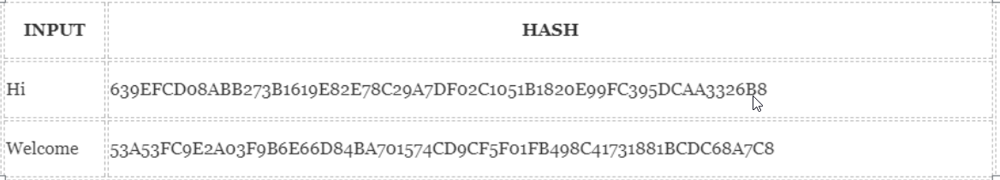

# Cryptography & Hashing

**Cryptography** is the study and practice of techniques for secure communication in the presence of third parties called adversaries. It deals with developing and analyzing protocols which prevents malicious third parties from retrieving information being shared between two entities thereby following the various aspects of information security.

1. **Confidentiality** refers to certain rules and guidelines usually executed under confidentiality agreements which ensure that the information is restricted to certain people or places.

2. **Data Integrity** refers to maintaining and making sure that the data stays accurate and consistent over its entire life cycle.

3. **Authentication** is the process of making sure that the piece of data being claimed by the user belongs to it.

4. **Non-repudiation** refers to ability to make sure that a person or a party associated with a contract or a communication cannot deny the authenticity of their signature over their document or the sending of a message.

---

**Hashing** is one way to enable security during the process of message transmission when the message is intended for a particular recipient only. A formula generates the hash, which helps to protect the security of the transmission against tampering.

It is important to know how blockchain Hashing works. In order to do that, however, we need to first understand one of the core principles that go into blockchain creation. Blockchain technology is one of the most innovative and era-defining discoveries of the past century.

In simple terms, hashing means taking an input string of any length and giving out an output of a fixed length. In the context of cryptocurrencies like bitcoin, the transactions are taken as input and run through a hashing algorithm (bitcoin uses SHA-256) which gives an output of a fixed length.

### Cryptographic hash functions

A **cryptographic hash function** is a special class of hash functions that has various properties making it ideal for cryptography. There are certain properties that a cryptographic hash function needs to have in order to be considered secure. Let’s run through them one by one.

1. Deterministic

   - This means that no matter how many times you parse through a particular input through a hash function you will always get the same result.

2. Quick Computation

   - This means that no matter how many times you parse through a particular input through a hash function you will always get the same result.

3. Pre-Image Resistance

   - What pre-image resistance states are that given H(A) it is infeasible to determine A, where A is the input and H(A) is the output hash. Notice the use of the word **infeasible** instead of **impossible**. We already know that **it is not impossible to determine the original input from its hash value**.

4. Small Changes In The Input Changes the Hash
   - Even if you make a small change in your input, the changes that will be reflected in the hash will be huge.

 

---

### Resources

<a href="https://www.geeksforgeeks.org/cryptography-introduction/">Cryptography Introduction</a>

<a href="https://blockgeeks.com/guides/what-is-hashing/">What is Hashing?</a>
