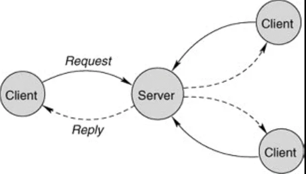

# Konsensüs Protokolleri

Geleneksel olarak bilgisayar sistemleri **server-client** modelini kullanır. Bu merkezi bir yaklaşımdır, server ortadadır, client'ın isteklerine yanıt verir.

**Peer to peer** model ise değneğin diğer ucundadır. Tamamen merkeziyetsiz bir sistem gerektirir. Her **node(düğüm)**, **hem server hem de client** olarak çalışır, hepsi eştir. Bu sistem kendi kendini organize edebilir. Bu nedenle yasaları, yasakları ve sansürü atlatmak için harikadırlar.

2000'li yıllarda peer to peer (eşler arası) sistemler popülerdi. Eşler arası müzik paylaşım uygulamaları **Napster** çok popülerdi. Bittorent (eşler arası iletişim protokolü) de çok popülerdi. Bir dönem BitTorrent tüm internet trafiğinin %20'sinden fazlasından sorumluydu.

Ardından, yıllar içinde eşler arası sistemler kayboldu. Metallica-Napster davaları ya da çeşitli film yapım firmalarının torrent siteleri ile savaşları vs derken eşler arası mimari kaldırıldı. Gerçek şu ki; P2P(peer-to-peer) sistemler pratik değildi ve merkezi modele karşı kaybetti. Ancak bu çalışmalardan elde edilen fikirler-teknolojiler geleneksel veri merkezi sistemlerinin geliştirilmesinde kullanıldı.

Bitcoin ile olan oldu ve bizans hainlerine dayanıklı bir konsensüs protokolü (**Nakamoto Consensus**) geliştirildi ve açık kaynak olarak paylaşıldı.

Zaman içinde kriptoparalar için asıl sorunun (Konsensüs protokolü) çözümü için birçok öneri ve yeni geliştirmeler yapıldı. Örneğin; **Bitcoin-NG, Tendermint, Avalanche vs**.

Kriptoparaları daha iyi anlamak için konsensüs protokollerini iyi anlamamız gerekmektedir. Yazılmış akademik tezlere, makalelere karşın yani bilinenin aksine **Proof of Work(PoW) ya da Proof of Stake(PoS) vb mekanizmalar konsensüs protokolü değildir. Bunlar sybil atak engellemek için alınan önlemlerdir**.

> Sybil saldırısı, bir ağı birden fazla sahte kimlik oluşturarak kontrol etme girişimidir. Dış gözlemciler için, bu sahte kimlikler benzersiz kullanıcılar gibi görünürler. Perde arkasında tek bir varlık aynı anda birçok kimliği kontrol edebildiğinden ağın kararlarına orantısız müdahil olunma riski doğar. Sonuç olarak, bu varlık ağdaki demokratik oylama gücünü kendi lehine etkileyebilir veya spekülatif haberlerle ağda karmaşa yaratabilir.

> Sybil saldırısına verilecek en yakın örneklerden biri de Amerika seçimlerinde Rusya’dan birçok sahte hesabın asparagas haberler yayma girişiminde bulunduğu şüphesidir. Sahte hesapların ve botların Facebook veya Twitter’a girerek ağın tamamını etkilemek için birden çok kimlik kullandıkları iddia ediliyor. Sybil saldırısı etkisi kuvvetli ancak tespit etmesi zor bir tehlikedir. Zira tek bir işletmenin/kişinin birçok hesabı kontrol ettiğini söylemek çok zor olabilir.

Bu bağlamda; Bitcoin’in kullandığı konsensüs protokolü Proof of Work değil, Nakamoto Konsensüs protokolüdür.

---

## Konsensüs Protokolü Nedir?

**Konsensüs**, dağıtılmış defterlerin temel çalışma özelliğidir. Bilgisayar biliminde konsensüs, dağıtılmış süreçler veya sistemler arasında tek bir veri değeri veya durum üzerinde anlaşmaya varmak için kullanılan protokollerdir. **Konsensüs, birbirlerini tanıması veya güvenmesi gerekmeyen taraflar arasında işlemlerin otomatik olarak yürütülmesi için güvenilir yazılım mekanizması sağlarlar**.

Kısaca, eşlerin(düğümlerin) günün sonunda aynı karar üzerinde fikir birliği kuracağını ve hiçbir düğümün farklı karar ver(e)meyeceğini belirtir.

Bir algoritma; Anlaşma (Agreement), Geçerlilik (Validity) ve Sonlandırma (Termination) gereksinimleri karşıladığında fikir birliğine varmış olur.

- **Anlaşma**: Hiçbir düğüm farklı karar veremez.
- **Geçerlilik (Bütünlük)**: Önerilen ​​değerlerinin tümü aynı ise, düğümlerin bu değeri vermesi gerekir. Tüm çıkış değerleri bir istemcinin giriş değeri olmalıdır.
- **Sonlandırma**: Sistem yeterli bir süre için güvenilir ve senkronize ise, tüm istemciler aynı değer vermelidir.

Fikir birliği protokollerinin performansını değerlendirirken, ilgilenilen iki faktör vardır diyebiliriz. Bunlar _çalışma süresi ve mesaj karmaşıklığıdır_.

> Klasik Konsensüs Protokolü olarak bilinen pBFT (Practical Byzantine Fault Tolerance) Big-O notasyonunda O(n²) karmaşıklığına sahipken, Facebook Libra’nın kullandığı protokol HotStuff O(n) ve son örnek olarak Avalanche Protokolü O(kn log n) ile O(kn) arasında bir karmaşıklığına sahiptir.
