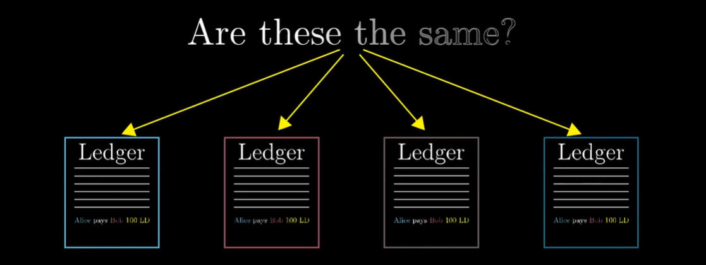

# Bizanslı General Problemi

Diyelim ki, ordunun farklı kısımlarını kontrol eden bir kısım Bizans Generali bir şehri kuşatıyor. Bu generallerin bu şehre ya saldırı kararı başlatması, ya da geri çekilme kararı almaları gerekiyor, fakat generaller aynı odada değiller. Dolayısıyla birbirleriyle tartışmıyorlar, sadece kendi kararlarını ilan edebiliyorlar.

Ancak bir sonuca varılması için herkes tarafından ortak bir karar alınmalı, yoksa yarım yamalak bir saldırı kararı alınabilir. Hem şehir, hem de ordu kaybedilebilir. Dahası generallerden bazıları **ihanetçi** bile olabilir.

- Mesela 9 generalden 4 tanesi saldırı kararı, 4 tanesi çekilme kararı almış olsun. 9. general çekilme kararı alanlara çekilme oyu verdiğini, saldırı kararı alanlara ise saldırma oyu verdiğini belirtebilir ve orduyu darmadağın edebilir. Bu sorun çözülemezse taraflar ortak bir karara varamazlar.

İşte bu Matematik ve Kriptografide **Bizanslı General Problemi** denir.

Bitcoin'in bu problemi çözme şekli ise Proof of Work'e dayanıyor.

> Bizim amacımıza baktığımız zaman dağıtık defterleri tutan herkesin, aynı deftere sahip olabilmesi. Bunun için de defterlerin gerçeği yansıtıp yansıtmadığını çözebilmeliyiz. Burada tabii ki defteri tutana güvenemeyiz, güveni insani olmayan bir şeye vermemiz gerekiyor.

## Proof of Work (İş İspatı)

PoW konsensüsü, ağda yayınlanacak olan bir sonraki bloku oluşturmak adına, belli bir eşiğin (nonce) altında olan bir değer karşılığında matematiksel bulmacaları çözmeye dayanır. Sonraki bloku oluşturan blok liderleri loto benzeri bir formatla seçilir. Bu seçim, madencilerin işlemi gerçekleştirmek için katkıda bulundukları işlem (hash) gücüne doğrudan bağlıdır. Satoshi Nakamoto’nun Bitcoin whitepaper’ında açıkladığı üzere:

> “İş İspatı, çoğunluğu temel alan karar mekanizmasında temsilcilerin belirlenmesi problemini de çözüyor. Çoğunluğu oluşturmak için her IP adresi başına bir oy prensibi benimsenmiş olsaydı çok sayıda IP adresi edinebilecek herkes kendi başına çoğunluğu oluşturabilirdi. İş İspatı mekanizmasının temelinde ise her CPU başına bir oy prensibi bulunuyor. Çoğunluk kararını temsil eden en uzun zincir, aynı zamanda, en fazla İş İspatı çabasını sağlamış olan zincir. CPU gücünün çoğunluğu dürüst node’lar tarafından kontrol edilirse bu dürüst zincir, en hızlı büyüyen zincir olacaktır ve rakiplerinin önüne geçecektir.”

### Madenciler

Madenciler, her 10 dakikada bir oluşturulan yeni blokları üretmek ve ağa yayınlamak için birbirleriyle rekabet eden bir katılımcı piyasasıdır. Her 10 dakikalık raundun sonunda kazanan madenci hem blok ödülünü (an itibarıyla 6,25 BTC) hem de bloktaki işlem ücretlerini alır. Bu sistem, iki sebepten dolayı madencilerin blok üretiminde dürüst davranmalarını teşvik eder.

İlk olarak madenciler, Bitcoin’in madencilik algoritmasını çözmek için pahalı donanım ekipmanlara yüksek miktarlarda yatırım yaparlar. Bu sayede, işlem gücünü sürekli olarak kullanıp tabiri caizse kaba kuvvetle çözümü bulmaya çalışırlar ve bunun için yüksek miktarda elektrik enerjisi tüketirler.

Madenciler kötü niyetli davranır ve madencilik sürecini çökertmeye çalışırlarsa hem Bitcoin’in itibarına zarar veriler hem de donanımlarına yaptıkları yatırımın maliyeti artar. Bunun sebebi, blok ödülü olarak kazandıkları BTC’lerden yatırım getirilerinin (ROI) düşecek olmasıdır ve bu da ikinci sebebi ortaya çıkarır.

Madenciler blok ödüllerini nakit olarak değil, doğrudan BTC olarak alırlar. Bunun sonucunda, gerçek dünyadaki bir kaynak olan elektrik enerjisini BTC üretimine harcarlar ve Bitcoin’in güvenlik modelinin temelindeki, sahtesi oluşturulamayacak değer üretimini desteklerler. Dahası, madenciler BTC üretiminde sade bir itibari parayı (donanım ekipman formunda) değil, gerçek bir kaynağı dönüştürdükleri için blok zinciri de gerçek hayatta geçerli olan bir tür değer kazanmış olur.

## Proof of Stake (Hisse İspatı)

Hisse ispatı, (PoS) bir kripto para blok zinciri ağının dağıtık fikir birliğine ulaşmayı amaçladığı bir algoritma türüdür. PoS tabanlı kripto para birimlerinde, bir sonraki bloğu oluşturan, rassal seçim ve zenginliğin (yani, hissenin) çeşitli kombinasyonları yoluyla seçilir. Aksine, bitcoin gibi emek ispatına dayanan kripto paraların algoritması, madencilik kullanır. Yani, kayıtları (transaction) doğrulamak ve yeni bloklar oluşturmak için yoğun hesaplamalı bulmacaların çözümünü gerektirir.

Hisse ispatı, bir dizi iyileştirme ile iş ispatının (PoW) yerini alacak:

- **daha iyi enerji verimliliği** - blok madenciliği için yüksek enerji kullanmanıza gerek yok
- **daha düşük giriş bedeli ve donanım gereksinimleri** - yeni bloklar oluşturma kabiliyeti için elit donanıma ihtiyacınız yok
- **merkezileştirmeye karşı daha güçlü bağışıklık** - hisse ispatı ağdaki düğüm sayısını artıracaktır
