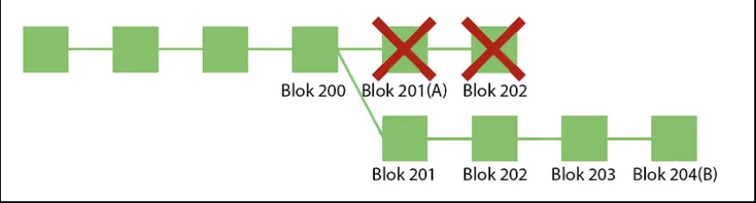

# Blockchain

Satoshi Nakamoto takma adlı kişi veya grup tarafından 2009 yılında Bitcoin'in piyasaya sürülmesinden sonra **Blockchain** çok fazla popülerlik kazandı. Birçok kişi blockchain'in bitcoin olduğunu sanır ve buna inanır. Ancak bitcoin, blockchain teknolojisinin bir uygulamasıdır. Sadece ödeme sistemleri dışında blockchain kullanılarak çözülebilecek birçok başka uygulama ve kullanım durumu vardır.

> **A Blockchain** is defined as a peer to peer distributed ledger forged by consensus, combined with a system for smart contracts.

---

## Distributed Ledger

Ledger, bir sürecin girdi ve çıktılarının tüm kayıtlarını içeren bir sistemir. Dağıtık defter, farklı bilgi işlem cihazlarına yayılmış bir veri yapısıır. **Distibuted Ledger** teknolojisi ise kayıtları tüm kullanıcılara dağıtan teknolojidir. DLT 3 bileşenden oluşur:

1. **Veri Modeli** - Defterin mevcut durumu
2. **İşlem Dili** - Defter durumunu değiştirir
3. **Protokol** Konsensus oluşturmak için kullanılır.

Blockchain bir tür distributed ledger'dır. Bu şekilde veriler, şeffaflığı arttırarak ve yolsuzluktan kaçınarak tüm kullanıcılar arasında paylaşılır.

---

## Smart Contracts

Bir an için akıllı sözleşmeyi ve blockchain'i unutun. Genel olarak sözleşmeleri düşünün. Bunlar, bazı işlemlerin (örneğin; para değişimi) gerçekleşmesi için yerine getirilmesi gereken bazı koşulları içerir. Örneğin, bana bir dizüstü bilgisayar satıyorsanız, yalnızca dizüstü bilgisayarın düzgün çalışması durumunda size ödeme yapmaktan sorumlu olacağımı belirten bir sözleşme yer alacaktır. Benzer şekilde, akıllı sözleşmeler, işlemlerin bir blok zincirinde gerçekleşmesi için yerine getirilmesi gereken ön koşuldur.

Akıllı sözleşme, diğer sözleşmelerde olduğu gibi, bir anlaşmanın koşullarını belirler. Ama geleneksel bir sözleşmenin aksine, akıllı sözleşmenin koşulları Ethereum gibi bir blok zincirinin üzerinde çalışan kodlar şeklinde yürütülür. Akıllı sözleşmeler, kredi ve sigortadan lojistik ve oyunlara kadar çok yönlü eşler arası işlev sunarak geliştiricilerin blok zincirinin sunduğu güvenlik, güvenilirlik ve erişilebilirlikten faydalanan uygulamalar oluşturmasına olanak tanır.

Bütün diğer sözleşmeler gibi akıllı sözleşmeler de bir anlaşma veya kontratın şartlarını belirler. Öte yandan akıllı sözleşmeleri "akıllı" kılan özellik, şartların bir avukatın masasındaki kağıt yerine bir blok zinciri üzerinde çalışan kodlar şeklinde belirlenmesi ve yürütülmesidir. Bitcoin'in ardındaki temel fikir, arada banka gibi "güvenilir bir aracı" olmaksızın para göndermeyi ve almayı mümkün kılmaktır. Akıllı sözleşmeler bu temel fikri bir adım öteye taşıyarak ne kadar karmaşık olursa olsun her türlü işlemi ve sözleşmeyi güvenli bir şekilde otomatikleştirir ve sanal olarak merkezsizleştirir. Ayrıca Ethereum gibi bir blok zinciri üzerinde çalıştığından güvenlik, güvenilirlik ve sınır tanımayan bir erişilebilirlik sunar.

### Gas Fee

Gas Fee, Ethereum ağı ve onun yerel kripto para birimi olan ETH için oluşturulmuştur. Gaz ücretleri, Ethereum ekibi tarafından Gwei olarak adlandırılmıştır. Saniye başına milyonlarca sunucu işlemi yapıldığı için bunun bir bedeli olması gerektiğine karar verilmiş ve gas fee oluşturulmuştur. Gaz ücretleri, ağdaki işlemlerin gerçekleştirilmesi ve madencilerin teşvik edilmesi amaçlanarak oluşturulmuştur. Ethereum madencilerinin bir işlemi gerçekleştirmesi gereken enerji karşılığında verilmektedir.

Ayrıca gas fee, Ethereum ağına bir güvenlik katmanı sağlamaktadır. Bunun nedeni her işlem için bir ücret talep etmek, kötü niyetli kişilerin ağa spam göndermesini önlemekte ve hesaplama israfı riskini azaltmaktadır. İşlemleri doğrulamak ve madencileri ödüllendirmek için kullanılmaktadır. Gas ücretlerinin Ethereum ağı tıkandığında artması, yatırımcılar için kötü bir senaryo haline gelmektedir.s

#### **Bazı önemli Akıllı Sözleşme Uygulamaları**

- **Uniswap**: Kullanıcıların kurları belirleyen herhangi bir merkezî otorite olmaksızın akıllı sözleşme aracılığıyla belirli kripto türlerini takas etmesine olanak tanıyan merkezsiz bir takas platformudur.
- **Compound**: Aracı bankaya ihtiyaç duymaksızın yatırımcıların faiz kazanmasını ve borç almak isteyenlerin anında kredi almasını sağlamak için akıllı sözleşmeleri kullanan bir platformdur.
- **USDC**: Bir USDC'nin değerini bir ABD dolarına eşitleyen bir akıllı sözleşme aracılığıyla ABD dolarına sabitlenmiş bir kripto para birimidir. USDC stabil kripto para olarak bilinen yeni bir dijital para kategorisindedir.

Akıllı sözleşmeler çeşitli programlama dillerinde (Solidiy, Web Assembly, Rust gibi) yazılır. Ethereum ağında her bir akıllı sözleşmenin kodu blok zincirinde depolanır. Böylece ilgili tüm taraflar sözleşmenin işlevini doğrulamak üzere sözleşmenin kodunu ve mevcut durumunu inceleyebilir.

- Ağdaki her bir bilgisayar (veya "düğüm"), blok zinciri ve işlem verilerinin yanı sıra var olan tüm akıllı sözleşmelerin bir kopyasını ve bunların mevcut durumunu depolar.
- Ethereum ağında akıllı bir sözleşme yürütmek için genellikle, "gas" olarak adlandırılan bir ücret (böyle adlandırılmasının nedeni, bu ücretlerin blok zincirinin çalışmasını sağlamasıdır) ödemeniz gerekir.

- Akıllı sözleşmeler bir blok zincirine uygulandıktan sonra genellikle yaratıcıları tarafından bile değiştirilemez. (Bu kuralın istisnaları vardır.) Bu, akıllı sözleşmelerin sansürlenememesini veya kapatılamamasını sağlamaya yardımcı olur.

---

## Dijital İmza Nedir?

Dijital imza, kriptografik tekniklere dayalı elektronik imza olarak tanımlanabilir. Başka bir ifade ile dijital ortamda gönderilen verinin kaynağı ve özgünlüğü dijital imzalar aracılığıyla kanıtlanmaktadır. Dijital imzalar söz konusu doğrulamaları gerçekleştirmek için hash ve asimetrik şifreleme yöntemi gibi kriptografik yöntemlerden yararlanır.

Kriptografik özet ya da hash, rastgele uzunluktaki bir girdiyi sabit uzunlukta şifrelenmiş bir çıktıya dönüştüren matematiksel bir algoritmadır. SHA-256 fonksiyonu da bu amaçla en fazla kullanılan matematiksel algoritmalardan biridir. SHA-256 algoritmasıyla şifrelenen her veri, girdinin boyutundan bağımsız olarak 64 karaktere veya 256 bit’lik bir boyuta indirgenmektedir.

### Dijital İmza Nasıl Çalışır?

Dijital imza, verinin kaynağını ve içeriğinin değiştirilmemiş olduğunu doğrulamak için kullanılan bir elektronik imzadır. Dijital imza oluşturmak için veri sahibinin öncelikle bir anahtar çiftine sahip olması gerekmektedir. Başka bir ifadeyle veri sahibinin bir adet özel anahtara (private key) ve ona karşılık gelen bir genel anahtara (public key) ihtiyacı bulunmaktadır. Bunlar kriptopara cüzdanlarına erişilmesini ve işlem yapılmasına olanak sağlayan anahtarlardır.

Dijital imzalar, gönderenin kimliğini doğrular. Bu sayede işlemlerin doğru kaynaktan geldiği teyit edilir. Kimlik doğrulamanın yanı sıra belge veya mesajın özgünlüğünü yani değişikliğe uğrayıp uğramadığını teyit etmek amacıyla da kullanılır. Kısacası veri bütünlüğünü sağlar.

Dijital imzaların kimlik doğrulama ve veri bütünlüğünü sağlamak gibi bir başka önemli fonksiyonu da dolandırıcılığı önlemek ve hesap verilebilirliği artırmaktır. Başka bir ifadeyle belgeyi imzalayan ya da gönderen taraf, belgeyi imzalamadığını veya sürecin kendi kontrolü dışında geliştiğini iddia edemez.

### Dijital İmza ve Elektronik İmza Arasındaki Fark Nedir?

Her dijital imza bir elektronik imzadır, ancak her elektronik imza bir dijital imza değildir. Dijital imzalar, gönderilen verinin kaynağını ve içeriğini doğrulamak amacıyla hash ve asimetrik şifreleme gibi matematiksel algoritmalar kullanır.

---

## Consensus

Konsensüs, bir blok zincirindeki tüm farklı kullanıcıların, mevcut blok zinciri durumuyla ilgili bir anlaşmaya varmasını sağlama sürecidir. Fikir birliğine varmak için farklı blok zincirleri tarafından kullanılan birkaç fikir birliği mekanizması vardır. Örneğin Bitcoin, Proof-of-Work'ü kullanırken Ethereum, Proof-of-Work'ten Proof-of-Stake algoritmasına geçiyor.

Bu noktada Bizans Generalleri Problemini de öğrenmemiz gerekiyor.

### Byzantine Generals Problem

Diyelim ki, ordunun farklı kısımlarını kontrol eden bir kısım Bizans Generali bir şehri kuşatıyor. Bu generallerin bu şehre ya saldırı kararı başlatması, ya da geri çekilme kararı almaları gerekiyor, fakat generaller aynı odada değiller. Dolayısıyla birbirleriyle tartışmıyorlar, sadece kendi kararlarını ilan edebiliyorlar.

Ancak bir sonuca varılması için herkes tarafından ortak bir karar alınmalı, yoksa yarım yamalak bir saldırı kararı alınabilir. Hem şehir, hem de ordu kaybedilebilir. Hatta generallerden bazıları **ihanetçi** bile olabilir.

- Mesela 9 generalden 4 tanesi saldırı kararı, 4 tanesi çekilme kararı almış olsun. 9. general çekilme kararı alanlara çekilme oyu verdiğini, saldırı kararı alanlara ise saldırma oyu verdiğini belirtebilir ve orduyu darmadağın edebilir. Bu sorun çözülemezse taraflar ortak bir karara varamazlar.

İşte bu Matematik ve Kriptografide **Bizanslı General Problemi** denir.

---

Bu problemi daha önce çözen pBFT gibi konsensuslar geliştirildi, gelin bir de bunlara bakalım.

### pBFT (Practical Byzantine Fault Tolerance)

BFT, Bizans generalleri problemini çözen yani Bizans-Hata Toleransı olan ilk konsensüs protokolüdür.

Nakamoto Consensus, 2009 yılında icat edilmeden önce (bir diğer tanımla Bitcoin makalesi yayımlanmadan önce), bilgisayar bilimcilerinin farklı bir dizi özelliğe sahip olan **Bizans generalleri problemine farklı bir çözümü vardı**. pBFT!

> | pBFT (Pratik Bizans Hata Toleransı), özellikle **üyelerin kısmen güvendiği konsorsiyumlar** için uygun bir konsensüs algoritmasıdır.

Algoritma, asenkron sistemlerde çalışacak şekilde tasarlanmıştır. Yüksek performans, hızlı yürütme süresi sağlamak için optimize edilmiştir. (ancak gecikmede hafif bir artış da cabasıdır.) Aslında, pBFT modelindeki tüm düğümler ardışık düzene sahiptir. Bunlardan biri **ana düğümdür (lider)**, diğerlerine **yedek düğümler** denir. Sistemdeki tüm düğümler birbirleriyle etkileşime girer. **Tüm dürüst düğümlerin amacı, çoğunluğun görüşüne dayanarak sistemin durumu üzerinde anlaşmaktır**. İletilerin yalnızca belirli bir eşler arası düğümden geldiğini kanıtlamak değil, aynı zamanda iletinin iletim sırasında değişmediğinden emin olmak da önemlidir.

# OKUNACAK

pBFT modelinin düzgün çalışması için, **kötü amaçlı düğümlerin anlık sayısının tüm ağ düğümlerinin üçte birine (1/3) eşit olmaması veya bu değerleri aşmaması gerekir**. Sistem ne kadar fazla düğüme sahip olursa, tüm düğümlerin üçte birinin kötü niyetli olması matematiksel olarak daha az olasıdır. **(n/3)+1'den fazla düğüm (n toplam düğüm sayısıdır) eş zamanlı olarak kötü amaçlı veya hatalı değilse, algoritma hem canlılığı hem de güvenliği sağlar**.

Unutulmamalıdır ki bu tür bir konsensüsün kullanılması güvenilen bir seçmen seti gerektirir.

---

### Nakamoto Konsensüs Protokolü

> Bizim amacımıza baktığımız zaman dağıtık defterleri tutan herkesin, aynı deftere sahip olabilmesi. Bunun için de defterlerin gerçeği yansıtıp yansıtmadığını çözebilmeliyiz. Burada tabii ki defteri tutana güvenemeyiz, güveni insani olmayan bir şeye vermemiz gerekiyor.

Nakamoto Konsensüs, Satoshi Nakamoto’nun icat ettiği Bitcoin’de kullanılan ayrıca birçok altcoinin(Ethereum, Monero, Zcash vs) ve **Proof-of-Work** sistemlerinin çoğunda kullanılan, **BFT**(Bizans hatasına toleranslı) olan ilk Blockchain Konsensüs Protokolüdür. Adımlar ve kurallar basittir:

1. Kriptografik bir bulmaca ile lider seçersiniz.
2. Lider ağdaki diğer tüm süreçlere bir iş kanıtı ile birlikte işlem bloğu önerir.
3. Üzerinde en fazla çalışma kanıtı olan bir blok önerildiğinde bu kabul edilir.
4. Çoğunluk dürüst süreçler tarafından kontrol edilirse, gerçek zincir en hızlı büyüyecek ve rakip zincirlerin ötesine geçecektir.
5. En uzun zincir, gerçek zincirdir.

Bu kuralların olma sebebi, **bir bloğun “doğru” olup olmadığından asla %100 emin olamamamızdır**. Örneğin, gördüğünüz en yüksek blok 200 ise, 201 yüksekliğinde bir A bloğu gördüğünüzde, kabul edersiniz.

Aniden, 204 yüksekliğinde bir B bloğu alırsanız, fikir birliği kurallarına göre, daha önce kabul ettiğiniz A bloğunu “tersine çevirmeniz” ve şimdi bu yeni blok geçmişini kabul etmeniz gerekecektir.

Bu kuralların kısaca, insanların **hangi zincirin gerçek zincir olduğu konusunda fikir birliğine varmasına** yardımcı olduğunu görebiliriz.

> pBFT’te katılımcıların önceden bilinmesi gerekmektedir ve fikir birliğine varılamadığı durumda ağ duracaktır. Fakat Nakamoto Konsensüs’te “iş kanıtıyla” bir lider mutlaka seçilir ve ağın lidersiz kalması önlenir. Hiç lider adayı(madenci) olmaması durumunu engellemek için de sistem içerisinde ödül sistemi vardır. Birden fazla lider çıkması durumunda da ağ bölünür fakat yine de fikir birliğine varılır.

Bitcoin'in problemi çözme şekli ise Proof of Work'e dayanıyor.

### Proof of Work (İş İspatı)

PoW konsensüsü, ağda yayınlanacak olan bir sonraki bloğu oluşturmak adına, belli bir eşiğin (nonce) altında olan bir değer karşılığında matematiksel bulmacaları çözmeye dayanır. Sonraki bloku oluşturan blok liderleri loto benzeri bir formatla seçilir. Bu seçim, madencilerin işlemi gerçekleştirmek için katkıda bulundukları işlem (hash) gücüne doğrudan bağlıdır. Satoshi Nakamoto’nun Bitcoin whitepaper’ında açıkladığı üzere:

> “İş İspatı, çoğunluğu temel alan karar mekanizmasında temsilcilerin belirlenmesi problemini de çözüyor. Çoğunluğu oluşturmak için her IP adresi başına bir oy prensibi benimsenmiş olsaydı çok sayıda IP adresi edinebilecek herkes kendi başına çoğunluğu oluşturabilirdi. İş İspatı mekanizmasının temelinde ise her CPU başına bir oy prensibi bulunuyor. Çoğunluk kararını temsil eden en uzun zincir, aynı zamanda, en fazla İş İspatı çabasını sağlamış olan zincir. CPU gücünün çoğunluğu dürüst node’lar tarafından kontrol edilirse bu dürüst zincir, en hızlı büyüyen zincir olacaktır ve rakiplerinin önüne geçecektir.”

Kriptoparaları daha iyi anlamak için konsensüs protokollerini iyi anlamamız gerekmektedir. Yazılmış akademik tezlere, makalelere karşın yani bilinenin aksine **Proof of Work(PoW) ya da Proof of Stake(PoS) vb mekanizmalar konsensüs protokolü değildir. Bunlar sybil atak engellemek için alınan önlemlerdir**.

> Sybil saldırısı, bir ağı birden fazla sahte kimlik oluşturarak kontrol etme girişimidir. Dış gözlemciler için, bu sahte kimlikler benzersiz kullanıcılar gibi görünürler. Perde arkasında tek bir varlık aynı anda birçok kimliği kontrol edebildiğinden ağın kararlarına orantısız müdahil olunma riski doğar. Sonuç olarak, bu varlık ağdaki demokratik oylama gücünü kendi lehine etkileyebilir veya spekülatif haberlerle ağda karmaşa yaratabilir.

Bu bağlamda; Bitcoin’in kullandığı konsensüs protokolü Proof of Work değil, Nakamoto Konsensüs protokolüdür.

PoW yapısına gelmişken, madencilere de bakmamız iyi olacak diye düşünüyorum.

### Madenciler

Madenciler, her 10 dakikada bir oluşturulan yeni blokları üretmek ve ağa yayınlamak için birbirleriyle rekabet eden bir katılımcı piyasasıdır. Her 10 dakikalık raundun sonunda kazanan madenci hem blok ödülünü (an itibarıyla 6,25 BTC) hem de bloktaki işlem ücretlerini alır. Bu sistem, iki sebepten dolayı madencilerin blok üretiminde dürüst davranmalarını teşvik eder.

İlk olarak madenciler, Bitcoin’in madencilik algoritmasını çözmek için pahalı donanım ekipmanlara yüksek miktarlarda yatırım yaparlar. Bu sayede, işlem gücünü sürekli olarak kullanıp tabiri caizse kaba kuvvetle çözümü bulmaya çalışırlar ve bunun için yüksek miktarda elektrik enerjisi tüketirler.

Madenciler kötü niyetli davranır ve madencilik sürecini çökertmeye çalışırlarsa hem Bitcoin’in itibarına zarar veriler hem de donanımlarına yaptıkları yatırımın maliyeti artar. Bunun sebebi, blok ödülü olarak kazandıkları BTC’lerden yatırım getirilerinin (ROI) düşecek olmasıdır ve bu da ikinci sebebi ortaya çıkarır.

Madenciler blok ödüllerini nakit olarak değil, doğrudan BTC olarak alırlar. Bunun sonucunda, gerçek dünyadaki bir kaynak olan elektrik enerjisini BTC üretimine harcarlar ve Bitcoin’in güvenlik modelinin temelindeki, sahtesi oluşturulamayacak değer üretimini desteklerler. Dahası, madenciler BTC üretiminde sade bir itibari parayı (donanım ekipman formunda) değil, gerçek bir kaynağı dönüştürdükleri için blok zinciri de gerçek hayatta geçerli olan bir tür değer kazanmış olur.

---

### Proof of Stake (Hisse İspatı)

Hisse ispatı, (PoS) bir kripto para blok zinciri ağının dağıtık fikir birliğine ulaşmayı amaçladığı bir algoritma türüdür. PoS tabanlı kripto para birimlerinde, bir sonraki bloğu oluşturan, rassal seçim ve zenginliğin (yani, hissenin) çeşitli kombinasyonları yoluyla seçilir. Aksine, bitcoin gibi emek ispatına dayanan kripto paraların algoritması, madencilik kullanır. Yani, kayıtları (transaction) doğrulamak ve yeni bloklar oluşturmak için yoğun hesaplamalı bulmacaların çözümünü gerektirir.

Hisse ispatı, bir dizi iyileştirme ile iş ispatının (PoW) yerini alacak:

- **daha iyi enerji verimliliği** - blok madenciliği için yüksek enerji kullanmanıza gerek yok
- **daha düşük giriş bedeli ve donanım gereksinimleri** - yeni bloklar oluşturma kabiliyeti için elit donanıma ihtiyacınız yok
- **merkezileştirmeye karşı daha güçlü bağışıklık** - hisse ispatı ağdaki düğüm sayısını artıracaktır
