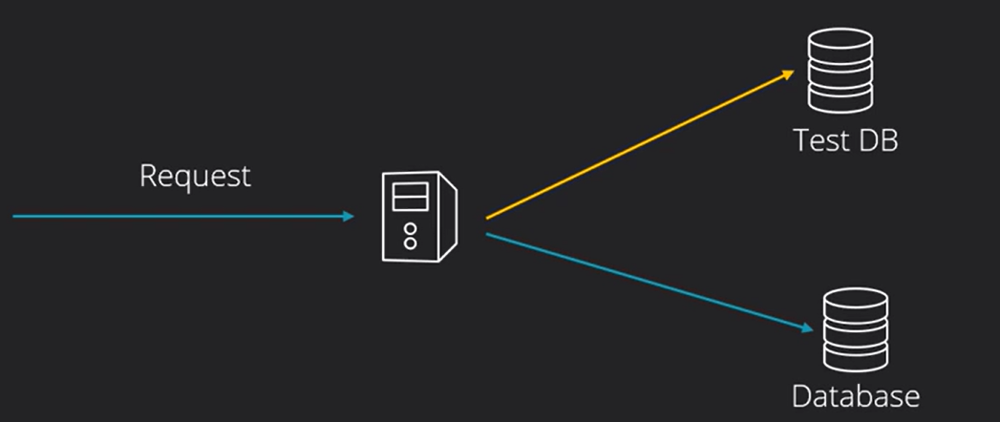

## What are software tests?
- Code that runs other code and makes assertions and checks
- Tests are requirements/specifications
- What is unit?
  - Method
  - Class
  - Module
- Types of software tests: unit, integration, end-to-end(UIs)

## Why we need automated tests?
- Peace of mind as a developer/tester
- Catch bugs early
  - Spend 1 hour for tests, win 3 hours of debugging
- Unit test impose high code quality
  - If a unit is too difficult to test, the code quality should be improved
- Prevent endless manual tests
- Think big: a TODO list doesn't need tests

## What is Jest
- JS, TS testing framework
- Developed by Facebook
- Assertion library
  - Powerful set of matchers
- Most popular test framework
- All in one solution (test runner, asserting library, matchers)

## Structure of a properly written unit test:
**AAA Principles:**
- Arrange
- Act
- Assert
 ***
 - Setup
 - Teardown

Tests should be independent
 
Reduce code duplication

## F.I.R.S.T Principles

Principles not rules, that we may follow when writing tests:
- Fast
  - Unit tests should be fast, faster tests - faster feedback
- Independent (Isolated)
  - From other tests
  - From external environment
    - No shared state with other tests
    - The order in which tests run should not matter
    - Contradiction with the Fast principle
      - Individual tests take more time to setup
- Repeatable
  - Same result with the same input: 
    - Random / Date values - we will often mock these
    - Test that wites to a database, It should always clean up
    - In contadiction with the Fast principle, More setup and teardown operations
- Self-validating
  - After the test is finished, it's results should be clear - Pass / Fail
- Thorough
  - Cover all the cases/paths/scenarios
    - Hard to think at all of them from the beginning
    - Happy cases, bad paths, edge cases
    - Invalid output
    - Large values
    - 100% code coverage - not a great indicator

### Illustration

- A tester walks into a bar
  - Runs into a bar
  - Crawls into a bar
  - Dances into a bar
  - Jumps into a bar
  - Others:
    - A beer
    - 2 beer
    - 0 beer
    - 1 million beers
    - -1 beers
    - A lizard beer
  - ****
- A real customer walks into a bark and ask where the bathrom is and its a **SYSTEM CRASH!!**

----

**Test properties:**
- only
- skip
- todo
- concurrent
  

**Test aliases:**
- it
- test
- xit
- fit
***
watch mode

## Test Driven Development with Jest (TDD)

- It is exactly what it sounds - development driven by tests
- Big projects - a detour
  - First achieve a working state, then write tests
- **TDD:** great when extending an app of fixing bugs

**TDD Cycle**

## Test Doubles
- Stubs
- Fakes
- Mocks
- Spies
- Mock Modules

### What are Test Doubles?

Some units are not fast, or easily accessible, replace them in tests: 

- Pretend objects used in place of a real object for testing purposes
  - **Dummy objects:** passed around but not used
  - **Fakes:** Simplified working implementation, it takes a shortcut
  - **Stubs:** Incomplete objects used as arguments
  - **Spies:** Tracks information about how a unit is called
  - **Mocks:** Preprogrammed with expectations

Note for Jest: **Mocks** and **spies** have a lot in common.
 

**Mocks: most used, most debated**
- The way we use them greatly influences the way we write tests.
- If we need to use them too much, there is something wrong with our code.
