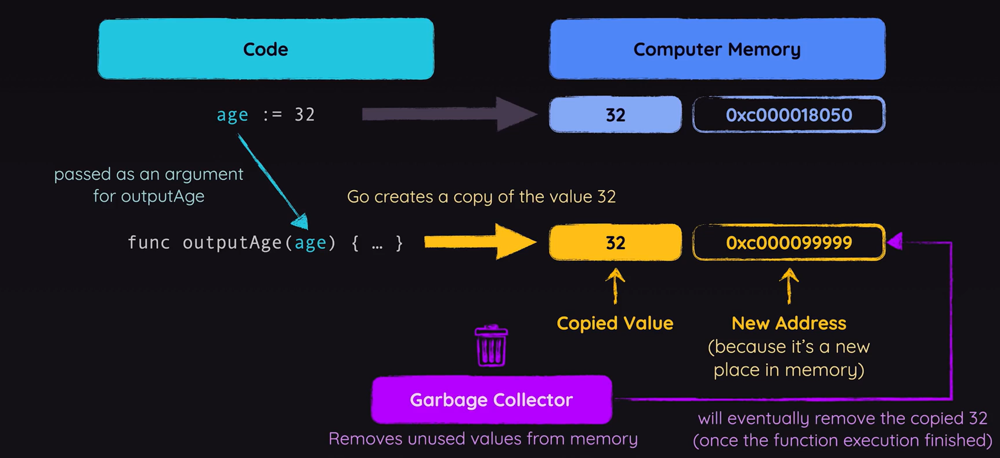
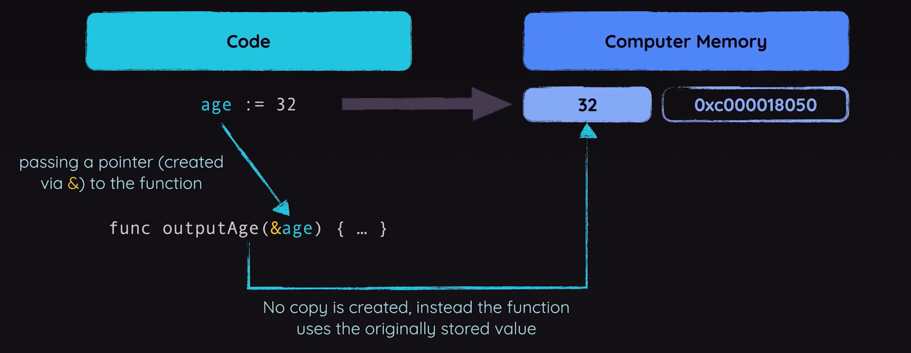
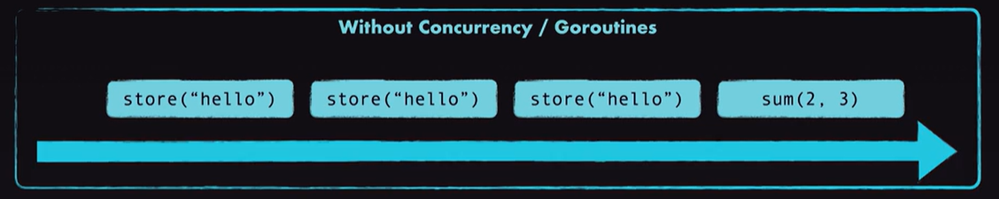
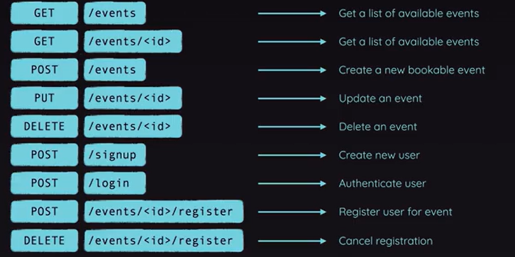

# Go Language - <a href="https://www.udemy.com/course/go-the-complete-guide/">by Maximilian Schwarzmüller</a>

It is an open-source programming language developed and published by Google.
- Focus on **simplicity**, **clarity** & **scalability**.
  - Inspired by langugages like Python
  - Aims to provide a clean, understandable syntax
- High performance & Focus on **Concurrency**
  - Similar to C or C++
  - Popular for tasks that benefit from multi-threading
- Batteries included
  - Go comes with a standard library
  - Many core features are built-in
- Static typing
  - Go is a type-safe language
  - Allows you to catch many errors early

> Popular are **Networking & APIs** & **Microservices** & **CLI (Command Line Interface) Tools**

```sh
go run app.go
```

We need to install Go because Go is a compiled language, which means the code must be translated to machine code before it is executed. And for that, we need to install that compiler.

## Go Essentials
> Values, Basic Types & Core Language Features
- Understanding the **Key Components** of a Go Program
- Working with **Values & Types**
- Creating & Executing **Functions**
- Controlling Execution with **Control Structure**

### Package

Every Go code needs such a package. If you remove package you will see an error. It expected a package. Why does it matter?

When writing go code you split your code across packages. You must have at least one package per application, but you can have multiple packages aswell.

We need these because one we work with multiple packages, we can use features from package B in package A for example. So we can export and import features across our files, so that the individual files stay rather lean.

In hello-world program, we are using `fmt` package. That's not a package written by us, instead, this `fmt` package is part of Go's standard library. Go comes with a <a href='https://pkg.go.dev/std'>huge standard library</a> of built-in packages. So packages that are installed together with Go, you could say, that are part of the Go Compiler.

#### Why is the package name is `main`?

Indeed you can use any name you want, many go projects especially bigger projects typically use multiple packages. These packages need different names.

**main** is a special package name, that tells Go that this package will be the main entry point. You'll not always run your code as we did it before like `go run app.go`.

When you build it for production and make it available for other people, those people might not even have Go installed on their system. So, they can't use this command. Instead, you typically run;

```sh
go build
```

This will then tell Go to in the end create an executable file that could also be executed on systems that don't have Go installed here.

Go does not just know packages, but also modules. The idea simply is that one module consists of multiple packages. So in many cases **a module is simply a go project**.

So, in order to tell Go that, this should be considered a module, we have to run a specific command;

```sh
go mod init
```

However, when you are wrote that, you will get an error that it can't determine the module path. You should name it with where you plan to host your module later, if you plan to expose it as a third party library to the world. 

```sh
go mod init example.com/first-app
go build
```

If you run Go build on Windows, you will get a first-app.exe an executable file. You can simply run that file by double clicking on it. On Mac OS or Linux you will get an executable like this without a file extension and you can run it inside a terminal by typing `./first-app`. Now we got this executable which **can be executed without having Go installed**. 

That's why we need a module and main package, because if I would change package name main to app and run `go build`, I get no file as an output, because Go doesn't find a main entry point for our application.

#### `main` function

We also have func which is named main, and this also must be named **main**. This is a so-called function, a block of code that can be executed by calling that function, Go will call and execute that function, therefore the code in that function when program starts. 

If you have another main package with another file. You can't have another main function, because with it, program confuse where to start.

### Null Values


> With backticks can building multiline strings.

### Functions

We can see the built-in functions in official standard library documentation, there is a <a href="https://cs.opensource.google/go/go">repository link</a>. All the code behind go and the standard library is publicly available. You can dive into the src folder to find subfolders for all these standard library packages like the fmt package here.

### Error Handling

App doesn't crash because read file when it doesn't find a file does indeed generate an error as you'll see in a second, but it does not crash your application. 

Instead in Go, error handling typically works a bit differently than it does in other languages. In other languages you might be used to certain actions or problems crashing your code. In other languages you can ofter use try catch statement to wrap code that could potantially fail to catch errors and define code that should run if an error occurs. That is not how it works in Go though.

Instead in Go, functions are written such and your functions should be written such that errors don't crash the applcation. Instead, read file for example, will simply return an empty byte collection if it fails to find that file, which is then converted to an empty string, which is converted to the value zero when parsing it as a float. That is why we see the 0 as a result if we check the balance.

That's not all Go does. Instead, for operations that could fail, it is quite common that funtions return such an error thing as a second value. That's the value we can accept and store as a second value here when calling that function.

## Working With Packages

- Splitting Code Across **Multiple Files**
- Splitting Files Across **Multiple Packages**
- **Importing & Using** Custom Packages

In demo bank application, in such cases it's not uncommon that we might wanna split that code across multiple files to keep every file on its own a bit more readable and understandable so that we don't have too much code in a single file since that can make working with that file unnecessarily complex, because we have to search for the code we wanna work on and so on. Thankfully, splitting code into files in Go is pretty straightforward.

### Why Would Use More Than One Package?

Splitting code across files is pretty easy. More complex project, you might wanna split your code not just into multiple files that belong to the same main package, but actually into multiple packages. That can be especially useful. 


For example, put utility code into a package that could then be used in different projects.


For example, code for interacting with the file system. It can also be a useful pattern if you have code that works pretty much standalone, but should also be used in the context of a bigger project. You could put such code into a seperate package to have a clearer seperation of that code and still use it in one in the same project if you want to.

### Splitting Code Across Multiple Packages

We made generic functions. Now we are splitting them into a new file which named `fileops.go`. Then we need to change our `package main` to `package fileops`. But if I try to do that, it breaks, I get an error here.

> Found packages main and fileops in the same folder basically. That's not allowed in Go. Instead, every package must go into its own sub folder.

So If I wanna have a seperate new package here, I also have to add a new folder, and that folder should have the same name as the package, so fileops in this case. Filename is can be any name.

#### Importing Packages

To get access to the functions we define in our own packages, or to the things we define there in general, for example all the global constants or variables, to get access to these things, we'll have to import our own package, just as we already imported packages from the standard library.

To import your own package, it's not enough to just add the package name `fileops`. Instead, you have to add the full path, which icludes your module path. `example.com/bank/fileops`

#### Exporting & Importing Identifiers

When we import our `example.com/bank/fileops` and then with using;

```go
fileops.getFloatFromFile()
```

can't be found on our own fileops package, even though import it there. It is not found because in go, only functions or variables or constants that's start with an uppercase character, so with an uppercase G for example, only such functions or variables and so on are available in other packages.

That's also explain why we always used functions with uppercase:

```go
fmt.Print("Hi there!")
fmt.Scan(&choice)
```

That's the Go way of exporting something, and you can only import and use something from another package into some package if it's exported there. It is exported in another package if it starts with an uppercase character.

### Using Third-Party Packages

We only worked with packages that were either part of the standard library or that we built on our own. Go's standard library really comes with loads of useful features and functionalities built-in. It's definetely possible that the standard library is all you need, but sometimes you need a certain functionality in your application that's not part of the standard library and that you maybe also don't wanna build on your own, in such cases, you can install third party libraries. 

Go indeed has a very active community and ecosystem and just as you can build your own packages, there also are people building <a href="https://pkg.go.dev/">packages</a> which they share with the world.

```sh
go get github.com/Pallinder/go-randomdata
```

To get randomdata package, run the above command. It will add it to your project. You will not see source files in here, but you will see that the Go mod file was edited. In there you will find this extra line,


This `go.mod` file does not just serve as a description of your module, for example, containing it's path, but instead it is also used to list all the third party dependencies of your project, so that if you would share your project with someone else, they could quickly get and download all those dependencies simply by running to;

```sh
go get # like npm install
```

## Understanding Pointers

Pointers are in the variables that store value **addresses** instead of values. That might sound confusing. So let's take a look at how your code affects your computer's memory. Let's say you have some code where you create and initialize a variable called age, which you set to a value of 32. In that case, that value 32 is stored in the computer's memory. That value in memory automatically gets an address. Every space in your computer's memory has an address. That address is required by the computer, to be able to retrieve that value and work with it. In this case here, this value which in our code, is stored in the variable age is actually also stored in the computer's memory. Every value you use in Go is at least for a short period of time, **stored somewhere in your computer's memory**. 


A pointer, then is a variable, where you don't store a value, but where you instead use this special ampersand operator, a single ampersand symbol to get and store the address of a value, instead of the value itself. So now age pointer would contain the address as a value.

### Why Would Use This Feature?

There are probably two main advantages of using pointers in Go, at least in certain situations.
1. When working with pointers, you can **avoid unnecessary value copies**.
2. You can use pointers to **directly mutate values**.

#### Avoid Unnecessary Values Copies

By default, in Go programs when you pass a variable to a function, so that function can work with that value, Go creates a **copy of the value of that variable in memory** and **passes that copy to that function**. So at least for a certain period of time, until the function *execution is **done*** and the copied value will **eventually be cleaned up by Go's Garbage Collector**. A process that runs in the background automatically and *gets rid of unused values*.



Until that happens, you have the same value twice in memory. 

For very large and complex values, that could be a problem in certain applications because since you have the same value twice, you are of course taking up twice as much space. For numbers, most strings and all the most more complex values, that won't really matter too much in most applications. You will need a very specific application or use case, where this optimization of using a pointer to avoid this copy might actually make a difference. 



Still, it is an advantage to be aware of, because that can be one reason for a using pointers. **When passing a pointer** as an argument to a function, **there's no copy being created**. Instead, that function receives the address, and can use that address to look up the value that's stored under the address. Again, by using a special syntax, to then work with that value that is stored there.

#### Directly Mutate Values

Another advantage of using pointers, can be that you can write functions to which you pass a pointer. So an address instead of a value to that function. That function can then, since it has the address to the original value, directly edit that value.

So it doesn't have to calculate a new value based on the input value, and then return that value so that returned value can be used in the place where the function was called. Instead, it can directly manipulate the value if it received such a pointer.

That can of course lead to less code, since it allows you to avoid the return statement and so on. To be clear, it can also **lead to less understandable code**, and unexpected behaviors. It might come as a suprise that a function called add for example;

```go
package main

import "fmt"

func main() {
  x := 5
  y := 10
  add (&x, y)

  fmt.Println("x: ", x) // x: 15
  fmt.Println("y: ", y) // y: 10
}
```

Doesn't give you the sum of two numbers, but instead edits the first number by adding the second to it. That can be unexpected. You might instead, expect a function that returns a result, and leaves the original numbers unchanged. So it comes down to your specific use case, your personal preferences, and of course also the naming of your function, so that you don't suprise yourself, or other developers with unexpected behaviours. 

That's what pointers are, and why you might want to use them. 

----

### Working With Pointers In Code

> If you are working with pointer, it's **null value is nil**. Not like float64 -> 0.0, int -> 0. All pointer's null value is **nil**.

#### **Working with Regular Variables**
```go
package main

import "fmt"

func main() {
	age := 32 // regular variable
	fmt.Println("Age:", age)
	adultYears := getAdultYears(age)
	fmt.Println(adultYears)
}

func getAdultYears(age int) int {
	return age - 18
}
```

#### **Working with Pointers**
```go
package main

import "fmt"

func main() {
	age := 32 // regular variable

	var agePointer *int
	agePointer = &age

	fmt.Println("Age:", *agePointer) // dereferencing - value at this address with *

	adultYears := getAdultYears(agePointer)
	fmt.Println(adultYears)
}

func getAdultYears(age *int) int {
	return *age - 18
}
```

If we are giving a pointer as a parameter of a function, we should change the type of parameter; because we don't want int, but instead a pointer to an int, which means we have to add an **asterisk (*)** here.

In Go, unlike in some other programming languages, you can't perform pointer arithmetic, you can't perform calculations on pointers. In some langugaes you can, and you can run into really nasty problems there, but it can also be a powerful feature. In Go you can't. 

You can't deduct values from a pointer, so from an address or anything like that. Instead here, if you wanna perform this operation we are performing here, we have to dereference the pointer, we have to add this asterisk. 

```go
func getAdultYears(age *int) int {
	return *age - 18
}
```

So with that we're getting the address from parameter, then we are looking up the value that's stored under that address, and we are deducting 18 from that. Then just as before, we return that new value. 

So therefore we can still create adultYears and call getAdultYears, but now here we should not pass age as a value to getAdultYears, but instead a pointer to age we can use agePointer as a parameter. 

Important difference is that now there is no copy of 32 being created. Then we don't copy the value or anything like that, and than pass that pointer to that function where we want a pointer, and therefore again **nothing is copied**. It is still the one single 32 value. 

#### **Using Pointers For Data Mutation**
```go
package main

import "fmt"

func main() {
	age := 32 // regular variable

	var agePointer *int
	agePointer = &age

	fmt.Println("Age:", *agePointer) // dereferencing - value at this address with *

	getAdultYears(agePointer)
	fmt.Println(*agePointer)
}

func getAdultYears(age *int) {
  *age = *age - 18
}
```

```go
func getAdultYears(age *int) {
	// return *age - 18
  // age = *age - 18 - not like this, age is the pointer, not the value
  *age = *age - 18
}
```
With usage of `*age = *age - 18`, we are overriding that 32 value with that new value. Just by using that pointer, which we receive. Therefore, getAdultYears will no longer return anything. We should therefore remove that return type annotation.

Therefore, when we calling that function no longer need to store adultYears, because we no longer get a value. At the Println, we should **dereference** instead output age.

```go
fmt.Println(age)
```

If I am outputting age, not my agePointer, not the dereferenced agePointer, but the original age variable. Keep in mind that getAdultYears did edit that place in memory. It overwrote the numbers stored under that address and therefore it overwrote this 32 and that variable just also used that place in memory.

So if we change that place in memory, that variable holds that new value that's stored there under that address in memory. That's why we're outputting 14 with this lnie of code here, because we added the original value.

That can be an advantage, because we don't have to return something here now. Of course it can also be a problem, because it might be unexpected that we override the original value. We might not want that, especially if we have a name like this, getAdultYears. That does not sound like it edits something. We instead might wanna to call this **editAgeToAdultYears** to make it clearer what this function will do.

---

So we can use pointers to directly edit a value from inside a function. Look at fmt.Scan function, which used to get user input. Which is why used with ampersand symbol.

```go
fmt.Scan(&choice)
```

We are creating a pointer here, which points at this choice integer, and we pass this pointer to scan, because scan then internally **de-references** this pointer and overwrites te value that's stored under that adress with the value entered by the user.

## Structs

Struct is in <a href="https://github.com/erenyusufduran/colins-path/tree/main/11-golang/01-course/00-essentials/04-structs">that file</a>, directly go `user/user.go` file and you can see their's creation, and method implementations. In `structs.go` file, you can see their usages.

## Interfaces

In Go and in most programming languages that have this feature is essentially a contract, you could say. A contract that guarantees that a certain value, typically a Struct, has a certain method.

```go
type saver interface {
	Save() error
}
```

> The requirement is a save method without arguments and an error return type

For example, here in this interface, I could say that I wanna guarantee that whichever struct implements this interface, so whichever struct signs this contract, have a save method with an uppercase S. **Save method which returns an error**, because things can go wrong. 

Method or function **doesn't have a function body**. Interfaces are not about defining the logic of a method. Instead they simply define that a certain method exists that it's there and what it's name is and what it's return values are. In addition, an interface can also define that a method accepts certain types of values as input, as parameters. You don't need to give these inputs here names, though you can, because **it's really only the types that matter here**.

If you have an interface that requires only on method, then your interface name is that method name plus `-er` at the end. It's not a must do, but it is a common convention.

### Using Interfaces

```go
func saveData(data saver) error {
	err := data.Save()

	if err != nil {
		fmt.Println("saving the note failed")
		return err
	}

	fmt.Println("saving the note succeeded!")
	return nil
}
```

> That's exactly what we have here.

```go
func (todo Todo) Save() error { // Todo's method
	fileName := "todo.json"
	json, err := json.Marshal(todo)

	if err != nil {
		return err
	}

	os.WriteFile(fileName, json, 0644)
	return nil
}
```

Unlike in other programming langauges, in Go, you don't have to explicitly connect this interface **to some other type to force that type** to adhere to that interface. Instead, Go simply takes a look at the value you are passing to saveData here, which wants such an interface type and it takes a look at that value and simply checks if that value, that todo struct in this case, **has such a save method** *that fulfills the requirements of the saver interface*.

```go
func (note Note) Save() error {
	fileName := strings.ReplaceAll(note.Title, " ", "_")
	fileName = strings.ToLower(fileName) + ".json"

	json, err := json.Marshal(note)

	if err != nil {
		return err
	}

	os.WriteFile(fileName, json, 0644)
	return nil
}
```

We have another save method with that Note struct. So, for Todo and Note structs have the save method and therefore, correctly implement this interface. That's why we can pass those values without any issues to saveData. That's why interfaces can be really useful because **they can help us write more generic, more flexible and more reusable code**. 

We can now use one saveData function to save the data for two different types of values. 

### Extracting Type Information From Values

#### With Swich Statements

```go
func printSomething(value interface{}) { // interface{} || any
	switch value.(type) {
	case int:
		fmt.Println("Integer:", value)
	case float64:
		fmt.Println("Float:", value)
	case string:
		fmt.Println(value)
	}
}
```

#### With Directly

```go
func printSomething(value interface{}) { // interface{} || any
	typedVal, ok := value.(int)

	if ok {
		typedVal += 1
		fmt.Println("Integer:", typedVal)
	}

	floatVal, ok := value.(float64)

	if ok {
		floatVal += 1
		fmt.Println("Integer:", floatVal)
	}
}
```

### Interfaces, Dynamic Types & Limitations

Interfaces can be very useful in Go and especially this special interface type that stands for any value can be very useful in certain situations since it allows you to write quite flexible code. But it also has some limitations and here's an example.

Let's say you want to create an add function, which should take two input values and return the sum of both. These two values should not be of a fixed type like int or float64. Instead they should be either an int or a float64 or also a string. So that we either combine two strings or we add two ints or we add two floats. 

Now ofcouse you could now use this special interface type `interface{}` or `any` keyword. So that Go accepts any kind of value here as an input. But you can't add structs.

```go
func add(a, b interface{}) interface{} {
	aInt, aIsInt := a.(int)
	bInt, bIsInt := b.(int)

	if (aIsInt && bIsInt) {
		return aInt + bInt
	}

	aFloat, aIsFloat := a.(float64)
	bFloat, bIsFloat := b.(float64)

	if (aIsFloat && bIsFloat) {
		return aFloat + bFloat
	}
}
```

So `interface{}` is a bit **too flexible**. You could make it work by using this special syntax here to check whether a is of type in add if it is, `aIsInt` will hold true and we'll get a value which we can store in a variable where Go now knows that it will be of type int. Now Go would know that both are of type int. Then we can't know what returns, because we want to see their addition with floats.

That's why Go offers another feature. It offers a concept called generics. This generic concept will help you solve problems like this.

#### **Generics**

Accepting any kind of value is a bit too wide, in addition another problem we have here is that the **return type also is too unspecific**. Therefore, if I call add and I pass two integers to it, Go doesn't understand that result will be an integer. Instead it thinks it's any kind of value.

```go
result := add(1, 2)
result += 1 // complains
```

Therefore after working with that result will be rather difficult. If I add one to it, Go complains that the types are not the same. So of course, it would be great if Go would understand that the return value of add will be an integer if the two values we pass to add are an integer and that's also a kind of problem that will be solved by turning this add function into a **generic add function**.

```go
func add[T interface{}](a, b T) T {
	aInt, aIsInt := a.(int)
	bInt, bIsInt := b.(int)

	if (aIsInt && bIsInt) {
		return aInt + bInt
	}

	aFloat, aIsFloat := a.(float64)
	bFloat, bIsFloat := b.(float64)

	if (aIsFloat && bIsFloat) {
		return aFloat + bFloat
	}
}
```

Which we do in Go by adding square brackets after the function name before the parameter list. In this square brackets you can define a **type placeholder name**. Typically that's T, but you can use any name of your choice. 

The idea is that it's now this placeholder that is used here instead of this interface type. You can also use this placeholder as a return type.

Then, we must tell Go which concrete types are allowed as types for that placeholder when add is being called.

With `T interface{}` simply means T can be any kind of value. As you see when doing that here, I'm getting a bunch of errors, but I will deal with them later. What's more important than that is that by making this simple change, if you now hover over result, **go understands that** it will be of type int. It understands this because what we are doing with this generic type placeholder is that we are telling Go that the concrete type of values **we are receiving from them and our returning will only be set and known at the point of time where add is called**.

```go
result := add(1, 2) // go knows result is int.
```

That's why this generics feature exists and why it can sometimes in certain situations be really useful because it allows you to write more reusable, more generic functions where Go nonetheless is able to correctly infer the types of values you are working with.

Therefore this code here now doesn't work anymore, because it isn't anymore.

> When writing this in a generic way, we can simply return `a + b`. We don't need any other checks.

```go
func add[T any](a, b T) T {
	return a + b // invalid operation: operator + not defied
}
```

However we'll still have one problem if we do it like this. Since we are saying that the concrete type that's used at the point of time where add is being called can be any type, we are of course back to this error that plus operator not defined.

We can work around that by setting the base type or the range of allowed types for T not to any, but instead to a list of pre-defined types with which we're fine. By simply listing all those types, seperated with such a pipe (`|`) symbol. 

```go
func add[T int | float64 | string](a, b T) T {
	return a + b
}
```

With that I am saying that T can be any type as long as it's an int, float or a string. Therefore now, this all works.

## Managing Related Data with Arrays, Slices & Maps

Arrays, Slices and Maps can also help you group related data together.

### Arrays - <a href="https://github.com/erenyusufduran/colins-path/tree/main/11-golang/01-course/00-essentials/06-arrays">Examples</a>

An array is a data structure that holds values, potentially different values that kind of describe the same thing. Creating such an array;

```go
var prices [4]float64
prices := [4]float64{10.99, 9.99, 45.99, 20.0}
fmt.Println(prices) // [10.99 9.99 45.99 20]
fmt.Println(prices[2]) // output - 45.99

var productNames [4]string
productNames = [4]string{"A Book"}
productNames[2] = "A Carpet" // output - [A Book  A Carpet ]
fmt.Println(productNames)
```

### Selecting Parts of Arrays with Slices

Sometimes, you need some part of the array.

```go
featuredPrices := prices[1:3] // from 1 to 3, 3 is not included
featuredPrices := prices[:3] // from the beginning, until index 3
featuredPrices := prices[1:] // from the first index, until last index + 1
```

Slices can be used on arrays, but slices actually also can be created based on other slices.

```go
highlightedPrices := featuredPrices[:1]
fmt.Println(highlightedPrices) // output - [9.99]
```

### Diving Deeper Into Slices

Time to a brief look behind the scenes to fully understand the connection between slices and arrays. Slices are like a **reference**, like a window into an array, a bit like a **pointer**, though it's a different concept. 

When we create an array like prices, that array is stored in **memory**. When we then treat a slice based on that array, we get a window into that array, so to say. Therefore, if you would modify an element in a slice, we would also modify the same element in the original array.  

```go
featuredPrices[0] = 199.99
fmt.Println(prices) // output - [10.99 199.99 45.99 20]
```

So for example here, if I use my featuredPricess slice, is this part of the original array, so the original array which I did not directly added here, we will have been overwritten by 199.99. Because slice is just a window into the original array.

When you create a slice, you **don't copy the original array**, so you don't have that copy in memory that occupies extra memory space. Instead, you still only have one array in memory and your slice is just a tiny reference to a part of that array. 

Hence it is a very memory efficient way of selecting parts of arrays and if you want to do that of editing parts of an array. 

Go also **saves some metadata for our slices** that can be useful to look into. For every slice, we got a length and a capacity and we can output both here to understand what it is.

```go
fmt.Println(len(featuredPrices), cap(featuredPrices)) // output - 3 3
```

> The length gives us the number of items in a slice or array. So if that slice featuredPrices has free elements, which it does, length will give us free as a value. 

```go
fmt.Println(len(highlightedPrices), cap(highlightedPrices)) // output - 1 3
```

> The capacity is a bit more complex. It's the same value here, but that would be different if we would output highlightedPrices.

highlightedPrices is based on featuredPrices which in turn, is based on the prices array. So they **share the same array** under the hood, but highlightedPrices selects everything from the start of featuredPrices up to do second element excluding that element. That is why we have 1 length.

But we **have a higher capacity**, because the slice and they offer the original array on which highlightedPrices is based, actually it has more items left. In featuredPrices where we selected everything from the second item until the end of the original array, we still have this (`9,99 45.99 20.0`) entire subset left. 

So if in highlightedPrices, we then select just the first item, we could theoretically still select the other two items and that's why we overall have a capacity of three. 

**Why not a capacity of four since the original array has a length of four?**

- Well because that's important to understand about slices. You can **always select more towards the end of an array, but not towards the start, so towards the left**. Since the first slice on which we are based starts at the second element and not at the first element, any other slices based on it can't go further to the left. So we can't go back to that first element which we omit here. That's why the **capacity only counts towards the end of the original array**, but omits any elements that might have been filtered out before.

In the end, it's just important to understand that you can always select more items to the right, but never to the left.

```go
highlightedPrices = highlightedPrices[:3]
fmt.Println(len(featuredPrices), cap(featuredPrices))
fmt.Println(len(highlightedPrices), cap(highlightedPrices))
```

highlightedPrices before in this code block was just one value because we sliced it to be only up to the second value. You can always select more towards the end of an array or slice. 

```go
highlightedPrices := featuredPrices[1:2] 
// That would be causes an error, if wroted above, because it's capacity would be 2 after that.
```

Even though highlightedPrices originally only had one element, we can reslice based on that element slice and now suddenly select more than that one element because internally, Go always **memorized that there is more content available to the right of the selected slice**. That's what this capacity here kind of told us where we had a difference between capacity and length.

### Dynamic Lists With Slices

Also with slices you can create dynamic arrays, let's come back to that original prices array.

```go
prices := [4]float64{10.99, 9.99, 45.99, 20.0}
```

One downside of using that array was that we had to define ahead of time how many values we'll have in there. Sometimes in the applications you're going to write, you know exactly how many values you'll have in a list of values.  

So having to set the length of an array in advance in your code can be a restriction that's quite annoying. In other programming languages like JavaScript, you don't have that restriction. There you can create an array and it's automatically dynamic, so you can always add and remove elements just as you want to. Go thankfully also has solution for us and that solution again is that **slices feature**.

Let's create a dynamic array, you can create suct a dynamic slice with a syntax that's similar to what we saw before, but you may now also omit the length here. 

```go
// both is possible
// prices := []float64{}
prices := []float64{10.99, 8.99} 

fmt.Println(prices[1]) // output - 8.99
fmt.Println(prices[0:1]) // output - 10.99 8.99

```

If you don't specify the number of items, Go will automatically **create a slice for you** and since a slice always is based on an array, it will also create an array for you behind the scenes, but it will **automatically ditch that array and create a new array if your slice grows beyond the balance** of that behind the scenes stored array.

There now is a built-in function in Go the **append function**, wants a slice as a first parameter, and then a list of elements that should be added to that slice. Then as a second parameter our add value, for example, `5.99`.

That will now append a new item, but it will actually also return a **brand new slice**. So it actually does not add it the *original slice, but instead what append does is it tells* Go that we want to add an item to that slice, and therefore also to the underlying array. Now of course, an array has a fixed length, so what Go will do in this case is it will create a **brand new array and add that element to that brand new array which is created such that it has the capacity for that new array**.

```go
updatedPrices := append(prices, 5.99)
fmt.Println(updatedPrices) // output - [10.99 8.99 5.99]
```

If I would print prices, you see that (`[10.99 8.99]`) the original slice did not change. This is still just these two values. The **original slice in array was not changed** by Go. If you wanted to do that you would have to instead **reassign this appended slice to the existing prices slice**, instead of creating a new variable.

```go
prices := append(prices, 5.99)
fmt.Println(prices) // output - [10.99 8.99 5.99]
```

> Technically, you are of course re-assigning the new slice to the existing variable - therefore the old value of that variable will be overwritten.

Then of course, if you do this and you output this prices slice, then you'll see that it changed. If you **reassign an appended slice to an existing slice**, it will of course also **ditch that original array** which only had two elements before, and **use that brand new array that holds that extra third element** for that slice instead. 

So **memory management** is taken care of by Go here and since we now have that extra flexibility where we can always add new elements if we need to, it's way more common to work with slices right from the start in Go than it is to use arrays.

You can still use fixed length arrays if you know for sure that you will never have more than X amounts of elements in a list, but if there is at least a slight chance that you might want to add new elements as your program executes, you should definitely go for this slices approach right from the start instead, because that allows you to add elements to slices, and let your arrays grow just as they need to.

If we wanna **remove the first element**, we simply create a new slice based on the existing slice that starts at the second element, and selects everything up to the end. That gives us a brand new slice that omits that first element.

```go
prices = prices[1:]
fmt.Println(prices) // output - [8.99 5.99]
```

So with that, we of course did remove that first element, which was `10.99`.

There is no built-in function for doing that, since we already have the **built-in mechanism with that feature that allows us to build slices**.

#### **Unpacking List Values**

Before dive into maps, there is a special syntax, when you work with arrays and slices. Specifically, when you work with append.

```go
prices := []float64{10.99, 8.99}
prices = append(prices, 5.99, 12.99)
```

Append actually does not just take on value that is appended, instead you can append as many values as you want. So here we could also add a couple of other values here.

<hr><br>

Sometimes you have an existing slice and you wanna append another slice or array to it. Let's say here we have our discount prices, that's a brand new list which I create here.

```go
discountPrices := []float64{140.99, 87.99, 20.59}
```

We might wanna merge discountPrices into prices slice. You can use the append function to perform such merges as well. Now, for that we can reassign prices and call append again, but it will give an error.

```go
prices = append(prices, discountPrices) // gives an error
```

So a list of floats, in a place where a single float is allowed, because prices is a list of floats, not a list of lists of floats. discountPrices is a list of floats. So adding the full list as one item into that existing list is not valid. Instead, we have to kind of pull out the existing items. There is a special operator in Go, which you can use for that. You can add three dots after discountPrices, exactly three dots to instruct Go to go to this list and take out all the elements in that list. So the three prices at the discountPrices and add them as seperated, comma seperated, elements to this append function.

```go
prices = append(prices, discountPrices...) // appends
```

### Maps - <a href="https://github.com/erenyusufduran/colins-path/tree/main/11-golang/01-course/00-essentials/08-maps/maps.go">Examples</a>

A map is a different kind of data structure, which you can also use to group data together. It's a bit like a struct, but different. Let's say we wanna store a bunch of website URLs here. So we have different companies and those companies have websites. For this we could add a website variable. We can create a slice of websites. This works, but saving those URLs like this could have a couple of disadvantages. We can just see URLs, neither their company names. So having an **extra label** here could make a lot of sense.  

In addition, let's say you wanna find *google*'s URL, you always need to memorize that *google* is the first URL here, so that you can retrieve it by index. Possible but if you have a long list of URLs, this can get very cumbersome if you need to start counting those different URLs to find the right index. That's a problem a map can solve for us. We can create a map by using the special map keyword in Go. Map, like a struct, is a storage where you have values of a certain type and then keys that identify those values, so labels for those values. You have **key vale pairs**; that's a map, just like a struct.

```go
websites := map[string]string{
	"Google": "https://google.com",
	"Amazon Web Services": "https://aws.com",
}

fmt.Println(websites["Amazon Web Services"]) // https://aws.com
```

#### Mutating Maps

When you work with maps, you are also not stuck to the initial map. You can always add new key value pairs. So unlike with arrays, there is no difference between arrays and slices. A map is a map and it's always dynamic. You can always add new key-value pairs. If you wanna add a new website, you just access websites and then you access a key that doesn't exist yet or overwrite a value by targeting an existing key.

```go
websites["LinkedIn"] = "https://linkedin.com"
```

Sometimes you also wanna get rid of keys, and you can do that with the built-in delete function.

```go
delete(websites, "Google")
fmt.Println(websites) // map[Amazon Web Services:https://aws.com LinkedIn:https://linkedin.com]
```

#### **Maps vs Structs**

Why we are using maps, we are already have structs, which are already key value data storages. There are two main very important differences. 
1. The first important difference is that for maps, **you can use anything as a key**. Here we are using strings, but you could also create a map that uses integer or event some array or a struct as a key. So **any value can be used as a key**. That gives you more flexibility since you are not stuck to just using human readable text as keys, even though that is probably what you'll do very often, but you have more flexibility there.
2. Another key difference is simply that maps *solve a different problem*. With structs, you have predefined data structures. 
	```go
	type Product struct {
		id string
		title string
		price float64
	}
	```
	Once we define that struct, when we work with in our code, we can't just add a new key value pair. Instead this is a set in stone, so to say. We also can't delete a key value pair from it. So these things which we can do with maps are not possible for structs, and that's not a disadvantage. Instead a struct solves a different problem. 

You don't yuse structs to manage multiple values of the same kind with different keys, but instead you use structs to describe data entities in your programs. Something like a product or a user or a company or anything like that.

Map on the other hand is used if you have a collection of values, which probably describe the same thing though technically, but then you can assign your own labels, your own keys and use any kinds of values for those keys that makes sense to you.

In a nutshell, you can basically think of **maps as arrays where you don't use indexes**, but instead **any labels of your choice**.

### Using the Special `make` Function

There are two remaining important Go features you should know when working with arrays, slices or maps.

Think of a userNames slice;

```go
userNames := []string{}
userNames = append(userNames, "Eren")
userNames = append(userNames, "Gökşen")
```

Now of course, we can create that slice like this. We can append a username. We know it, Go will essentially also **create an empty array**. Then once you start adding items, it will **start creating new arrays to fit the new content into those arrays**, and therefore, essentially into your slice. A slice is just a window into an array. Go takes care about managing those arrays.

That's of course great, but if you have a scenario where you know that you're going to add a couple of items to a slice that's initially empty, or **at least not as big as it eventually will be**, then you can **also pre allocate some space** for these to be added elements. 

That only makes sense if you know roughly how many elements you are going to add. In here, where I am adding two elements, we could make Go aware of the fact that we will add those two elements eventually. When we do **Go is able to create a bigger array right from the start**, and it then **doesn't have to recreate those arrays all the time**, which is **a bit more efficient**. 

You can tell Go that you need a bigger array behind the scenes by using the make function. You can call the built-in make function to create such a slice. This function then needs a couple of arguments, and the first argument is the type of slice it should create. Therefore, you define **just the type not with curly braces**. Then you must **at least pass one extra argument** to make. First extra argument you can pass to make when using it for creating a slice **would define the length of that slice, the initial length** of that slice.

```go
userNames := make([]string, 2)
```

With that, Go will go ahead and behind the scenes, create an array with length two, **where both elements initially will be null**, empty slots so to say, but where you can now assign elements to those slots.

```go
userNames = append(userNames, "Eren")
userNames = append(userNames, "Gökşen")
fmt.Println(userNames) // output - [  Eren Gökşen]
```

The result of this code might be different that what you may expect though. As you can see output, the empty slots are actually in front of Eren and Gökşen. So the two userNames I assigned here do not occupy these slots. On the other hand, should make sense.

`make` like this, creates an array of length two. These two elements then are empty here. Then we append new elements, **we don't add those for those existing slots**, instead, **we append them to the end**.

Instead you could now, when you using make like this, assign values for these two slots that have been created like this:

```go
userNames[0] = "Julie"
fmt.Println(userNames) // output - [Julie  Eren Gökşen]
```

<hr><br>

If we create the array without make:

```go
userNames := []string{}
userNames[0] = "Julie"
```

would get an error with that code, because this creates an empty array behind the scenes. **When you then try to target the first element there, you'll get an error**.

That's the difference of make. You can create an array behind the scenes that already got some slots, which can be helpful if you wanna **assign values to specific indexes**. 

Originally, about a greater efficiency if you let Go know about the intended size of the array you'll eventually need, that's not yet what we are doing here. Instead you can pass **another argument to make**, when using it to make a string, that would be the **capacity of the array that should be created behind the scenes**, for example, five.

```go
userNames := make([]string, 2, 5)
```

Keep in mind, the capacity is essentially the **maximum number of array items**, therefore **controls how much memory space will be allocated behind the scenes** by Go for this array. So the make function call will make sure that Go ***allocates enough memory space* for a string array** that takes five items, and it will create an array **with two empty slots**.

Not with that pre allocated memory, appending items here is more efficient, because with this code, Go now doesn't have to go to the **memory and allocate new space**. Instead, it can use the existing space, because we **already reserved enough space**. 

```go
userNames = append(userNames, "Eren")
userNames = append(userNames, "Eren")
userNames = append(userNames, "Eren")
userNames = append(userNames, "Eren")
userNames = append(userNames, "Eren")
userNames = append(userNames, "Eren")
```

Only once we go beyond the five capacity limit here, it **will have to allocate new space**. Therefore, using this make function can be useful if you know in advance that you are soon going to add a fixed number of items, or at least a number where you have a rough estimate how much you are going to add, because that **then can make memory management more efficient**.

#### **`make`ing maps**

This make function is not just available for slices. Instead, you can also use it to make maps. 

```go
courseRatings := map[string]float64{}
courseRatings["go"] = 4.7
courseRatings["react"] = 4.8

fmt.Println(courseRatings) // map[go:4.7 react:4.8]
```

When we create such an empty map here, Go will have to **reallocate memory** whenever **we add new items to that map**. If we know at least roughly how many items we are going to add to that map, we can also use the `make` function to create such a map.

Instead here we can also pass an additional argument to make, but unlike with make for slices, it's now not two additional arguments that can be passed here, but instead **only one**, because here, **we can't set any empty slots**. This doesn't really make sense for maps. Instead, we can **justify the intended length of that map**. Go can go ahead and pre-allocate memory.

```go
courseRatings := make(map[string]float64, 3)
courseRatings["go"] = 4.7
courseRatings["react"] = 4.8
courseRatings["nodejs"] = 4.6
```

We could set this to three, now we can add three items here, *without Go having to reallocate memory*. That would only be the case once we add another item here, 
```go
courseRatings["angular"] = 4.7
```
then since we only defined a capacity of three here, Go would have to reallocate memory, but if we know in advance that we only plan on adding three items, at least for the moment we could make this a bit more efficient by using make for creating that map.

#### Working With Type Aliases

Another feature that can make your code a bit more efficient from a developer's perspective could be a custom type, a type alias. 

```go
make(map[string]float64, 3)
```

For this example, types like this are rather long. A map with string keys and float values, that's quite some text you have to write to define this type. Then you could add a **output method**:


```go
type floatMap map[string]float64

func (m floatMap) output() {
	fmt.Println(m)
}
```

Then you can use it them:

```go
courseRatings := make(floatMap, 3)
courseRatings["go"] = 4.7
courseRatings["react"] = 4.8

courseRatings.output() // map[go:4.7 react:4.8]
```

You can print it with it's own method. Even if you don't plan on adding custom methods, using such a custom type, such a type alias for longer built-in types like this can make sense, because now we have this **more concise**, **shorter type** which we can use in our code.

#### For Loops With Arrays, Slices & Maps

When working with slices, arrays or maps, so with collections that store a number of items, you can also use the **for loop** to go through all these items and perform some operation for every item. That indeed is something you'll typically need to do quite a bit when writing code.

The syntax for doint that is pretty easy.

```go
for range userNames {} // if you don't care values or indexes

for index, value := range userNames {
	fmt.Println("Index:", index)
	fmt.Println("Value:", value)
} // if you care about

/* Output
Index: 0
Value: Julie
Index: 1
Value:
Index: 2
Value: Eren
Index: 3
Value: Gökşen
*/
```

Index and value is needed, because this range keyword essentially exposes two values related to the usernames slice for every iteration of this for loop. That's exactly what we store in out userNames slice. We created with two empty slots. Then we store Julie for the first slot. Then we append 2 users.

This for loop does not just exist for slices. You can of course also use it with arrays in the same way you use it for maps. For maps, it's also still the same syntax.

```go
for key, value := range courseRatings {
	fmt.Println("Key:", key)
	fmt.Println("Value:", value)
}

/* Output
Key: go
Value: 4.7
Key: react
Value: 4.8
*/
```

## **Functions**

Function is a piece of code that we can execute on the demand. We give it a name, we accept parameters and we can return values, even multiple return values. 

We can also do with functions in Go is that we can use function themselves as **parameter values for other functions**. This might sound a bit cryptic and strange.

Let's say we have a couple of numbers, I now wanna double every number in that slice. We can write a for loop here and we can go through all the numbers and then perform this operation with for loop. We might have multiple slices of numbers in different parts of our program and therefore we wanna outsource this loop, into a seperate function.

```go
func main() {
	numbers := []int{1, 2, 3, 4}
	doubled := doubleNumbers(&numbers)
	fmt.Println(doubled) // output - [2 4 6 8]
}

func doubleNumbers(numbers *[]int) []int {
	dNumbers := []int{}
	for _, value := range *numbers {
		dNumbers = append(dNumbers, value*2)
	}
	return dNumbers
}
```

With that, we are just repeating what we already learned, but this is an important first step to then understand what that mean with functions as parameter values for other functions. At the moment we are not using that feature yet.

Our goal here is to not have this doubleNumbers function, which only works on slices, but instead we might want a general double function that doubles integer themselves, so not slices of integers, but single integers.

For this we can write another function.

```go
func double(number int) int {
	return number * 2
}

dNumbers = append(dNumbers, double(value)) // from above code
```

Now we have another utility function, but here we are passing the result of calling that function to append and that's also not new. We have been using the results of calling functions as parameters for other functions before already, but now comes the interesting part. Let's say we don't just have double function, but we also have a triple function as a dummy example.

```go
func triple(number int) int {
	return number * 3
}
```

We have to write brand new triple numbers function, where we repeat all that code just to then call a different function here inside of that for loop. *That's where this function are first class values feature can now come in handy*. It would be pretty nice if **double numbers would be less specific**. Maybe just be a transformNumbers function. Exact transformation is not hard coded into the function as it currently is. We maybe also accept a second parameter value **that describes the to be performed transformation**. 

That's where it's now handy that in Go, we can also pass functions as parameter values and we can therefore accept functions as parameter values. 

```go
func main() {
	numbers := []int{1, 2, 3, 4}
	doubled := transformNumbers(&numbers, double)
	tripled := transformNumbers(&numbers, triple)

	fmt.Println(doubled) // output - [2 4 6 8]
	fmt.Println(tripled) // output - [3 6 9 12]
}

func transformNumbers(numbers *[]int, transform func(int) int) []int {
	dNumbers := []int{}
	for _, value := range *numbers {
		dNumbers = append(dNumbers, transform(value))
	}
	return dNumbers
}

func double(number int) int {
	return number * 2
}

func triple(number int) int {
	return number * 3
}
```

Now that we know that we can pass functions themselves as parameter values, we can **save that unneccessary code duplication**, we can avoid it and we can instead justify this generic function once and then accept the specific transformation function that should be executed inside of it as a function parameter.

Now that we know about function types, I can also come back to a feature we learned about **custom types**. Function types can get rather long. This one isn't (`func(int) int`), but that's just a function that takes one parameter and one return value. Let's create our custom type:

```go
type transformFn func(int) int
func transformNumbers(numbers *[]int, transform transformFn) []int {}
```

### Returning Functions as Values - <a href="https://github.com/erenyusufduran/colins-path/tree/main/11-golang/01-course/00-essentials/10-functions/function-values/function-values.go">Examples</a>

Functions can also return other functions. They can not just get them as parameter values. Now this will become more useful once we also learn about anonymous functions and closures later, but still want to show it to you. 

```go
func getTransformerFunction() transformFn {
	return double
}
```

Now whenever you execute, `getTransformerFunction` you get a function as a return value because that's also possible. You can not just accept functions as parameter values. You can also return them. Here we are returning double. We are not executing it, because if I would, I would return the result of calling that function. I just wanna return the function itself here, and hence I don't execute it. **Return value is function itself as a value**.

For better example, we could say that `getTransformerFunction` has the job of picking the right transformer for the data on which we want to perform the transformation. Hence we could expect some numbers here, which might be a slice of integer.

```go
func getTransformerFunction(numbers *[]int) transformFn {
	if (*numbers)[0] == 1 {
		return double
	} else {
		return triple
	}
}
```

Now we can use this `getTransformerFunction` in `main` function:

```go
func main() {
	numbers := []int{1, 2, 3, 4}
	moreNumbers := []int{5, 1, 2}

	transformFn1 := getTransformerFunction(&numbers)
	transformFn2 := getTransformerFunction(&moreNumbers)

	transformedNumbers := transformNumbers(&numbers, transformFn1)
	moreTransformedNumbers := transformNumbers(&moreNumbers, transformFn2)

	fmt.Println(transformedNumbers) // output - [2 4 6 8]
	fmt.Println(moreTransformedNumbers) // output - [15 3 6]
}
```

This is definetely a made up case, but the key takeaway is that functions can return other functions and that can come in handy in certain situations. 

### Anonymous Functions - <a href="https://github.com/erenyusufduran/colins-path/tree/main/11-golang/01-course/00-essentials/10-functions/anonymous-closures/main.go">Examples</a>

We have code that looks similar to what we had before, we have a transformNumbers function just as before, takes another function as a second parameter. 

```go
func main() {
	numbers := []int{1, 2, 3, 4}

	transformed := transformNumbers(&numbers, ???)

	fmt.Println(transformed)
}

func transformNumbers(numbers *[]int, transform func(int) int) []int {
	dNumbers := []int{}
	for _, value := range *numbers {
		dNumbers = append(dNumbers, transform(value))
	}
	return dNumbers
}
```

Here is an error, because we are not passing a value for transformNumbers second parameter. We don't have the double and triple functions from before anymore.

Because now we dive into anonymous functions. When you *have a case where a function wants another function as a parameter value or where a function returns a function*, then you often can save some effort and **time by using anonymous functions**, which is a feature that **allows you to define a function just in time when you need it** instead of in advance.

I need a function that doubles all my numbers, I might not want to write a brand new double function because maybe **I only need the double function once and for the next transformation**, I need a different function, different logic. 

In that case, you can write a function here in place of these free question marks. 

```go
transformed := transformNumbers(&numbers, func(number int) int {
	return number * 2
})
```

This is valid way of writing this. Now this here is a so-called **anonymous function**. It's not a function type, because we are not writing this in a place where a type is expected, but in a place where a value is expected. We are calling another function and we are passing in values for these parameters after all.

#### **Understanding Closures** - <a href="https://github.com/erenyusufduran/colins-path/tree/main/11-golang/01-course/00-essentials/10-functions/anonymous-closures/main.go">Examples</a>

Related to anonymous function, we have the concept of closures. Closures also use anonymous functions and use a specific aspect of anonymous functions. 

I am using regular function named `createTransformer`. This function has the goal of producing functions. For this, I will return an anonymous function, because in all the places where functions are needed, so both in parameter values as well as in return values, you can use anonymous functions. That function should return functions that takes int as inputs and return int as values.

```go
func createTransformer() func(int) int {
	return func(number int) int {}
}
```

Then in anonymous function returns the number with which I wanna multiply that number should be a parameter of `createTransformer` now. So here the factor is another integer, inside of anonymous function we can use this factor.

```go
func createTransformer(factor int) func(int) int {
	return func(number int) int {
		return number * factor
	}
}
```

Note that factor is **not a parameter of this anonymous function**, but of createTransformer. Because of scoping and because of the fact that we can use variables and parameters act like variables and are just variables in the end, in lower level nested scopes means that we can use factor which belongs to the scope of `createTransformer` inside of this anonymous function, which has it's own scope, but which is part of the function scope.

So we can use factor in this inner anonymous function, even though it's not a parameter of this function, because it is variable or parameter of that outer scope of this outer function. 

Now the function which I return, takes both its own parameter number as well as a parameter of `createTransformer`. We can use this function as a **so-called factory function**. Because that **produces other functions with different configurations**. 

Now we can easily create different number transformers.

```go
numbers := []int{1, 2, 3, 4}

double := createTransformer(2)
triple := createTransformer(3)

doubled := transformNumbers(&numbers, double)
tripled := transformNumbers(&numbers, triple)

fmt.Println(doubled) // output - [2 4 6 8]
fmt.Println(tripled) // output - [3 6 9 12]
```

That's how we can use such a factory function here. **Factory functions are just a pattern**, but we also actually have a closure here. Every anonymous function is a closure, and that simply means that if you use *a variable from a scope in which the function is created*, so from an **outer scope like factor** here, then the value of that **outer scope variable or parameter is locked in into this created function**. 

So that means that if I call `createTransformer` with two different values as I do it here with two and three, then the function that is produced **will not be changed by those later calls**. If I call `createTransformer` with two here, then this function will return me a function that multiplies the input value to this transformer function with two, because I passed in two here, If I then call `createTransformer` thereafter again with a different value, **that will be a totally different scope, totally different function execution**. Just because I call it with three, will not change the double function, which was produced before because this anonymous function closed over the variables or parameters of the scope in which it was created.

`factor` value **will be locked in and will be available at any point** in the future when we execute this function, even if we call `createTransformer` thereafter, this locked in value won't be changed.

### Recursion - <a href="https://github.com/erenyusufduran/colins-path/tree/main/11-golang/01-course/00-essentials/10-functions/recursion/recursion.go">Examples</a>

We talk about recursion if a **function calls itself**. The great example for this is a function that calculates the factorial of a number. Just to make sure we are on the same page, the factorial of five would be `5 * 4 * 3 * 2 * 1`. So it would simply be `120`.

```go
func main() {
	fact := factorial(5)
	fmt.Println(fact) // 120
}

func factorial(number int) int {
	result := 1
	for i := 1; i <= number; i++ {
		result = result * i
	}
	return result
}
```

This is not using anything new. There is nothing wrong with this approach, but with recursion we can write this in a slightly more concise way, and in other cases recursion can **have even bigger advantages and solve problems which can be difficult to solve**. 

Recursion is calling itself, so you **have to define an exit condition**. *Otherwise this is an infinite loop. Because you keep on calling yourselves, and you just lower the number, at some point will go into the negative space*, but will continue calling ourselves. 

```go
func main() {
	fact := factorial(5)
	fmt.Println(fact) // 120
}

func factorial(number int) int {
	if number == 0 {
		return 1
	}
	return number * factorial(number-1)
}
```


### Variadic Functions - <a href="https://github.com/erenyusufduran/colins-path/tree/main/11-golang/01-course/00-essentials/10-functions/main.go">Examples</a>

Let's say you wanna build a function `sumup`, which should take a list of numbers and build the sum of that list. Now for this of course, we could accept a slice of ints, and then return a single int.

```go
func main() {
	numbers := []int{1, 10, 15}
	sum := sumup(numbers)
	fmt.Println(sum) // 26
}

func sumup(numbers []int) int {
	sum := 0
	for _, val := range numbers {
		sum += val
	}
	return sum
}
```

Sometimes, when writing code or when working on more complex programs, you might not have a slice or an array of numbers available. You might wanna call `sumup`, but instead of creating a slice in a seperate step, you might **prefer to just pass in your list of numbers like this** as simple parameter values:

```go
sum := sumup(1, 10, 25)
```

So that's not an array or slice, it's just a list of free parameter values. Of course, that doesn't work here, because `sumup` doesn't want free individual parameter values. That's where **variadic functions** come into play.

You can write functions that **work with any amount of parameters**. In most cases, you clearly define that a function as one or two or three or whatever you need parameters. Sometimes, you want to write a function that really works with any amount of parameters. In here I wanna accept **any amount of numbers as inputs**, but I *don't wanna force others to pass in a slice or array of numbers that has to be created seperately*. 

To handle that case we can use three dots:

```go
func sumup(numbers ...int) int {}
sum := sumup(1, 10, 15, 40, -4)
fmt.Println(sum) // 61
```

In the end numbers, if we hover it, will just be a slice of these value types. So the tree dots in the end, **collect that list of standalone values and merge that all into a slice for you**. That's what the three dots here in that parameter list when defining a function do for you. We still act on a slice of numbers, but **now it's created behind the scenes based on a list of standalone values** instead of forcing the color of the function to create the slice ahead of time.

That certainly wouldn't be the end of the world, but it's more convenient to do it like that. It's also worth that you can also mix this feature with other parameters which are defined standalone.

```go
func sumup(startingValue int, numbers ...int) int {}
```

With this way, first value that we pass into `sumup` would be interpreted as a `startingValue`, which we then can use in any way we want in the `sumup` function. **All the other values that don't have their own specific parameter-defined would be collected together into this slice**.

#### Splitting Slices Into Parameter Values

Now what if you have a variadic function that you maybe did not write yourself, but a colleague or third party package have it. You do have a slice of numbers, but you have a function that doesn't want that slice of numbers, but instead, a list of standalone parameters.

```go
numbers := []int{1, 10, 15}
sum := sumup(numbers) // it gives error now
```

Now calling such a function would be pretty annoying if you have a slice, because you *can't pass your slice as a value here, we want list, not a slice*. Thankfully, there is also the **opposite of this collect all parameter**. In a place where a value is needed, so where you call a function that has this collect all parameter, **you can pass in your slice with help of another special operator in Go** and as a first parameter we give an seperate integer.

```go
anotherSum := sumup(1, numbers...) // correct way
fmt.Println(anotherSum) // 27
```

Then for that collect all parameter, which wants a list of individual parameter values, **I can now pass in my slice with the three dots**, and in this place the three dots will actually **pull all the elements from that slice out of that slice** and **turn that slice into a list of standalone parameter values**. 

So behind the scenes, `sumup` is called with four parameters, one is for `startingValue`, and then the three values in that slice pulled out and turned into three seperate parameter values.

So the three dots can be useful to make your functions more **dynamic** and **flexible**. You can either use them *when you define a function in the parameter list that you define to add such a collect all parameter* or use *three dots in place where you do want to split a slice or array of existing values up into a standalone parameter list*, so that you can pass that data into a function that does have this collect all function parameter in it's function definition.

## Practice Project: **Price Calculator** - <a href="https://github.com/erenyusufduran/colins-path/tree/main/11-golang/01-course/02-price-calculator">Examples</a>

We build a tool that calculates `tax included` prices for a given list of **prices & tax rates**. 


Main goal of this program is to then go through prices and for every price I want to add all taxes for these different tax rates and then get a bunch of new prices for every single price.

I want to have a bunch of prices for every tax rate if we wanna store the result like this:

```go
func main() {
	prices := []float64{10, 20, 30}
	taxRates := []float64{0, 0.7, 0.1, 0.15}

	result := make(map[float64][]float64)

	for _, taxRate := range taxRates {
		taxIncludedPrices := make([]float64, len(prices))
		for priceIndex, price := range prices {
			taxIncludedPrices[priceIndex] = price * (1 + taxRate)
		}
		result[taxRate] = taxIncludedPrices
	}
	fmt.Println(result)
}
```

This is the basic of that program, in the <a href="https://github.com/erenyusufduran/colins-path/tree/main/11-golang/01-course/02-price-calculator">file</a> you can see advanced version.

## **Concurrency** - Running Tasks In Parallel

One of Go's advantages focus on concurrency and it's high performance. 
- What exactly concurrency means in Go?
- How you can work with a feature called **Goroutines** to run tasks in parallel?
- Sending Data with **Channels**
- Controlling **Code Flow** & **Simultaneous Tasks**

### Goroutines

To understand concurrency and Goroutines, let's first understand how a Go program normally executes when we're not using any special concurrency features. 

In a normal program, if we have a bunch of function calls that should do stuff, these functions are **simply executed after each other**. So If we have some code where we call the store function three times, and then the sum function, these functions will **be executed after each other**. 



What's very important here is that the second function will **only start after the first function finished** and so on. 

Therefore, as a result if one of these functions should take **a bit longer**, it will **block the execution** *of all subsequent functions*. So all functions calls that come thereafter until it's done. The other code will only execute once that long-taking operation finished.

Now in many programs, this behavios isn't a problem, because all functions might be relatively quick or might simply depend on each other. Therefore, running them in **parallel** might not make a lot of sense. But you can, in Go, actually run code in parallel and *execute functions concurrently by using a feature called **Goroutines***. 


#### **Running Functions As Goroutines**

```go
func greet(phrase string) {
	fmt.Println("Hello!", phrase)
}

func slowGreet(phrase string) {
	time.Sleep(3 * time.Second)
	fmt.Println("Hello!", phrase)
}

func main() {
	greet("nice to meet you")
	greet("how are you")
	slowGreet("how .. are .. you ..")
	greet("I hope you are like it")
}
```

Example contains a very basic go file with two functions. A `greet` function and `slowGreet` function where the `slowGreet` function to simulate a task the takes a bit longer. In reality that might be a long taking calculation, file operation, request can be. 

Last `greet` function execution, only shows up after `slowGreet` function operation is done. *Normally functions execute after each other and the next execution of the **next function only starts after the previous execution finished***. So the code is executed line by line from top to bottom, and this `greet` function's execution here only starts after this `slowGreet` function's execution finished.

Goroutines could be used to make this program faster and to speed it up, because we got a operation that's taking relatively long and we got another operation thereafter, which is **blocked by this long taking operation, which does not depend on the long taking operation** though.

Last function call does not need any result from that long taking operation. If it would, we would have to run them after each other. Here that's not the case. Therefore **we can run them in parallel simply by adding to go keyword in front of every function invocation**.

```go
func main() {
	go greet("nice to meet you")
	go greet("how are you")
	go slowGreet("how .. are .. you ..")
	go greet("I hope you are like it")
}
```

By adding this built-in go keyword, you tell go that you wanna run these functions as Goroutines, which in the end simply means they still will be executed, but *they will now run in parallel instead of after each other*. 

#### **Understanding Goroutine Behaviour**

When we running the above code we are not seeing anything in the console, even we have prints in there. When running these functions as Goroutines, why don't we see anything? 

To understand this, it's important to understand and keep in mind that the idea behind running a function as a goroutine, is to **run it a non-blocking way**. So that the next operation thereafter, the next function call thereater, whatever, **can immediately be invoked**. 

So if we run all four functions as Goroutines as we are doing it here, then we essentially **just dispatch** these four Goroutines, these four tasks, and then we are done in the main function. That is what's happening here. It's the very definiton of a Goroutine, that **it doesn't return a value** and *that the place where the function is called*, therefore, **doesn't wait for the Goroutine to complete**. That's the idea.

It is just dispatched and then it goes on it's own. Of course, as a result, all the main function does now, **dispatch four goroutines and then it's done**. What happens when the main function is done? Program exits. 

You might think that these `greet` functions are so simple that they should immediately print something to the console, but indeed dispatching these four Goroutines, **starting these four is even faster**. *That's why the program ends before we see anything in the console*.

### Channels

The solution from the above's problem is a concept called **channels**. A channel in Go, is in the end, simply a value, a value that can be used as a communication well, channel when working with Goroutines.

A channel is created with help of the built-in `make` function, and then you use the `chan` keyword.

```go
make(chan)
```

The idea behind the channel is actually **that it will transmit**, you could say, *some kind of data*. So you can think of a channel in Go *as a communication device*. Therefore, you also must add another type here besides `chan`, which describes **the kind of data that will be sent through the channel**. That could be an int or float64 value, or a string or a struct, whatever you need. Here we will go for a boolean value. So true or false. Because I wanna have a *simple channel that tells me whether the program is done or not*, or to be presice, whether this operation here is done or not.

```go
make(chan bool)
```

Therefore, I'll name this channel done and **store the created channel** in variable like this;

```go
done := make(chan bool)
```

So we have a variable named done, **which contains a channel**, so such a communication device as named it, as a value. You can now pass this channel to the functions that you intend to run as a Goroutine. For that, `slowGreet`, accept a second parameter, which named doneChan,	which is of type channel, boolean.

```go
func slowGreet(phrase string, doneChan chan bool) {
	time.Sleep(3 * time.Second)
	fmt.Println("Hello!", phrase)
}
```

Then we use this channel inside of the function once we are *done with our operation to send data through that channel* to the place where we started the Goroutine. We do that by using the channel and then special arrow operator which in the end is just the lower than sign and the dash `<-`. Combined, these *two symbols form a special operator* in Go **that sends data to a channel** and the data that should be sent goes to the right side of this arrow.

So this arrow operator **points in the direction where the data should flow**. We could simply send true as a value to this channel since our channel wants a boolean value. If you had a channel that wants an int, you should send some int number.	  

```go
func slowGreet(phrase string, doneChan chan bool) {
	time.Sleep(3 * time.Second)
	fmt.Println("Hello!", phrase)
	doneChan <- true
}
```

Now we can go to the main function and pass our `done` channel as a second argument to `slowGreet`. Then *read from that channel by using it putting the arrow on the other side of the channel*, because the **arrow always describes the direction of data flow**. Now we are basically waiting for the channel to emit data you could say, so for data to come out of this channel, and we could now also print this value.


```go
func main() {
	done := make(chan bool)
	go slowGreet("how .. are .. you ..", done)
	fmt.Println(<- done)
}
```

We can also let it flow into the void so to say. It's just important that we have the statement (`<- done`) here, because *that simply means that Go will only continue after this lines of code* and therefore in this case **end of the program after some data came out of the channel**. We are waiting for some data to come out of the channel.

Now, program waits and we get that output, thereafter it finishes.

### Working with Multiple Channels & Goroutines

We saw channel can be used to wait for the completion of a Goroutine. Now you can also use a channel to wait for the completion of multiple Goroutines. 

For that we wanna make sure that the channel is created before we run these Goroutines, of course, then we should make sure that all these Goroutines accept such a channel. So in this case, the second parameter should be accepted by the `greet` function aswell. Of course that function then also *write data to that channel*. It **should send data through that channel once it's done**.

```go
func greet(phrase string, doneChan chan bool) {
	fmt.Println("Hello!", phrase)
	doneChan <- true
}

func slowGreet(phrase string, doneChan chan bool) {
	time.Sleep(3 * time.Second)
	fmt.Println("Hello!", phrase)
	doneChan <- true
}

func main() {
	done := make(chan bool)

	go greet("nice to meet you", done)
	go greet("how are you", done)
	go slowGreet("how .. are .. you ..", done)
	go greet("I hope you are like it", done)

	<-done
}
```

You can use one and the same channel with multiple Goroutines. That is absolutely fine, because this channel, in in the end a *transmission device, a communication device*. It is capable and indeed intended **to be used to receive multiple values**, not just a single value. You can use it for that, but you can also **send multiple values from different Goroutines through the same channel**.

However, if you save and run this code, you'll get some strange results. If you run this a couple of times, you will eventually get different outputs. Sometimes just the last message, sometimes last message and another message.

```sh
Hello! I hope you are like it
----
Hello! I hope you are like it
Hello! how are you
```

So we don't have a *consistent behaviour here and we definetely don't wait for all Goroutines to finish*. Instead, it looks like we have some kind of **race condition** here where the function **that completes first simply ends** the execution of the program. 

Indeed that is what's happening here, because we're using one channel and the same channel for multiple Goroutines and we then simply read from that channel here in this place at the end of the main function, which to Go simply means **that we're done as soon as we got one value out of this channel**. 

We could write `<-done` four times.

```go
<-done
<-done
<-done
<-done
```

The result will be different, now program is wait for that long taking task as well, and we then output all these results.

```sh
Hello! I hope you are like it
Hello! nice to meet you
Hello! how are you
Hello! how .. are .. you ..
```

In the order in which they've finished. So that is one thing to keep in mind with channels. I*f you use the same channel for multiple Goroutines*, you also **have to wait for as many values as you have Goroutines** at least *if you want all of them to be finished*.

Since the code here is not very scalable and we always have to update the number of reads from this channel whenever we add another Goroutine, since that's not ideal there is an alternative way of handling this.

We can work with a *slice*, which we can also create with the make function where the slice should contain a bunch of channels, because a channel is just a normal value. So it can also be stored in structs, slices, maps.. Then we can create such a slice of channel with four empty elements.

```go
dones := make([]chan bool, 4)
```

We can simply add new channels for every Goroutine, again by using the `make` function. Then we want the channel that *transports a boolean*, we store that as a first element in dones. Then **create all these different channels which are stored in these different positions** in that `dones` slice.

Now we can use a for loop to go through the different done channels that we have in that `dones` slice with a for range loop. **Then simply read all these channels**.

```go
func main() {
	dones := make([]chan bool, 4)

	dones[0] = make(chan bool)
	go greet("nice to meet you", dones[0])

	dones[1] = make(chan bool)
	go greet("how are you", dones[1])

	dones[2] = make(chan bool)
	go slowGreet("how .. are .. you ..", dones[2])

	dones[3] = make(chan bool)
	go greet("I hope you are like it", dones[3])

	for _, done := range dones {
		<-done
	}
}
```

With that, we will then wait for as many channels as we have here. Therefore, if you run that, we get the same result as before and we wait for all operations to finish.

```sh
Hello! I hope you are like it
Hello! nice to meet you
Hello! how are you
Hello! how .. are .. you ..
```

<hr>

Managing such a slice of channels can be a bit cumbersome, go also gives you another feature you can use instead of creating multiple channels and managing them in such a slice. 

Bring back that single `done` channel and pass that single done channel to all Goroutines again. So we're back to one channel for all Goroutines.

```go
func main() {
	done := make(chan bool)

	go greet("nice to meet you", done)
	go greet("how are you", done)
	go slowGreet("how .. are .. you ..", done)
	go greet("I hope you are like it", done)
}
```

Now to make sure that we don't have to manually add as many reads from done as we have Goroutines, as we had it before, we'll use a different feature built-in to Go. 

We can also use the for loop directly on a channel with the range keyword still, but now instead of passing a slice or map after range, we pass our channel as a value after range. 

```go
for doneChan := range done {
	fmt.Println(doneChan)
}
```

That is a feature that is supported by Go. Then inside of this for loop here, we'll actually not get the channel, but instead **the values that are emitted by that channel**. So bunch of booleans here actually, which we could not output with `Println`.

If we do that and we use this for range loop directly on this one single channel that is used for all these different Goroutines, you now see we again wait for all operations to finish, but at the end it looks like we have a problem here that all Goroutines are asleep. In addition, we all print true all the time.

```sh
fatal error: all goroutines are asleep - deadlock!
```

We can get rid of that true value by simply not caring about the value returned by the done channel.

```go
for range done {}
```

To go through all the done values nonetheless. So with that we would *still get that output and wait for all invocations*, but we would also *get error* still.

We get this error, because of course not **Go doesn't know when this channel is out of values**. We simply loop through all the values and *we wait for new values to be emitted*, but eventaully **there will be no value left** and that's *why we are getting an error*. We can work around this problem by explicitly **closing the channel once we are done**, with help of the `close(doneChan)` function to which you pass the channel that should be closed.  

```go
func slowGreet(phrase string, doneChan chan bool) {
	time.Sleep(3 * time.Second)
	fmt.Println("Hello!", phrase)
	doneChan <- true
	close(doneChan)
}
```

Doing that in that *slow operation*, because we know that we don't need that channel anymore once this operation is done. This of course, therefore **only works if you do know which operation will take the longest** and after which operation this channel is not needed anymore. 

#### **<a href="https://github.com/erenyusufduran/colins-path/tree/main/11-golang/01-course/02-price-calculator">Price Calculator Project with Goroutines & Channels</a>** - (You can Look at <a href="https://github.com/erenyusufduran/colins-path/commit/053e82fcf800c86be9961560e9f5dd12310f50ee">**Commit**</a>)

It is an existing project. We will continue to build it.

- To simulate a slow program, go to the filemanager and there, let's say when we write our data to the disk, `WriteResult` function, we introduce some delay with time package. We have four tax rates and if we take three seconds for every tax rate to write it's results to the disk, then this will take 12 seconds overall. Now we have a scenario where Goroutines could make sense.

```go
// filemanager.go
time.Sleep(3 * time.Second)
```

In `main.go` file that I call `Process()` on my `priceJob` struct. This struct is responsible for *starting all the **other sub-processes***. Hence if we could run this main `priceJob` process here as a Goroutine, we should **able to significantly speed up the overall program**.

```go
// main.go
err := priceJob.Process()
if err != nil {
	fmt.Println("could not process job")
	fmt.Println(err)
}
```

Therefore in `main.go` `priceJob.Process()` as a Goroutine by adding the `go` keyword. Now Goroutines **don't return values**, so storing the error or trying to get back any other return value and storing that won't work. You'll h**ave to use channels if you want to transmit data**.

```go
// main.go
go priceJob.Process()
// if err != nil {
// 	fmt.Println("could not process job")
// 	fmt.Println(err)
// }
```

With that we essentially have the same program as before, but now this task here is ran as a Goroutine. Therefore, all the other tasks that are started by this `Process()` method **will be part of that Goroutine**.

If we save this and run the program, it now finishes *instantly*, which is great, but it actually also didn't work as expected. If you delete result files, you will *see that no new files are created*.

These processes are started in **parallel**, and Go *doesn't keep track of when they are done*. Instead, it is done after all processes started, therefore the programs exits. 

As a solution, we can use a **channel**, or such an array of channels. So we will create a slice of channels, every channels gets a boolean, then I will create an empty slice to begin with help of the `make` function, though it actually should come with a couple of elements, which then just should be empty elements essentially.

I know how many channels, I'll need, because I have a fixed number of `taxRates`.

```go
// main.go
taxRates := []float64{0, 0.7, 0.1, 0.12, 0.15}
doneChans := make([]chan bool, len(taxRates))

for _, taxRate := range taxRates {
	fm := filemanager.New("prices.txt", fmt.Sprintf("result_%v.json", taxRate*100))
	priceJob := prices.NewTaxIncludedPriceJob(fm, taxRate)
	go priceJob.Process()
}
```

So with that I have my channels. We can actually make use of index, which we get from the range kayword and create a couple of new channels for the different indexes so that we replace the empty slots that were created by `make` function.

```go
// main.go
for index, taxRate := range taxRates {
	doneChans[index] = make(chan bool)
	fm := filemanager.New("prices.txt", fmt.Sprintf("result_%v.json", taxRate*100))
	priceJob := prices.NewTaxIncludedPriceJob(fm, taxRate)
	go priceJob.Process()
}
```

So now we create one new channel for every tax rate, and we can then pass this channel to process. So that process can let us know through that channel once it's done.

```go
// main.gp
go priceJob.Process(doneChans[index])
```

Then we are coming `Process()` method to take parameter. The idea is simply send data through that channel once operation is done.

```go
// prices.go
func (job *TaxIncludedPriceJob) Process(doneChan chan bool) error {
	err := job.LoadData()
	if err != nil {
		return err
	}

	result := make(map[string]string)

	for _, price := range job.InputPrices {
		taxIncludedPrice := price * (1 + job.TaxRate)
		result[fmt.Sprintf("%.2f", price)] = fmt.Sprintf("%.2f", taxIncludedPrice)
	}

	job.TaxIncludedPrices = result
	return job.IOManager.WriteResult(job)
}
```

We should get rid of `WriteResult` *return* statement, because when you execute a function as a Goroutine, **it's return value is ignored**, it's not supported by this feature, therefore we don't *need to return anything*. We can actually also get rid of the return type error of the function.

```go
// prices.go
func (job *TaxIncludedPriceJob) Process(doneChan chan bool) {
	err := job.LoadData()
	if err != nil {
		// return err
	}

	result := make(map[string]string)

	for _, price := range job.InputPrices {
		taxIncludedPrice := price * (1 + job.TaxRate)
		result[fmt.Sprintf("%.2f", price)] = fmt.Sprintf("%.2f", taxIncludedPrice)
	}

	job.TaxIncludedPrices = result
	job.IOManager.WriteResult(job)
}
```

If you would have places in the app where `Process()` is still called as a regular function instead of a Goroutines, **you could keep that return type so that you can use this method both** *as a Goroutine and as a regular function*. Here, that will not be the case. So we get rid of the return err.

After we call `WriteResult` and we waited for that to finish, I will pass a value into my `doneChan`. That value will be true, but you could use any value.

```go
// prices.go
job.IOManager.WriteResult(job)
doneChan <- true
```

So with that, we got the code in `Process()`, this code will be executed step by step. Because *that method is started as a Goroutine* **does not mean that all the functions in there are started as Goroutines as well**. Instead they **are still processed as before**. It's just the overall `Process()` method that started as a Goroutine. So that *multiple processes can run in parallel*.

We could start more Goroutines in there if we needed to, but here, current approach is enough. It is important that we send the data through that channel though, so in `main.go`, we can wait for that data. So that we do know when we are done.

```go
// main.go
for _,doneChan := range doneChans {
	<- doneChan
}
```

That simply tells Go that **we wait until every channel has emitted one value**, then thereafter this main function finishes and the program exits. With that we now can save everything and run this again. You'll notice that now it takes three seconds, because that's the time it takes to write data to the disk. 

Now we don't have to wait for the 12 seconds, because we ran all these processes in parallel. So it was now just **the longest taking process that mattered instead of the sum of all process durations**.

<hr>

#### Error Handling at Goroutines & Channels with Wrong Way

Previously we also had error handling, we can't return errors, but we can use channels instead. we could for example in the process method, accept a second channel parameter that could be called `errorChan`, which should send error values. Istead of return error, we simply send data to that errorChan channel.

Still return after sending error so that below code doesn't execute, because whilst the value returned is ignored when called as a Goroutine, **the return keyword of course still works as before**.

```go
// prices.go
func (job *TaxIncludedPriceJob) Process(doneChan chan bool, errorChan chan error) {
	err := job.LoadData()
	if err != nil {
		errorChan <- err
		return
	}

	result := make(map[string]string)

	for _, price := range job.InputPrices {
		taxIncludedPrice := price * (1 + job.TaxRate)
		result[fmt.Sprintf("%.2f", price)] = fmt.Sprintf("%.2f", taxIncludedPrice)
	}

	job.TaxIncludedPrices = result
	job.IOManager.WriteResult(job)
	doneChan <- true
}
```

Now in back in the `main.go` file and we then need to listen for values in these error channels. Create a new slice of errorChans, pass the created error channels to the `Process()` method.

```go
// main.go
func main() {
	taxRates := []float64{0, 0.7, 0.1, 0.12, 0.15}
	doneChans := make([]chan bool, len(taxRates))
	errorChans := make([]chan error, len(taxRates))

	for index, taxRate := range taxRates {
		doneChans[index] = make(chan bool)
		errorChans[index] = make(chan error)

		fm := filemanager.New("prices.txt", fmt.Sprintf("result_%v.json", taxRate*100))

		priceJob := prices.NewTaxIncludedPriceJob(fm, taxRate)
		go priceJob.Process(doneChans[index], errorChans[index])
		// if err != nil {
		// 	fmt.Println("could not process job")
		// 	fmt.Println(err)
		// }
	}

	for _, doneChan := range doneChans {
		<-doneChan
	}
}
```

The only problem we'll now have is that *we can't really wait for the error channel*, because we could duplicate this for loop, go through all the error channels then also use it. You'll see that now the program won't work as expected.

```go
// main.go
for _, errorChan := range errorChans {
	<-errorChan
}

for _, doneChan := range doneChans {
	<-doneChan
}
```

It *will be stuck* and eventually it *will crash*, because we are essentially **waiting for data to come back that's never sent**. Because in most cases, the error channel won't be used, we have no errors, we need some way of either waiting for an error sent through the error channel or the done channel.

#### Managing Channels with the `select` Statement

If you have multiple channels like we have it here, error and done, where only one of the *two channels will emit a value for a given Goroutine*. If you have a solution like this, you can use a special control structure that's built into Go, the **select** statement.

Which is a control structure that's built to be used with channels. The idea behind `select` is kind of related to the idea behind the **switch** statement, just that we are now not evaluating different values being stored in a variable, but that we instead wait for different values emitted by a channel. 

For this, we should start by select statement into a for loop that goes through all channels that we could have. So either `doneChans` or `errorChans` in this case, or simply `taxRates` since that is used as a source for the length for both channels.

So there is need a for loop where I go through all my taxRates and then you wanna have that select statement inside of that for loop. I won't case about the taxRate and I don't care about index.

```go
// main.go
for range taxRates {}
```

Then the select statement also needs a pair of curly braces. You can define the different cases, this different cases will be related to different channels.

With case keyword you can read the value from a channel like `<-errorChan` and also if you need to store it in a variable `err := <-errorChan` you can code for this case.

```go
// main.go
for index, _ := range taxRates {
	select {
	case err := <-errorChans[index]:
		if err != nil {
			fmt.Println(err)
		}
	case <-doneChans[index]:
		fmt.Println("Done")
	}
}
```

Once we done, we can remove for loops for `errorChans` and `doneChans`.

**What is the select statement doing here?**

- The idea behind the select statement is that you can define different cases for different channels it will be the **case of the channel that emits a value earlier that will be executed, but then it will not wait for the other channel to also emit a value**. That's exactly what we need here. *It allows us to wait for only one channel to emit a value*. Once that happened, it will move on. It will not case about the other case. **The case that gives us a value earlier wins and the other case is discarded, ignored**. That's exactly what we need.

### Deferring Code Execution with `defer`

There is one last kind of concurrency related feature. For that go to that `filemanager.go` file. In there *we have methods that work with the file system*. We open a file, we then read from a file. Whenever you are doing that, **you have to make sure that you also close that file once you are done**. Because of that we are calling `fileClose()`.

Calling this manually like this is not the best way of doing it, because you have to call it in multiple places and it's easy to forget that you should call it. 

```go
// filemanager.go
func (fm FileManager) ReadLines() ([]string, error) {
	file, err := os.Open(fm.InputFilePath)

	if err != nil {
		return nil, errors.New("could not open file")
	}

	scanner := bufio.NewScanner(file)

	var lines []string
	for scanner.Scan() {
		lines = append(lines, scanner.Text())
	}
	err = scanner.Err()

	if err != nil {
		file.Close()
		return nil, errors.New("reading the file content failed")
	}

	file.Close()
	return lines, nil
}
```

Therefore, the better way of closing the file is to use a special keyword that's built-in Go. After the first if check where I know that opening the file worked, you can use the **`defer` keyword** to defer the `file.Close()` operation.

```go
// filemanager.go
file, err := os.Open(fm.InputFilePath)
if err != nil {
		return nil, errors.New("could not open file")
}
defer file.Close()
```

So I still call `file.Close()` with defer, but executing a function with defer in front of it, *Go will actually not execute this code right away*, but instead it **executes only once the surrounding function or method, so this case the `ReadLines` method finished**, either because of an error or because it's done.

So go will call `file.Close()` for me at the right point of time. That's great, because now we only have to call it once and it will then be called for us.

Therefore we should of course not just use it here in `ReadLines`, but also in `WriteResults` Once we know that we have a file that we did not get an error, we should `defer file.Close()`.

```go
// filemanager.go
func (fm FileManager) ReadLines() ([]string, error) {
	file, err := os.Open(fm.InputFilePath)

	if err != nil {
		return nil, errors.New("could not open file")
	}

	defer file.Close()
	scanner := bufio.NewScanner(file)

	var lines []string
	for scanner.Scan() {
		lines = append(lines, scanner.Text())
	}
	err = scanner.Err()

	if err != nil {
		return nil, errors.New("reading the file content failed")
	}

	return lines, nil
}

func (fm FileManager) WriteResult(data interface{}) error {
	file, err := os.Create(fm.OutputFilePath)
	if err != nil {
		return errors.New("failed to create file")
	}

	defer file.Close()
	time.Sleep(3 * time.Second)

	encoder := json.NewEncoder(file)
	err = encoder.Encode(data)

	if err != nil {
		return errors.New("failed to convert data to JSON")
	}

	return nil
}
```

So **`defer`** is an important keyword whenever you have some operation, some function that **must be called whenever the outer function is done**. Because *then by using defer you can make sure that you don't forget it in some place and that you don't have to call it manually in multiple places*.

## Build a REST API 

Rest API is simply think of it as a website that's not serving HTML code, but instead data that can then be used by any client that needs that data. If you are building a mobile app, that might need to talk to some server to store user data or user-generated data or to fetch some data. So we are going to build such a web server that simply wants data or is prepared to receive and store data, and that also serves data to any client that needs that data.

### Project Description

REST API should support the following routes:



So it should simply support that the clients send these kind of requests to the REST API. For exapmle, I get HTTP request to the domain that serves `/events`.

We will going to build an event booking REST API. This API also support user authentication and will actually also use this fact that we have users in this API that we are building to require authentication for certain endpoints.

We are going to implement this protection layer with help of concept called JWTs, which will simply mean, when we log a user in, we send back a token that's generated by the server in a way such that only the server can verify that the token is valid, and this token can then, therefore be used for requests to these endpoints. We can then check whether it is a valid token, because only this server will be able to verify whether it is a valid token.

---

### Gin Framework

Firstly we should handle a first incoming request. To do that, we could use the http package, that's part of Go's standard library. This is a package that provides utility functions that you can use to send http requests or also handle incoming requests. You could use this package for this purpose and it is a decent package for doing that. However in here some more advanced features and so on, I don't wanna use this basic package. Instead will use the Gin library, Gin package which is a third party package provided for Go. It's not a standard library, developed by the Go community. 

To install Gin;

```sh
go get -u github.com/gin-gonic/gin
```

It is easy to set up such a pre-configured server with that package.

### SQL

It's time to move from a real database. With just a single file that you add to your project, which gives you a SQL database without installing any extra SQL tools, which is pretty amazing.

Go standard library has a SQL package that helps you interact with such database, though as you'll learn on that <a href="https://pkg.go.dev/database/sql">package page</a>, this SQL package must be used in conjunction with a database driver. So in the end, with some other package that implements some database engine specific logic. 

Now we can take a look at the drivers they recommend here. You see there are drivers for interacting with all kinds of database services and so on. 

> In this section we will use go <a href="https://github.com/mattn/go-sqlite3">SQLite3 package</a>, which is a pretty popular go SQLite package.

Firstly we should do installation. Then we had to initialize and establish a database connection.

#### **Preparing Statements vs Directly Executing Queries (Prepare() vs Exec() / Query())**

1. `DB.Exec()` (when we created the tables)
2. `Prepare()` + `stmt.Exec()` (when we inserted data into the database)
3. `DB.Query()` (when we fetched data from the database)

Using `Prepare()` is 100% optional! You could send all your commands directly via `Exec()` or `Query()`. `Prepare()` prepares a SQL statement - this can lead to better performance if the same statement is executed multiple times (potentially with different data for its placeholders). 

> This is only true, if the prepared statement is not closed (`stmt.Close()`) in between those executions. In that case, there wouldn't be any advantages. Indeed, in this application, we are calling `stmt.Close()` directly after calling `stmt.Exec()`. So here, it really wouldn't matter which approach you're using.
