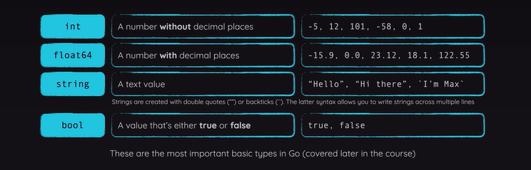
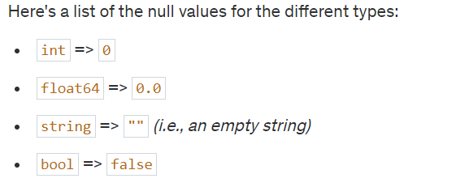
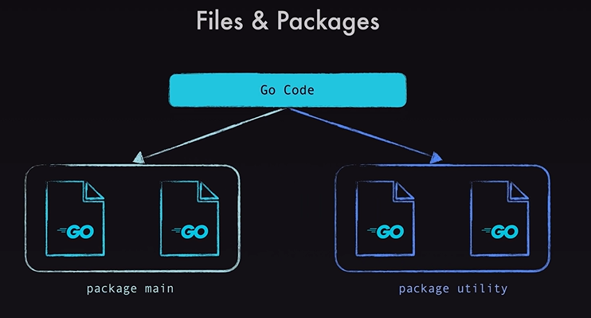
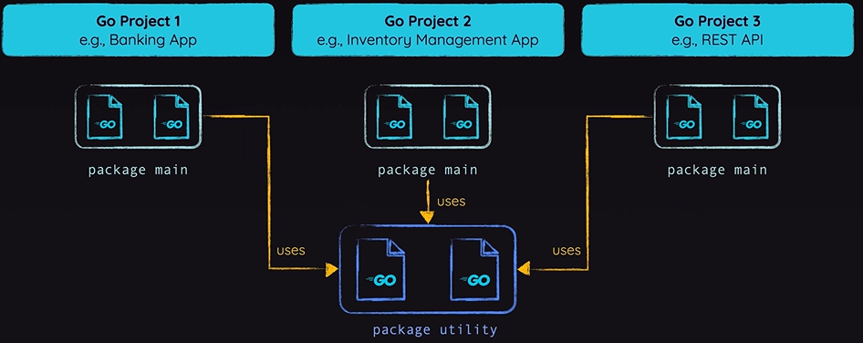
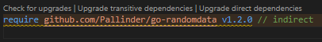
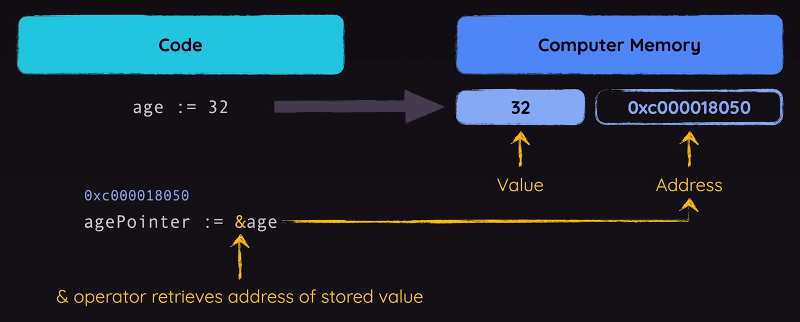

## What is Go?

It is an open-source programming language developed and published by Google.
- Focus on **simplicity**, **clarity** & **scalability**.
  - Inspired by langugages like Python
  - Aims to provide a clean, understandable syntax
- High performance & Focus on **Concurrency**
  - Similar to C or C++
  - Popular for tasks that benefit from multi-threading
- Batteries included
  - Go comes with a standard library
  - Many core features are built-in
- Static typing
  - Go is a type-safe language
  - Allows you to catch many errors early

> Popular are **Networking & APIs** & **Microservices** & **CLI (Command Line Interface) Tools**

```sh
go run app.go
```

We need to install Go because Go is a compiled language, which means the code must be translated to machine code before it is executed. And for that, we need to install that compiler.

## Go Essentials
> Values, Basic Types & Core Language Features
- Understanding the **Key Components** of a Go Program
- Working with **Values & Types**
- Creating & Executing **Functions**
- Controlling Execution with **Control Structure**

### Package

Every Go code needs such a package. If you remove package you will see an error. It expected a package. Why does it matter?

When writing go code you split your code across packages. You must have at least one package per application, but you can have multiple packages aswell.

We need these because one we work with multiple packages, we can use features from package B in package A for example. So we can export and import features across our files, so that the individual files stay rather lean.

In hello-world program, we are using `fmt` package. That's not a package written by us, instead, this `fmt` package is part of Go's standard library. Go comes with a <a href='https://pkg.go.dev/std'>huge standard library</a> of built-in packages. So packages that are installed together with Go, you could say, that are part of the Go Compiler.

#### Why is the package name is `main`?

Indeed you can use any name you want, many go projects espcially bigger projects typically use multiple packages. These pacakges need different names.

**main** is a special package name, that tells Go that this package will be the main entry point. You'll not always run your code as we did it before like `go run app.go`.

When you build it for production and make it available for other people, those people might not even have Go installed on their system. So, they can't use this command. Instead, you typically run;

```sh
go build
```

This will then tell Go to in the end create an executable file that could also be executed on systems that don't have Go installed here.

Go does not just know packages, but also modules. The idea simply is that one module consists of multiple packages. So in many cases **a module is simply a go project**.

So, in order to tell Go that, this should be considered a module, we have to run a specific command;

```sh
go mod init
```

However, when you are wrote that, you will get an error that it can't determine the module path. You should name it with where you plan to host your module later, if you plan to expose it as a third party library to the world. 

```sh
go mod init example.com/first-app
go build
```

If you run Go build on Windows, you will get a first-app.exe an executable file. You can simply run that file by double clicking on it. On Mac OS or Linux you will get an executable like this without a file extension and you can run it inside a terminal by typing `./first-app`. Now we got this executable which **can be executed without having Go installed**. 

That's why we need a module and main package, because if I would change package name main to app and run `go build`, I get no file as an output, because Go doesn't find a main entry point for our application.

#### `main` function

We also have func which is named main, and this also must be named **main**. This is a so-called function, a block of code that can be executed by calling that function, Go will call and execute that function, therefore the code in that function when program starts. 

If you have another main package with another file. You can't have another main function, because with it, program confuse where to start.

### Null Values





> With backticks can building multiline strings.

### Functions

We can see the built-in functions in official standard library documentation, there is a <a href="https://cs.opensource.google/go/go">repository link</a>. All the code behind go and the standard library is publicly available. You can dive into the src folder to find subfolders for all these standard library packages like the fmt package here.

### Error Handling

App doesn't crash because read file when it doesn't find a file does indeed generate an error as you'll see in a second, but it does not crash your application. 

Instead in Go, error handling typically works a bit differently than it does in other languages. In other languages you might be used to certain actions or problems crashing your code. In other languages you can ofter use try catch statement to wrap code that could potantially fail to catch errors and define code that should run if an error occurs. That is not how it works in Go though.

Instead in Go, functions are written such and your functions should be written such that errors don't crash the applcation. Instead, read file fore example, will simply return an empty byte collection if it failts to find that file, which is  then converted to an empty string, which is converted to the value zero when parsing it as a float. That is why we see the 0 as a result if we check the balance.

That's not all Go does. Instead, for operations that could fail, it is quite common that funtions return such an error thing as a second value. That's the value we can accept and store as a second value here when calling that function.

## Working With Packages

- Splitting Code Across **Multiple Files**
- Splitting Files Across **Multiple Packages**
- **Importing & Using** Custom Packages

In demo bank application, in such cases it's not uncommon that we might wanna split that code across multiple files to keep every file on its own a bit more readable and understandable so that we don't have too much code in a single file since that can make working with that file unnecessarily complex, because we have to search for the code we wanna work on and so on. Thankfully, splitting code into files in Go is pretty straightforward.

### Why Would Use More Than One Package?

Splitting code across files is pretty easy. More complex project, you might wanna split your code not just into multiple files that belong to the same main package, but actually into multiple packages. That can be especially useful. 



For example, put utility code into a package that could then be used in different projects.



For example, code for interacting with the file system. It can also be a useful pattern if you have code that works pretty much standalone, but should also be used in the context of a bigger project. You could put such code into a seperate package to have a clearer seperation of that code and still use it in one in the same project if you want to.

### Splitting Code Across Multiple Packages

We made generic functions. Now we are splitting them into a new file which named `fileops.go`. Then we need to change our `package main` to `package fileops`. But if I try to do that, it breaks, I get an error here.

> Found packages main and fileops in the same folder basically. That's not allowed in Go. Instead, every package must go into its own sub folder.

So If I wanna have a seperate new package here, I also have to add a new folder, and that folder should have the same name as the package, so fileops in this case. Filename is can be any name.

#### Importing Packages

To get access to the functions we define in our own packages, or to the things we define there in general, for example all the global constants or variables, to get access to these things, we'll have to import our own package, just as we already imported packages from the standard library.

To import your own package, it's not enough to just add the package name `fileops`. Instead, you have to add the full path, which icludes your module path. `example.com/bank/fileops`

#### Exporting & Importing Identifiers

When we import our `example.com/bank/fileops` and then with using;

```go
fileops.getFloatFromFile()
```

can't be found on our own fileops package, even though import it there. It is not found because in go, only functions or variables or constants that's start with an uppercase character, so with an uppercase G for example, only such functions or variables and so on are available in other packages.

That's also explain why we always used functions with uppercase:

```go
fmt.Print("Hi there!")
fmt.Scan(&choice)
```

That's the Go way of exporting something, and you can only import and use something from another package into some package if it's exported there. It is exported in another package if it starts with an uppercase character.

### Using Third-Party Packages

We only worked with packages that were either part of the standard library or that we built on our own. Go's standard library really comes with loads of useful features and functionalities built-in. It's definetely possible that the standard library is all you need, but sometimes you need a certain functionality in your application that's not part of the standard library and that you maybe also don't wanna build on your own, in such cases, you can install third party libraries. 

Go indeed has a very active community and ecosystem and just as you can build your own packages, there also are people building <a href="https://pkg.go.dev/">packages</a> which they share with the world.

```sh
go get github.com/Pallinder/go-randomdata
```

To get randomdata package, run the above command. It will add it to your project. You will not see source files in here, but you will see that the Go mod file was edited. In there you will find this extra line,



This `go.mod` file does not just serve as a description of your module, for example, containing it's path, but instead it is also used to list all the third party dependencies of your project, so that if you would share your project with someone else, they could quickly get and download all those dependencies simply by running to;

```sh
go get # like npm install
```

## Understanding Pointers

Pointers are in the variables that store value **addresses** instead of values. That might sound confusing. So let's take a look at how your code affects your computer's memory. Let's say you have some code where you create and initialize a variable called age, which you set to a value of 32. In that case, that value 32 is stored in the computer's memory. That value in memory automatically gets an address. Every space in your computer's memory has an address. That address is required by the computer, to be able to retrieve that value and work with it. In this case here, this value which in our code, is stored in the variable age is actually also stored in the computer's memory. Every value you use in Go is at least for a short period of time, **stored somewhere in your computer's memory**. 



A pointer, then is a variable, where you don't store a value, but where you instead use this special ampersand operator, a single ampersand symbol to get and store the address of a value, instead of the value itself. So now age pointer would contain the address as a value.

### Why Would Use This Feature?

There are probably two main advantages of using pointers in Go, at least in certain situations.
1. When working with pointers, you can **avoid unnecessary value copies**.
2. You can use pointers to **directly mutate values**.

#### Avoid Unnecessary Values Copies

By default, in Go programs when you pass a variable to a function, so that function can work with that value, Go creates a **copy of the value of that variable in memory** and **passes that copy to that function**. So at least for a certain period of time, until the function *execution is **done*** and the copied value will **eventually be cleaned up by Go's Garbage Collector**. A process that runs in the background automatically and *gets rid of unused values*.


Until that happens, you have the same value twice in memory. 

For very large and complex values, that could be a problem in certain applications because since you have the same value twice, you are of course taking up twice as much space. For numbers, most strings and all the most more complex values, that won't really matter too much in most applications. You will need a very specific application or use case, where this optimization of using a pointer to avoid this copy might actually make a difference. 


Still, it is an advantage to be aware of, because that can be one reason for a using pointers. **When passing a pointer** as an argument to a function, **there's no copy being created**. Instead, that function receives the address, and can use that address to look up the value that's stored under the address. Again, by using a special syntax, to then work with that value that is stored there.

#### Directly Mutate Values

Another advantage of using pointers, can be that you can write functions to which you pass a pointer. So an address instead of a value to that function. That function can then, since it has the address to the original value, directly edit that value.

So it doesn't have to calculate a new value based on the input value, and then return that value so that returned value can be used in the place where the function was called. Instead, it can directly manipulate the value if it received such a pointer.

That can of course lead to less code, since it allows you to avoid the return statement and so on. To be clear, it can also **lead to less understandable code**, and unexpected behaviors. It might come as a suprise that a function called add for example;

```go
package main

import "fmt"

func main() {
  x := 5
  y := 10
  add (&x, y)

  fmt.Println("x: ", x) // x: 15
  fmt.Println("y: ", y) // y: 10
}
```

Doesn't give you the sum of two numbers, but instead edits the first number by adding the second to it. That can be unexpected. You might instead, expect a function that returns a result, and leaves the original numbers unchanged. So it comes down to your specific use case, your personal preferences, and of course also the naming of your function, so that you don't suprise yourself, or other developers with unexpected behaviours. 

That's what pointers are, and why you might want to use them. 

----

### Working With Pointers In Code

> If you are working with pointer, it's **null value is nil**. Not like float64 -> 0.0, int -> 0. All pointer's null value is **nil**.

#### **Working with Regular Variables**
```go
package main

import "fmt"

func main() {
	age := 32 // regular variable
	fmt.Println("Age:", age)
	adultYears := getAdultYears(age)
	fmt.Println(adultYears)
}

func getAdultYears(age int) int {
	return age - 18
}
```

#### **Working with Pointers**
```go
package main

import "fmt"

func main() {
	age := 32 // regular variable

	var agePointer *int
	agePointer = &age

	fmt.Println("Age:", *agePointer) // dereferencing - value at this address with *

	adultYears := getAdultYears(agePointer)
	fmt.Println(adultYears)
}

func getAdultYears(age *int) int {
	return *age - 18
}
```

If we are giving a pointer as a parameter of a function, we should change the type of parameter; because we don't want int, but instead a pointer to an int, which means we have to add an **asterisk (*)** here.

In Go, unlike in some other programming languages, you can't perform pointer arithmetic, you can't perform calculations on pointers. In some langugaes you can, and you can run into really nasty problems there, but it can also be a powerful feature. In Go you can't. 

You can't deduct values from a pointer, so from an address or anything like that. Instead here, if you wanna perform this operation we are performing here, we have to dereference the pointer, we have to add this asterisk. 

```go
func getAdultYears(age *int) int {
	return *age - 18
}
```

So with that we're getting the address from parameter, then we are looking up the value that's stored under that address, and we are deducting 18 from that. Then just as before, we return that new value. 

So therefore we can still create adultYears and call getAdultYears, but now here we should not pass age as a value to getAdultYears, but instead a pointer to age we can use agePointer as a parameter. 

Important difference is that now there is no copy of 32 being created. Then we don't copy the value or anything like that, and than pass that pointer to that function where we want a pointer, and therefore again **nothing is copied**. It is still the one single 32 value. 

#### **Using Pointers For Data Mutation**
```go
package main

import "fmt"

func main() {
	age := 32 // regular variable

	var agePointer *int
	agePointer = &age

	fmt.Println("Age:", *agePointer) // dereferencing - value at this address with *

	getAdultYears(agePointer)
	fmt.Println(*agePointer)
}

func getAdultYears(age *int) {
  *age = *age - 18
}
```

```go
func getAdultYears(age *int) {
	// return *age - 18
  // age = *age - 18 - not like this, age is the pointer, not the value
  *age = *age - 18
}
```
With usage of `*age = *age - 18`, we are overriding that 32 value with that new value. Just by using that pointer, which we receive. Therefore, getAdultYears will no longer return anything. We should therefore remove that return type annotation.

Therefore, when we calling that function no longer need to store adultYears, because we no longer get a value. At the Println, we should **dereference** instead output age.

```go
fmt.Println(age)
```

If I am outputting age, not my agePointer, not the dereferenced agePointer, but the original age variable. Keep in mind that getAdultYears did edit that place in memory. It overwrote the numbers stored under that address and therefore it overwrote this 32 and that variable just also used that place in memory.

So if we change that place in memory, that variable holds that new value that's stored there under that address in memory. That's why we're outputting 14 with this lnie of code here, because we added the original value.

That can be an advantage, because we don't have to return something here now. Of course it can also be a problem, because it might be unexpected that we override the original value. We might not want that, especially if we have a name like this, getAdultYears. That does not sound like it edits something. We instead might wanna to call this **editAgeToAdultYears** to make it clearer what this function will do.

---

So we can use pointers to directly edit a value from inside a function. Look at fmt.Scan function, which used to get user input. Which is why used with ampersand symbol.

```go
fmt.Scan(&choice)
```

We are creating a pointer here, which points at this choice integer, and we pass this pointer to scan, because scan then internally **de-references** this pointer and overwrites te value that's stored under that adress with the value entered by the user.

## Interfaces

In Go and in most programming languages that have this feature is essentially a contract, you could say. A contract that guarantees that a certain value, typically a Struct, has a certain method.

```go
type saver interface {
	Save() error
}
```

> The requirement is a save method without arguments and an error return type

For example, here in this interface, I could say that I wanna guarantee that whichever struct implements this interface, so whichever struct signs this contract, have a save method with an uppercase S. **Save method which returns an error**, because things can go wrong. 

Method or function **doesn't have a function body**. Interfaces are not about defining the logic of a method. Instead they simply define that a certain method exists that it's there and what it's name is and what it's return values are. In addition, an interface can also define that a method accepts certain types of values as input, as parameters. You don't need to give these inputs here names, though you can, because **it's really only the types that matter here**.

If you have an interface that requires only on method, then your interface name is that method name plus `-er` at the end. It's not a must do, but it is a common convention.

### Using Interfaces

```go
func saveData(data saver) error {
	err := data.Save()

	if err != nil {
		fmt.Println("saving the note failed")
		return err
	}

	fmt.Println("saving the note succeeded!")
	return nil
}
```

> That's exactly what we have here.

```go
func (todo Todo) Save() error { // Todo's method
	fileName := "todo.json"
	json, err := json.Marshal(todo)

	if err != nil {
		return err
	}

	os.WriteFile(fileName, json, 0644)
	return nil
}
```

Unlike in other programming langauges, in Go, you don't have to explicitly connect this interface **to some other type to force that type** to adhere to that interface. Instead, Go simply takes a look at the value you are passing to saveData here, which wants such an interface type and it takes a look at that value and simply checks if that value, that todo struct in this case, **has such a save method** *that fulfills the requirements of the saver interface*.

```go
func (note Note) Save() error {
	fileName := strings.ReplaceAll(note.Title, " ", "_")
	fileName = strings.ToLower(fileName) + ".json"

	json, err := json.Marshal(note)

	if err != nil {
		return err
	}

	os.WriteFile(fileName, json, 0644)
	return nil
}
```

We have another save method with that Note struct. So, for Todo and Note structs have the save method and therefore, correctly implement this interface. That's why we can pass those values without any issues to saveData. That's why interfaces can be really useful because **they can help us write more generic, more flexible and more reusable code**. 

We can now use one saveData function to save the data for two different types of values. 